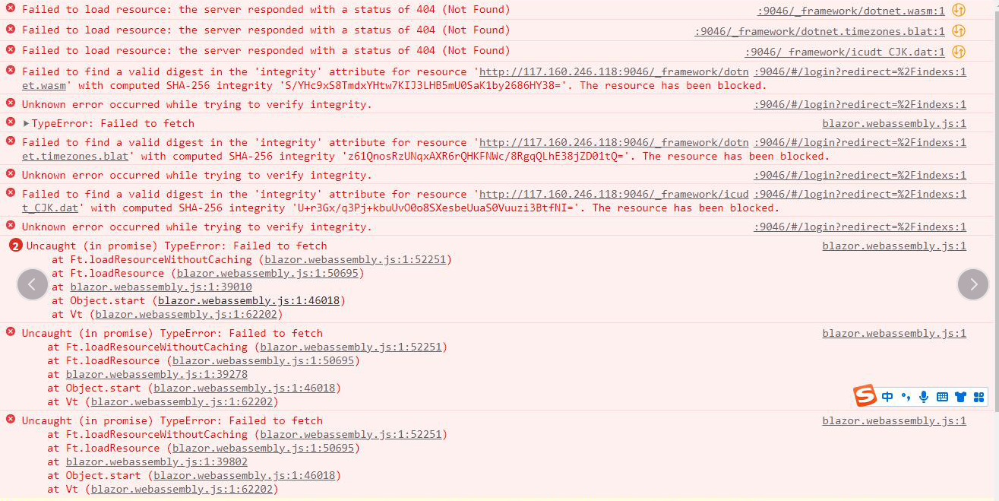
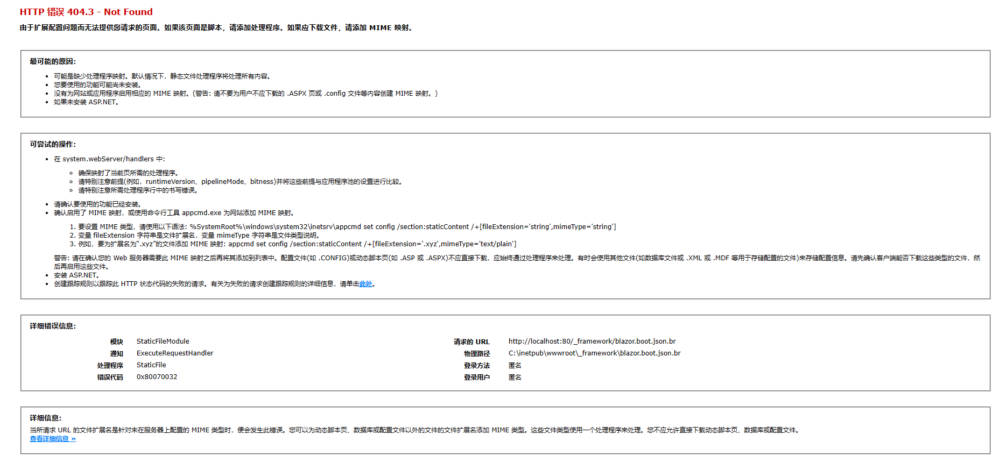
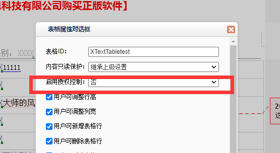
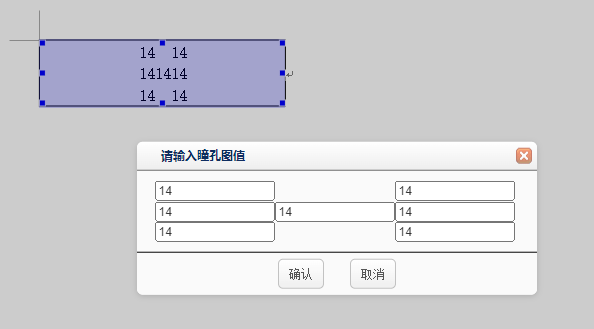

**DCWriter 第五代 Web 电子病历编辑器**

**接口手册**

**南京都昌信息科技有限公司**

**2023 年 4 月**

**目录**

1\. 引言 10

1.1. 目的 10

1.2. 系统概述 10

1.3. 约定 10

1.4. 环境和安装 11

2\. 入门指南 11

2.1. 授权注册 14

3\. 事件 16

3.1. 控件事件 16

3.1.1 WriterControl_OnLoad 控件加载完成事件 16

3.1.2 WriterControl_DocumentContentChanged 内容改变事件 16

3.1.3 DocumentLoad 文档加载事件 16

3.1.4 SelectionChanged 选择内容改变事件 16

3.1.5 EventCanInsertObject 是否可以插入内容 17

3.1.6 EventInsertObject 插入内容事件 17

3.1.7 EventShowContextMenu 右键菜单事件 18

3.1.8 EventBeforeCut 复制内容前事件 22

3.1.9 EventBeforeCopy 复制内容前事件 23

3.1.10 EventBeforePaste 粘贴内容前事件 23

3.1.11 EventBeforePrintPreview 打印预览前事件 23

3.1.12 EventAfterPrintPreview 打印预览后事件 23

3.1.13 EventBeforePrint 打印前事件 24

3.1.14 EventBeforePrintToGetHtml 在获取打印的 Html 前触发 24

3.1.15 ondocumentclick 鼠标单击事件 24

3.1.16 ondocumentdblclick 鼠标双击事件 24

3.1.17 QueryListItems 动态下拉列表事件 24

3.1.18 EventChangeSearchInputSpellCode 下拉列表搜索事件 25

3.1.19 EventAfterInsertSubDocuments 插入病程后事件 26

3.1.20 ondocumentmousedown 鼠标按下事件 26

3.1.21 ondocumentmouseup 鼠标弹起事件 26

3.1.22 WriterControl_EventElementGotFocus 元素获取事件 26

3.1.23 WriterControl_EventElementLostFocus 元素失去焦点事件 27

4\. 接口 27

4.1. 选项设置 27

4.1.1. 安全和权限相关选项 28

4.1.2. 文档试图选项 31

4.1.3 编辑选项 40

4.1.4 文档行为选项 41

4.2. 文件 44

4.2.1. 关于 44

4.2.2. 新建文件 44

4.2.3. 打开本地文件 45

4.2.4. 保存 XML 或 Json 字符串 46

4.2.5. 加载 XML 或 Json 字符串 47

4.2.6. 通过组合数据进行加载文档 47

4.2.7. 保存 XML 或 Json Base64 格式字符串 48

4.2.8. 加载 XML 或 Json Base64 格式字符串 49

4.2.9. 下载文档 49

4.2.10. PDF 预览 50

4.2.11. 保存选中 XML 内容 51

4.2.12. 保存选中 Json 内容 51

4.2.13. 保存选中 Html 内容 52

4.2.14. 保存选中 Txt 内容 52

4.2.15. 插入 XML 内容 53

4.2.16. 插入 Json 内容 53

4.2.17. 刷新文档 53

4.2.18. 违禁关键字 54

4.2.19. 获取违禁关键字 54

4.2.20. 批注校验 55

4.2.21. 页面设置 55

4.2.22. 获取页面设置值 56

4.2.23. 装订线 57

4.2.24. 文档网格线 58

4.2.25. 水印 59

4.2.26. 数据源绑定 61

4.2.27. 获取文档状态 66

4.2.28. 重置文档状态 66

4.2.29. 通过 base64 的 xml 数据转换成 HTMl 66

4.2.30. 清空文档内容 67

4.2.31. 插入批注 67

4.2.32. 多文档合并 HTML 68

4.2.33. 插入 xml 文档 70

4.2.34. 清空正文内容 71

4.3. 编辑与格式 71

4.4.1. 剪切 71

4.4.2. 复制 71

4.4.3. 粘贴 72

4.4.4. 纯文本复制 72

4.4.5. 纯文本粘贴 72

4.4.6. 撤销 72

4.4.7. 重做 73

4.4.8. 字体 73

4.4.9. 字体名称 75

4.4.10. 字体大小 75

4.4.11. 粗体 76

4.4.12. 斜体 76

4.4.13. 下划线 77

4.4.14. 删除线 77

4.4.15. 前景色 78

4.4.16. 背景色 78

4.4.17. 上标 79

4.4.18. 下标 79

4.4.19. 套圈 80

4.4.20. 左对齐 80

4.4.21. 右对齐 80

4.4.22. 居中对齐 81

4.4.23. 分散对齐 81

4.4.24. 首行缩进 82

4.4.25. 左缩进量 82

4.4.26. 段前距 83

4.4.27. 段后距 83

4.4.28. 行间距 84

4.4.29.退格 84

4.4.31.圆点列表 85

4.4.32.文字套圈 85

4.4.33.清空正文所有输入域的内容 86

4.4.34.清空正文内容 86

4.4.35.清空当前输入域内容 86

4.4.36.清除格式 87

4.4.37.清除撤销信息列表 87

4.4.38.清除批注式校验结果 88

4.4.39.将选中的内容转为输入域内容 88

4.4.40.将当前输入域转为文本内容 89

4.4.41.带清空输入域内容的复制 89

4.4.42.删除 90

4.4.43.物理删除 90

4.4.44.删除所有批注 90

4.4.45.删除当前批注 91

4.4.46.删除当前行文本 91

4.4.47.删除文档后面的空白内容 92

4.4.48.显示文档里面隐藏的元素 92

4.4.49.设置文档默认样式 93

4.4.50.对文档进行校验 93

4.4.51.对文档进行批注式校验 94

4.4.52.着重号 94

4.4.53.设置输入域的固定宽度 95

4.4.54.字体 95

4.4.55. 获得文档中被选择的内容 96

4.4.56.设置标题 1 的样式 96

4.4.57.设置标题的数字列表 1 的样式 97

4.4.58.设置标题 2 的样式 97

4.4.59.设置标题的数字列表 2 的样式 97

4.4.60.设置标题 3 的样式 98

4.4.61.设置标题的数字列表 3 的样式 98

4.4.62.设置标题 4 的样式 99

4.4.63.设置标题的数字列表 4 的样式 99

4.4.64.设置标题 5 的样式 100

4.4.65.设置标题的数字列表 5 的样式 100

4.4.66.设置标题 6 的样式 101

4.4.67.设置标题的数字列表 6 的样式 101

4.4.68.设置页眉下边缘横线 101

4.4.69.隐藏被标记为自动隐藏的元素 102

4.4.70.插入 Html 102

4.4.71.插入文本标签元素 103

4.4.72.插入软回车 103

4.4.73.插入段落符号 104

4.4.74.插入文本 104

4.4.75.插入空格进行右对齐 105

4.4.76.字符间距 105

4.4.77.向下移动一行 106

4.4.78.移动到行尾 106

4.4.79.移动到行首 106

4.4.80.向左移动一列 107

4.4.81.向下翻页 107

4.4.82.向上翻页 108

4.4.83.向右移动一列 108

4.4.84.移动到指定插入点位置 109

4.4.85. 将插入点移动到文档中的指定的位置（有问题，切换的时候上面按钮会丢失） 110

4.4.86.向上移动一行 110

4.4.87.撤销 110

4.4.88.重做 111

4.4.89.重置表单数据 111

4.4.90.全选 112

4.4.91.选中当前光标行 112

4.4.92.设置文档默认样式 113

4.4.93.带选择的向下移动一行 113

4.4.94.带选择的向上移动一行 114

4.4.95.带选择的移动到行尾 114

4.4.96.带选择的移动到行首 114

4.4.97.带选择的向左移动 115

4.4.98.带选择的向右移动 115

4.4.99.带选择的向下移动一页 116

4.4.100.带选择的向上移动一页 116

4.4.101.显示单元格背景编号 117

4.4.102.显示被标记为自动隐藏的元素 117

4.4.103.简体和繁体相互转换 118

4.4.104.简体和转繁体 118

4.4.105.删除线 118

4.4.106.下标 119

4.4.107.上标 119

4.4.108.删除表格列 120

4.4.109.删除表格行 120

4.4.110.删除表格 121

4.4.111.打印预览 121

4.4.112.有序列表 121

4.4.113.无序列表 123

4.4.114.悬挂缩进 124

4.4.115.查找替换 124

4.4.116.格式刷 124

4.4.117.插入特殊字符 125

4.4.118.大写字母转小写字母 125

4.4.118.小写字母转大写字母 126

4.4.118.字符边框 126

4.4.119.插入当前时间 127

4.4.120.插入当前日期 127

4.4.120.段落 128

4.4.120.文档默认字体 128

4.4. 打印 129

4.4.1.打印 129

4.4.2.打印当前页 129

4.4.3.打印预览 130

4.4.4.整洁打印预览 130

4.4.5.留痕打印预览 131

4.4.6.预览当前页 131

4.4.7.关闭打印预览 131

4.4.8.整洁打印 132

4.4.8.留痕打印 132

4.4.9 打印为 PDF 132

4.4.10.打印为 Html 133

4.4.11.本地打印 133

4.4.12.打印选择内容（暂缺） 134

4.4.13.区域选择打印（暂缺） 134

4.4.14.续打 135

4.4.15.偏移续打 135

4.4.16.根据选择区域来设置续打状态(跟 c 端有区别) 136

4.5. 视图 137

4.5.1.放大 137

4.5.2.縮小 137

4.5.3.表单模式 137

4.5.4.设计模式 138

4.5.5.普通表单模式 139

4.5.6.阅读模式 139

4.5.7.只读切换 139

4.5.8.留痕模式 140

4.5.9.清洁模式 140

4.5.10.取消内容保护 141

4.5.11.内容保护-可以写 141

4.5.12.内容保护-不能写入 142

4.5.13.用户登录 142

4.5.14.单栏展示 143

4.5.15.多栏展示 143

4.5.16.水平铺开 143

4.5.17.管理员模式 144

4.5.18.后台运行模式 144

4.5.19.续打模式 145

4.5.20.退出续打模式 145

4.5.21.偏移续打模式 146

4.5.22.是否为预览模式 146

4.6. 表格 146

4.6.1. 插入表格 146

4.6.2. 删除表格 147

4.6.3. 删除表格行 147

4.6.4. 删除表格列 148

4.6.5. 上面插入行 148

4.6.6. 下面插入行 149

4.6.7. 左边插入列 149

4.6.8. 右边插入列 149

4.6.9. 合并单元格 150

4.6.10. 拆分单元格 150

4.6.11. 背景编号 151

4.6.12. 顶端左对齐 151

4.6.13. 顶端右对齐 152

4.6.14. 顶端中间对齐 152

4.6.15. 垂直居中水平左对齐 152

4.6.16. 垂直居中水平右对齐 153

4.6.17. 垂直居中水平中间对齐 153

4.6.18. 底端左对齐 154

4.6.19. 底端右对齐 154

4.6.20. 底端居中对齐 155

4.6.21. 表格内边距 155

4.6.22. 单元格网格线 155

4.6.23. 单元格斜分割线 156

4.6.24. 表格边框 157

4.6.25. 单元格边框 157

4.6.26. 表格属性对话框 157

4.6.27. 表格行属性对话框 158

4.6.28. 单元格属性对话框 158

4.6.29. 获取当前表格对象 159

4.6.30. 获取当前表格行对象 159

4.6.31. 获取到当前单元格对象 159

4.6.32. 设置表格边框样式 160

4.6.33. 设置单元格边框样式 161

4.6.34. 表格前插入段落符号 162

4.6.35. 获取表格设置的自定义属性 162

4.6.36. 设置表格自定义属性 163

4.6.37. 获取表格行自定义属性 163

4.6.38. 设置表格行自定义属性 164

4.6.39. 获取单元格自定义属性 164

4.6.40. 设置单元格自定义属性 165

4.7. 病程记录 166

4.7.1.插入病程 166

4.7.2.追加病程 167

4.7.3.当前病程编号 168

4.7.4.删除当前病程 168

4.7.5.删除指定病程 169

4.7.6.追加单个病程 169

4.7.7.单个 base64 170

4.7.8.单个保存 170

4.7.9.病程编号 171

4.7.10.根据编号定位病程 171

4.7.11.根据序号定位病程 172

4.7.12.病程只读 172

4.7.13.取消只读 173

4.7.14.设置跨页 173

4.7.15.取消跨页 173

4.8. 结构化元素 174

4.8.1 输入域元素 174

4.8.2.单复选框元素 181

4.8.3.条形码元素 183

4.8.4.二维码元素 185

4.8.5.页码元素 186

4.8.5.医学表达式元素 187

4.8.6.标签文本元素 201

4.8.7.按钮元素 203

4.8.8.图片元素 205

4.8.9.批注元素 207

4.8.10.水平线元素 209

4.8.10.图表元素 210

4.8.11.元素属性对话框 212

4.8.12.获取相同类型的元素 213

4.8.13.获取当前光标的元素 214

4.9. 光标位置 215

FocusAdjacent 215

4.10. 痕迹 215

4.10.1. 将正文没有给用户标记的内容设置成当前用户的痕迹 215

4.10.2. 清除文档中所有的用户痕迹 216

4.10.3. 清除用户选中内容的痕迹 216

4.10.4. 提交用户痕迹 217

4.10.5. 获取文档痕迹列表 217

4.11. 注册（暂缺） 218

4.12. 其他 218

4.14.1. 获取到当前样式 218

4.14.2. 清空内容字号 218

4.14.3. 清空内容字体样式 219

5\. 软件常见接口应用以及错误处理 219

5.1. 加载完成但是方法找不到 219

6\. 附录 219

# 引言

## 目的

本文档说明了 DCWriter 电子病历编辑器第五代 Web 版本的接口声明、参数及使用方法等，主要提供有软件编程能力且对电子病历系统功能熟悉的开发人员进行扩展功能开发使用。

## 系统概述

DCWriter 电子病历编辑器第五代 Web 版本是南京都昌信息科技有限公司独立自主研发的控件产品，可以嵌入到各类 Web 框架中应用。

支持跨平台运行，包含 Windows、Linux 以及各类国产操作系统。

支持移动端运行，包含 Windows Mobile、Android、iOS、HarmonyOS 等。

支持浏览器，包含 Microsoft Edge、Chrome、Firefox、Safari 等。客户端浏览器需要支持 canvas 功能。

支持 JavaScript 开发。广义来说，只要支持 JavaScript 开发的前端框架都可以使用本控件。

本控件产生的文档是 XML 或 Json 格式，它不直接操作数据库，而是把数据返回给用户，由用户自行存储利用。XML 或 Json 格式是未加密的格式。

本控件对服务端没有特殊要求，包含 Windows、Linux 以及各类国产操作系统。支持常用的 Web 服务器，包含 IIS、Apache、Tomcat 等。

## 约定

通过前端接口，获取编辑器控件对象，代码如下：

| var ctl = document.getElementById("myWriterControl"); 或 var myWriterControl = document.getElementById("myWriterControl"); |
| -------------------------------------------------------------------------------------------------------------------------- |

本文无特殊说明，其中 myWriterControl 表示控件在 web 页面中的 ID 编号，ctl 或 myWriterControl 表示编辑器控件对象。

## 环境和安装

本控件对服务端没有特殊要求，包含 Windows、Linux 以及各类国产操作系统。支持常用的 Web 服务器，包含 IIS、Apache、Tomcat 等。只需要把本控件的依赖项目，放在用户自己的 Web 项目的目录下即可。

注意：本控件暂时不支持跨域调用，不支持静态运行。

本项目的依赖如下：

## 1.5 使用规范

### 1.5.1 在使用数值表达式的时候，输入域元素编号的命名需要符合标识符的规范，不要用纯数字进行命令。

答：如果用纯数字，数值表达式计算是直接取数字进行计算。

### 1.5.2 第五代编辑器部署在 IIS 上进行访问，编辑器初始化的时候报以下错误的时候

答：需要在当前网站下 MIME 下添加以下类型。

### 1.5.3 vue 引用第五代编辑器文件的时候，启动 vue，浏览器控制台报：SyntaxError:Unexpected end of JSON input。

答：找到\_framework 文件夹下面的 blazor.webassembly.js 文件，把\_framework 全局替换下/\_framework 即可

### 1.5.4 vue3 编辑器初始化浏览器报以下错误：”TypeError:window.CreateWriterControlForWASM is not a function”

答：把\_framework 测试包放入到 vue 下 public 文件夹下即可

### 1.5.5 vue 运行编辑器初始化的时候报错：”Corrupted padding bits”

答：找到编辑器初始化的代码，如下：

···javascript//注释掉这个 js 代码，替换成下面的引用 js \<script type="module"\> import { BrotliDecode } from './\_framework/decode.min.js'; Blazor.start({ loadBootResource: function (type, name, defaultUri, integrity) { if (type !== 'dotnetjs') { return (async function () { const response = await fetch(defaultUri + '.br', { cache: 'no-cache' }); if (!response.ok) { throw new Error(response.statusText); } const originalResponseBuffer = await response.arrayBuffer(); const originalResponseArray = new Int8Array(originalResponseBuffer); const decompressedResponseArray = BrotliDecode(originalResponseArray); const contentType = type === 'dotnetwasm' ? 'application/wasm' : 'application/octet-stream'; return new Response(decompressedResponseArray, { headers: { 'content-type': contentType } }); })(); } } }); \</script\> //换成这个写法 \<script src="\_framework/blazor.webassembly.js"\>\</script\>···

### 1.5.6 不能在病程记录对象里面插入病程记录

### 1.5.7 用户执行登录接口，在有的容器元素里面输入内容不会产生痕迹。

答：是因为容器元素都有 EnablePermission 属性设置后只对自己有影响，在这个容器内不开启痕迹。

比如表格：

### 1.5.8 设置文档选项的时候，不能同步调用编辑器的命令。

答：例如：

| //调用的命令会无效 ctl. DocumentOptions.ViewOptions.ShowHeaderBottomLine= false ctl.ExecuteCommand(“FormViewMode” , false , “Normal”); ctl.ApplyDocumentOptions() //正常用法 ctl. DocumentOptions.ViewOptions.ShowHeaderBottomLine= false ctl.ApplyDocumentOptions() ctl.ExecuteCommand(“FormViewMode” , false , “Normal”); |
| --------------------------------------------------------------------------------------------------------------------------------------------------------------------------------------------------------------------------------------------------------------------------------------------------------------------------- |

# 入门指南

前端使用步骤如下：

1.  在前端引用 Jquery，如下所示：

| \<script src="js/jquery-1.7.2.min.js"\>\</script\> |
| -------------------------------------------------- |

2.在前端引用本控件的依赖项，如下所示：

| \<script src="\_framework/blazor.webassembly.js"\>\</script\>                                                                                                                      |
| ---------------------------------------------------------------------------------------------------------------------------------------------------------------------------------- |
| //编辑器初始化的方法里面加上以下代码即可。 var newCtl = document.getElementById(newControlID); if(window.CreateWriterControlForWASM){ window.CreateWriterControlForWASM(newCtl); } |

3.在前端以 DIV 容器承载本控件，如下所示：

| \
正在加载... \</div\> |
| -------------------------------------------------------------------------------------------------------------------------------------------------------------------------------------------------------------------------------------------------------------------------------------------------------------------------------------------------------------------------------------------------------------------------------------------------------------------------------------------------------- |

其中：

ID 表示控件在 web 页面中的 ID 编号；

dctype 是控件的类型标记；

ServicePageUrl 表示授权服务的地址，可使用第四代的授权地址即可；

OutputFormatedXMLSource 表示控件的设置项，更多的设置项可参考接口文档中的描述；

OnLoad 表示控件初始化后执行的函数。根据需求可以不添加该功能

页面加载后，本控件将自动加载显示。

如果是动态创建控件请参考以下方法:

1.  在前端添加动态引用 js 的接口，如下所示：

| function loadScript(url, callback) { var script = document.createElement("script"); script.type = "text/javascript"; if (typeof (callback) != "undefined") { if (script.readyState) { script.onreadystatechange = function () { if (script.readyState == "loaded" \|\| script.readyState == "complete") { script.onreadystatechange = null; callback(); } }; } else { script.onload = function () { callback(); }; } }; script.src = url; document.body.appendChild(script); } |
| ------------------------------------------------------------------------------------------------------------------------------------------------------------------------------------------------------------------------------------------------------------------------------------------------------------------------------------------------------------------------------------------------------------------------------------------------------------------------------ |

1.  在页面中添加一个 DIV 容器承载编辑器控件，如下所示：

| \
 |
| ---------------------------------------------- |

1.  在需要动态创建编辑器控件时，使用以下代码：

| var content = \`\
正在加载...\</div\>\`; document.getElementById('main').innerHTML = content; loadScript("\_framework/blazor.webassembly.js", function () { }); |
| ------------------------------------------------------------------------------------------------------------------------------------------------------------------------------------------------------------------------------------------------------------------------------------------------------------------------------------------------------------------------------------------------------------------------------------------------------------------------------------------------------------------------------------------------------------------------------------------------------------------------------------------------- |

此时控件将自动创建完成。

1.  如果需要在通过代码创建，请参考以下代码：

| var newCtl = document.getElementById(newControlID); newCtl.setAttribute("servicepageurl", strServicePageUrl); window.CreateWriterControlForWASM(newCtl); newCtl.LoadDocumentFromString(strFileContent, fileFormat); |
| ------------------------------------------------------------------------------------------------------------------------------------------------------------------------------------------------------------------- |

## 授权注册

在编辑器未注册时，会在前端显示类似“未注册”的字样。去除未注册标记需要客户提供响应的服务器机器码。根据服务器机器码制作授权服务端程序。

制作授权服务端程序有两种：asp.net 和 asp.net core。

在 ASP.NET 服务端，通过服务页面设置 RegisterCode 属性即可。也可以在 Global 文件中添加静态的设置，表示该服务端所有的编辑器控件都设置了注册码。注册码支持从配置文件中读取。

| WebWriterControlServicePageExecuter executer = new WebWriterControlServicePageExecuter(); executer.RegisterCode = "注册码"; executer.CrossDomainSettings.Enabled = true;//是否开启跨域 executer.EventReadFileContent = new DCSoft.Writer.WriterReadFileContentEventHandler(this.My_ReadFileContent);//事件 if (executer.HandleService(this)) { return; } //静态注册 DCSoft.Writer.Controls.WebWriterControl.StaticSetRegisterCode("注册码"); |
| -------------------------------------------------------------------------------------------------------------------------------------------------------------------------------------------------------------------------------------------------------------------------------------------------------------------------------------------------------------------------------------------------------------------------------------------- |

注：此方法注册每次替换注册码需要重新编译项目。

在 ASP.NET 服务端中也可以使用一般处理程序，代码如下：

| public void ProcessRequest(HttpContext context) { var executer = new WebWriterControlServicePageExecuter(); executer.SetAllowSmallPiecesWhenMergeDocument(true); executer.RegisterCode = "注册码"; executer.EnabledCrossDomain = true;// .CrossDomainSettings.Enabled = true; executer.HandleService(context); } |
| ---------------------------------------------------------------------------------------------------------------------------------------------------------------------------------------------------------------------------------------------------------------------------------------------------------------- |

在 ASP.NET CORE 服务端，在控制器里面添加注册码信息，代码如下：

| WebWriterControlEngine engine = new WebWriterControlEngine(); engine.SetRegisterCode("注册码"); engine.Options.ControlName = "myWriterControl"; engine.Options.ServicePageURL = this.Url.Action("HandleDCWriterServicePage");//第一种服务路径 engine.Options.ContentRenderMode = WebWriterControlRenderMode.NormalHtmlEditable; ViewBag.WriterControlHtml = engine.GetAllContentHtml(); engine.Dispose(); return View(); |
| ------------------------------------------------------------------------------------------------------------------------------------------------------------------------------------------------------------------------------------------------------------------------------------------------------------------------------------------------------------------------------------------------------------------------ |

把从都昌获取的注册码填入到 RegisterCode 中即可。

前端控件设置的 ServicePageUrl 属性设置上述服务端程序的地址即可。

# 事件

## 控件事件

在控件加载和文档加载后会触发各类事件（回调函数）。包含

### 3.1.1 WriterControl_OnLoad 控件加载完成事件

在控件加载后触发。示例如下：

| function WriterControl_OnLoad(rootElement) { console.log('控件加载完毕') }; |
| --------------------------------------------------------------------------- |

### 3.1.2 WriterControl_DocumentContentChanged 内容改变事件

在文档中内容改变时触发。示例如下：

| function WriterControl_DocumentContentChanged(rootElement) { console.log(rootElement.id + " 内容发生改变"); }; |
| -------------------------------------------------------------------------------------------------------------- |

### 3.1.3 DocumentLoad 文档加载事件

在文档加载后触发。该事件需要写在控件加载事件 WriterControl_OnLoad 中。示例如下:

| function WriterControl_OnLoad(rootElement) { rootElement.DocumentLoad = function (eventSender, args) { console.log("文件加载完毕"); }; }; |
| ----------------------------------------------------------------------------------------------------------------------------------------- |

### 3.1.4 SelectionChanged 选择内容改变事件

在文档中选择内容时触发。该事件需要写在控件加载事件 WriterControl_OnLoad 中。示例如下:

| function WriterControl_OnLoad(rootElement) { rootElement.SelectionChanged = function (eventSender, args) { var txt ="第" + (this.FocusedPageIndexBase0 + 1) + "页,第" +this.CurrentLineIndexInPage + "行，第" +this.CurrentColumnIndex + "列."; if (this.SelectionLength != 0) { txt = txt + "选择了" + Math.abs(this.SelectionLength) + "个元素"; } var p = this.SelectionStartPosition; txt = txt + " X:" + p.x + " Y:" + p.y; var selectMes = txt + " 当前字体:" + this.CurrentFontName + "," + this.CurrentFontSize; var fontfamilySelect = document.getElementById("fontfamilySelect"); fontfamilySelect.value = this.CurrentFontName; var fontSizeSelect = document.getElementById("fontSizeSelect"); fontSizeSelect.value = this.CurrentFontSize; }; }; |
| -------------------------------------------------------------------------------------------------------------------------------------------------------------------------------------------------------------------------------------------------------------------------------------------------------------------------------------------------------------------------------------------------------------------------------------------------------------------------------------------------------------------------------------------------------------------------------------------------------------------------------------------------------------------------------------------------------------------------------------------------------------- |

### 3.1.5 EventCanInsertObject 是否可以插入内容

判断当前位置是否可以插入内容，一般需要结合 rootElement.EventInsertObject 事件，在外部向编辑器内部拖拽数据时使用。示例代码如下：

| function WriterControl_OnLoad(rootElement) { rootElement.EventCanInsertObject = function (eventSender, eventArgs) { eventArgs.Result = true; }; }; |
| -------------------------------------------------------------------------------------------------------------------------------------------------- |

### 3.1.6 EventInsertObject 插入内容事件

在向编辑器文档中插入内容或拖拽到编辑器内时触发。一般需要结合 rootElement. EventCanInsertObject 事件。示例代码如下：

| function WriterControl_OnLoad(rootElement) { rootElement.EventInsertObject = function (eventSender, eventArgs) { if (eventArgs.GetDataPresent("Text")) { var txt = eventArgs.GetData("Text"); rootElement.DCExecuteCommand ("InsertString", false, new Date().toLocaleDateString() + " 插入字符串 " + txt); eventArgs.Handled = true; // 设置 Handle=true,表示事件已经处理了，不需要后续的默认处理。 } }; }; |
| ------------------------------------------------------------------------------------------------------------------------------------------------------------------------------------------------------------------------------------------------------------------------------------------------------------------------------------------------------------------------------------------------------------ |

### 3.1.7 EventShowContextMenu 右键菜单事件

通过该事件可以在编辑器文档中添加右键菜单。示例代码如下：

| function WriterControl_OnLoad(rootElement) { rootElement. EventShowContextMenu= function (eventSender, args) { let myWriterControl = GetCurrentWriterControl(); var typename = args.ElementType;//当前的元素 if (typename != null && typename != "") { typename = typename.toLowerCase(); var options = [ { label: '撤销', exec: () =\> { myWriterControl.DCExecuteCommand ('Undo', false, null); }, }, '-', ]; if (typename == "xtexttablecellelement") {//单元格 var options2 = [ '-', { label: '删除表格行', exec: () =\> { myWriterControl.DCExecuteCommand ("Table_DeleteRow", false, null); }, }, ]; options = options.concat(options2); } else { } ContextMenu(options, args, eventSender); }; }; function ContextMenu(options, menuObj, rootElement) { if (options != null && Array.isArray(options)) { if (menuObj) { //获取到包裹元素 var pageContainer = rootElement.querySelector('[dctype=page-container]'); //判断是否存在 dcContextMenu 的元素 var hasContextMenu = pageContainer.querySelector('\#dcContextMenu'); if (!hasContextMenu) { var meunDiv = document.createElement('div'); meunDiv.setAttribute('id', 'dcContextMenu') pageContainer.appendChild(meunDiv); meunDiv.innerHTML = \`\
\</div\>\`; hasContextMenu = meunDiv; //判断是否有 css var dcHead = document.head; //判断是否存在对应的 css var hasContextMenuCss = dcHead.querySelector('\#ContextMenuCss'); if (!hasContextMenuCss) { var newCssString = \` \#dcContextMenu{ position: absolute; margin: 0; padding: 2px; border-width: 1px; border-style: solid; background-color: \#fafafa; border-color: \#ddd; color: \#444; box-shadow: rgb(204, 204, 204) 2px 2px 3px; width: 144px; overflow: hidden; /\* left: 8px; top: 481.672px; \*/ z-index: 110008; display: none; } \#dcContextMenu \> div:hover{ color: rgb(0, 0, 0); border-color: rgb(183,210,255); background: rgb(234,242,255); } \#dcContextMenu .dcMenu-line{ position: absolute; left: 26px; top: 0; height: 100%; font-size: 1px; border-left: 1px solid \#ccc; border-right: 1px solid \#fff; } \#dcContextMenu .dcMenu-item{ position: relative; white-space: nowrap; cursor: pointer; margin: 0px; padding: 0px; overflow: hidden; border-width: 1px; border-style: solid; border-color: transparent; } \#dcContextMenu .dcMenu-item .dcMenu-text{ float: left; padding-left: 28px; font-size: 12px; } \#dcContextMenu .dcMenu-icon{ position: absolute; width: 16px; height: 16px; left: 2px; top: 50%; margin-top: -8px; } \#dcContextMenu .dcMenu-sep{ margin: 3px 0px 3px 25px; font-size: 1px; border-top: 1px solid \#ccc; border-bottom: 1px solid \#fff; }\` var ContextMenuCss = document.createElement('style'); ContextMenuCss.setAttribute('id', 'ContextMenuCss'); dcHead.appendChild(ContextMenuCss); ContextMenuCss.innerHTML = newCssString; //页面滚动 pageContainer.addEventListener('scroll', function () { var hasContextMenu = rootElement.querySelector('\#dcContextMenu'); if (hasContextMenu) { hasContextMenu.remove(); } }) //鼠标按下 document.body.addEventListener('mousedown', function () { var hasContextMenu = rootElement.querySelector('\#dcContextMenu'); if (hasContextMenu) { hasContextMenu.remove(); } }) //丢失焦点 window.addEventListener('blur', function () { var hasContextMenu = rootElement.querySelector('\#dcContextMenu'); if (hasContextMenu) { hasContextMenu.remove(); } }) } } else { //存在时，清空所有 item 和 sep 的元素 var allItem = hasContextMenu.querySelectorAll('.dcMenu-item, .dcMenu-sep'); for (var i = 0; i \< allItem.length; i++) { allItem[i].remove(); } } var containerHeight = 0; if (Array.isArray(options) && options.length \> 0) { //根据 options 显示元素 for (var option = 0; option \< options.length; option++) { if (typeof options[option] == 'object') { var itemEle = document.createElement('div'); itemEle.setAttribute('class', 'dcMenu-item'); itemEle.style.cssText = 'height: 30px;'; hasContextMenu.appendChild(itemEle); itemEle.innerHTML = \` \
\${options[option].label}\</div\> \
\</div\> \`; itemEle.setAttribute('menuIndex', option) itemEle.addEventListener('mousedown', function (e) { e.stopPropagation(); e.preventDefault(); }) itemEle.addEventListener('click', function () { options[this.getAttribute('menuIndex')].exec(); //itemEle.getAttribute() //将 hasContextMenu 元素隐藏 hasContextMenu.remove(); }) containerHeight += 30; } else if (typeof options[option] == 'string' && options[option] == '-') { var sepEle = document.createElement('div'); sepEle.setAttribute('class', 'dcMenu-sep'); hasContextMenu.appendChild(sepEle); containerHeight += 8; } } var pageElement = menuObj.PageElement; containerHeight = containerHeight ? containerHeight + 6 : 0 hasContextMenu.style.height = containerHeight + 'px'; hasContextMenu.style.left = pageElement.offsetLeft + menuObj.X + 'px'; hasContextMenu.style.top = pageElement.offsetTop + menuObj.Y + 'px'; hasContextMenu.style.display = 'block'; } } } } |
| -------------------------------------------------------------------------------------------------------------------------------------------------------------------------------------------------------------------------------------------------------------------------------------------------------------------------------------------------------------------------------------------------------------------------------------------------------------------------------------------------------------------------------------------------------------------------------------------------------------------------------------------------------------------------------------------------------------------------------------------------------------------------------------------------------------------------------------------------------------------------------------------------------------------------------------------------------------------------------------------------------------------------------------------------------------------------------------------------------------------------------------------------------------------------------------------------------------------------------------------------------------------------------------------------------------------------------------------------------------------------------------------------------------------------------------------------------------------------------------------------------------------------------------------------------------------------------------------------------------------------------------------------------------------------------------------------------------------------------------------------------------------------------------------------------------------------------------------------------------------------------------------------------------------------------------------------------------------------------------------------------------------------------------------------------------------------------------------------------------------------------------------------------------------------------------------------------------------------------------------------------------------------------------------------------------------------------------------------------------------------------------------------------------------------------------------------------------------------------------------------------------------------------------------------------------------------------------------------------------------------------------------------------------------------------------------------------------------------------------------------------------------------------------------------------------------------------------------------------------------------------------------------------------------------------------------------------------------------------------------------------------------------------------------------------------------------------------------------------------------------------------------------------------------------------------------------------------------------------------------------------------------------------------------------------------------------------------------------------------------------------------------------------------------------------------------------------------------------------------------------------------------------------------------------------------------------------------------------------------------------------------------------------------------------------------------------------------------------------------------------------------------------------------------------------------------------------------------------------------------------------------------------------------------------------------------------------------------------------------------------------------------------------------------------------------------------------------------------------------------------------------------------------------------------------------------------------------------------------------------------------------------------------------------------------------------------------------------------------------------------------------------------------------------------------------------------------------------------------------------------------------------------------------------------------------------------------------------------------------------------------------------------------------------------------------------------------------------------------------------------------------------------------------------------------------------------------------------------------------------------------------------------------------------------------------------------------------------------------------------------------------------------------------------------------------------------------------------------------------------------- |

通过以上代码可以在编辑器中添加右键菜单，并且可以自定义实现右键菜单的样式。

### 3.1.8 EventBeforeCut 剪切内容前事件

在编辑器内剪切内容之前触发该事件。示例代码如下：

| function WriterControl_OnLoad(rootElement) { rootElement. EventBeforeCut = function (e, data) { console.log(e + " 复制前事件 EventBeforeCut " + data) //return false;//拦截复制 } }; |
| ------------------------------------------------------------------------------------------------------------------------------------------------------------------------------------ |

### 3.1.9 EventBeforeCopy 复制内容前事件

在编辑器内复制内容之前触发该事件。示例代码如下：

| function WriterControl_OnLoad(rootElement) { rootElement.EventBeforeCopy = function (e, copydata) { console.log(e + " 复制前事件 EventBeforeCopy " + copydata) //return false;//拦截复制 } }; |
| --------------------------------------------------------------------------------------------------------------------------------------------------------------------------------------------- |

### 3.1.10 EventBeforePaste 粘贴内容前事件

在编辑器内粘贴内容之前触发该事件。示例代码如下：

| function WriterControl_OnLoad(rootElement) { rootElement.EventBeforePaste = function (copydata) { console.log( " 粘贴前事件 EventBeforePaste " + copydata) //return false;//拦截粘贴 } }; |
| ----------------------------------------------------------------------------------------------------------------------------------------------------------------------------------------- |

### 3.1.11 EventBeforePrintPreview 打印预览前事件

在编辑器内打印预览之前触发该事件。示例代码如下：

| function WriterControl_OnLoad(rootElement) { rootElement.EventBeforePrintPreview = function (PrintPreviewDiv) { console.log(rootElement.id + " 打印预览前事件 EventBeforePrintPreview " + args.Element); } }; |
| ------------------------------------------------------------------------------------------------------------------------------------------------------------------------------------------------------------- |

### 3.1.12 EventAfterPrintPreview 打印预览后事件

在编辑器内打印预览之后触发该事件。示例代码如下：

| function WriterControl_OnLoad(rootElement) { rootElement. EventAfterPrintPreview = function (PrintPreviewDiv) { console.log(rootElement.id + " 打印预览前事件 EventAfterPrintPreview " + args.Element); } }; |
| ------------------------------------------------------------------------------------------------------------------------------------------------------------------------------------------------------------ |

### 3.1.13 EventBeforePrint 打印前事件

在编辑器内打印文档之前触发该事件。示例代码如下：

| function WriterControl_OnLoad(rootElement) { rootElement.EventBeforePrint = function (printDoc) { console.log(rootElement.id + " 打印前事件 EventBeforePrint " + args.Element); } }; |
| ------------------------------------------------------------------------------------------------------------------------------------------------------------------------------------ |

### 3.1.14 EventBeforePrintToGetHtml 在获取打印的 Html 前触发

在编辑器内获取打印的 Html 前触发该事件。示例代码如下：

| function WriterControl_OnLoad(rootElement) { rootElement. EventBeforePrintToGetHtml= function (printDoc) { console.log(rootElement.id + " 打印前事件 EventBeforePrintToGetHtml" + args.Element); } }; |
| ----------------------------------------------------------------------------------------------------------------------------------------------------------------------------------------------------- |

### 3.1.15 ondocumentclick 鼠标单击事件

在编辑器内鼠标单击事件。示例代码如下：

| function WriterControl_OnLoad(rootElement) { rootElement.ondocumentclick = function (e) { console.log("点击事件"); } }; |
| ----------------------------------------------------------------------------------------------------------------------- |

### 3.1.16 ondocumentdblclick 鼠标双击事件

在编辑器内鼠标双击事件。示例代码如下：

| function WriterControl_OnLoad(rootElement) { rootElement.ondocumentdblclick = function (e) { console.log("双击事件"); } }; |
| -------------------------------------------------------------------------------------------------------------------------- |

### 3.1.17 QueryListItems 动态下拉列表事件

当输入域元素设置为动态下拉列表时，用户激活（一般使用单击或双击）该输入域时，会触发该事件。示例代码如下：

| function WriterControl_OnLoad(rootElement) { rootElement.QueryListItems = function (sender, eventObject) { console.log("QueryListItems 获取的编号：" + eventObject.ElementID + "，获取的数据来源名称：" + eventObject.ListSourceName); eventObject.AddResultItemByTextValue("刘一", "liuyi"); eventObject.AddResultItemByTextValue("陈二", "chener"); eventObject.AddResultItemByTextValue("张三", "zhangsan"); eventObject.AddResultItemByTextValue("李四", "lisi"); eventObject.AddResultItemByTextValue("王五", "wangwu"); eventObject.AddResultItemByTextValue("赵六", "zhaoliu"); eventObject.AddResultItemByTextValue("孙七", "sunqi"); eventObject.AddResultItemByTextValue("周八", "zhouba"); eventObject.AddResultItemByTextValue("吴九", "wujiu"); eventObject.AddResultItemByTextValue("郑十", "zhengshi"); } }; |
| --------------------------------------------------------------------------------------------------------------------------------------------------------------------------------------------------------------------------------------------------------------------------------------------------------------------------------------------------------------------------------------------------------------------------------------------------------------------------------------------------------------------------------------------------------------------------------------------------------------------------------------------------------------------------------------------------------------------------------------------------------------------------------------------------------------------------- |

其中 AddResultItemByTextValue 接口，表示对该输入域的下拉列表赋值，第一个参数为文本、第二个参数为值。

此时会出现搜索框，用户输入内容后会在下拉列表中筛选数据。如果用户需要再次向数据库或缓存中查询数据，可以添加 EventChangeSearchInputSpellCode 事件。

### 3.1.18 EventChangeSearchInputSpellCode 下拉列表搜索事件

在触发 QueryListItems 事件后，用户在搜索框中输入内容会触发该事件，用户可以再次向数据库或缓存中查询数据。示例如下：

| function WriterControl_OnLoad(rootElement) { rootElement. EventChangeSearchInputSpellCode= function (eventObject) { console.log("EventChangeSearchInputSpellCode 获取的编号：" + eventObject.ElementID + "，获取的数据来源名称：" + eventObject.ListSourceName +"，用户输入信息：" + eventObj); for (var i = 0; i \< 10; i++) { eventObj.AddResultItemByTextValue(eventObj.Value + i, i); } eventObj.ChangeSpellCode(); } }; |
| ---------------------------------------------------------------------------------------------------------------------------------------------------------------------------------------------------------------------------------------------------------------------------------------------------------------------------------------------------------------------------------------------------------------------------- |

### 3.1.19 EventAfterInsertSubDocuments 插入病程后事件

在编辑器内插入病程后触发该事件。示例代码如下：

| function WriterControl_OnLoad(rootElement) { rootElement.EventAfterInsertSubDocuments = function (arr) { console.log("添加病程回调函数 EventAfterInsertSubDocuments:", arr); } }; |
| --------------------------------------------------------------------------------------------------------------------------------------------------------------------------------- |

### 3.1.20 ondocumentmousedown 鼠标按下事件

在编辑器内鼠标按下触发该事件。示例代码如下：

| function WriterControl_OnLoad(rootElement) { rootElement. ondocumentmousedown = function (arr) { console.log("ondocumentmousedown:", arr); } }; |
| ----------------------------------------------------------------------------------------------------------------------------------------------- |

### 3.1.21 ondocumentmouseup 鼠标弹起事件

在编辑器内鼠标弹起触发该事件。示例代码如下：

| function WriterControl_OnLoad(rootElement) { rootElement. ondocumentmouseup = function (arr) { console.log("ondocumentmousedown:", arr); } }; |
| --------------------------------------------------------------------------------------------------------------------------------------------- |

### 3.1.22 WriterControl_EventElementGotFocus 元素获取事件

在编辑器内元素获取焦点触发该事件。示例代码如下：

| function WriterControl_EventElementGotFocus(rootElement, args) { console.log(rootElement.id + " 聚焦事件 WriterControl_EventElementGotFocus " + args.Element); }; |
| ----------------------------------------------------------------------------------------------------------------------------------------------------------------- |

### 3.1.23 WriterControl_EventElementLostFocus 元素失去焦点事件

在编辑器内元素失去焦点触发该事件。示例代码如下：

| function WriterControl_EventElementLostFocus( rootElement,args) { console.log(rootElement.id + " 失去焦点事件 WriterControl_EventElementLostFocus " + args.Element); }; |
| ----------------------------------------------------------------------------------------------------------------------------------------------------------------------- |

### 3.1.24 WriterControl_EventElementMouseClick 元素点击事件

在编辑器内点击元素触发该事件。示例代码如下：

| function WriterControl_EventElementMouseClick(rootElement, args) { console.log(rootElement.id + " 元素点击事件 EventElementMouseClick " + args.ElementID) } |
| ----------------------------------------------------------------------------------------------------------------------------------------------------------- |

### 3.1.25 WriterControl_EventElementMouseDblClick 元素双击事件

在编辑器内双击元素触发该事件。示例代码如下：

| function WriterControl_EventElementMouseDblClick(rootElement, args) { console.log(rootElement.id + " 元素双击事件 EventElementMouseDblClick " + args.ElementID) } |
| ----------------------------------------------------------------------------------------------------------------------------------------------------------------- |

# 接口

## 选项设置

通过设置选项可以实现客户的差异化需求，如代码：

| myWriterControl.DocumentOptions.ViewOptions.ShowParagraphFlag = false; myWriterControl.ApplyDocumentOptions(); |
| -------------------------------------------------------------------------------------------------------------- |

上面的代码，设置为 true，表示在文档中段落的最后面显示符号标记；设置为 false 表示不在文档中显示段落符号的标记。

编辑器内使用选项的功能有两种方法。

第一种，在编辑器容器中直接添加选项，如：

| \
 正在加载... \</div\> |
| --------------------------------------------------------------------------------------------------------------------------------------------------------------------------------------------------------------------------------------------------------------------------------------------------------------------------------------------------------------------------------------------------------------------------------------------------------------------------------------------------------------------------------------------------------------------------------- |

此时在编辑器初始化成功后，将自动启用该功能。可以添加多个选项。

第二种，在编辑器初始化成功后需要调用选项功能，如：

| myWriterControl.DocumentOptions.ViewOptions.ShowParagraphFlag = false; myWriterControl.ApplyDocumentOptions(); |
| -------------------------------------------------------------------------------------------------------------- |

在设置文档选项后，调用启用接口 ApplyDocumentOptions，将自动启用该功能。可以添加多个选项。

1.
2.
3.
4. 1.

### 安全和权限相关选项

类型 DCSoft.Writer.Security.DocumentSecurityOptions 用于存储安全和权限相关的选项，主要属性有：

#### 4.1.1.1.CanModifyDeleteSameLevelContent

描述：能否修改或删除同授权等级的内容。默认为 true。

参数：bool 值。

代码示例：

ctl.DocumentOptions.SecurityOptions.CanModifyDeleteSameLevelContent=true;

ctl.ApplyDocumentOptions();

备注：无。

#### 4.1.1.5.EnableLogicDelete（暂缺）

描述：执行逻辑删除。默认为 false。

参数：bool 值。

代码示例：

ctl.DocumentOptions.SecurityOptions.EnableLogicDelete = true;

备注：可结合使用，如用户登录后设置以下代码，表示复杂留痕视图模式：

ctl.DocumentOptions.SecurityOptions.EnablePermission = true;

ctl.DocumentOptions.SecurityOptions.EnableLogicDelete = true;

ctl.DocumentOptions.SecurityOptions.ShowLogicDeletedContent = true;

ctl.DocumentOptions.SecurityOptions.ShowPermissionMark = true;

ctl.DocumentOptions.SecurityOptions.ShowPermissionTip = true;

#### 4.1.1.6.EnablePermission（暂缺）

描述：启用文档内容安全和权限控制。若为 false 则不启用，文档内容可任意编辑。默认为 false。

参数：bool 值。

代码示例：

ctl.DocumentOptions.SecurityOptions.EnablePermission = true;

备注：可结合使用，如用户登录后设置以下代码，表示复杂留痕视图模式：

ctl.DocumentOptions.SecurityOptions.EnablePermission = true;

ctl.DocumentOptions.SecurityOptions.EnableLogicDelete = true;

ctl.DocumentOptions.SecurityOptions.ShowLogicDeletedContent = true;

ctl.DocumentOptions.SecurityOptions.ShowPermissionMark = true;

ctl.DocumentOptions.SecurityOptions.ShowPermissionTip = true;

#### 4.1.1.9.ShowLogicDeletedContent（暂缺）

描述：显示被逻辑删除的元素。默认为 false。

参数：bool 值。

代码示例：

ctl.DocumentOptions.SecurityOptions.ShowLogicDeletedContent= true;

备注：可结合使用，如用户登录后设置以下代码，表示复杂留痕视图模式：

ctl.DocumentOptions.SecurityOptions.EnablePermission = true;

ctl.DocumentOptions.SecurityOptions.EnableLogicDelete = true;

ctl.DocumentOptions.SecurityOptions.ShowLogicDeletedContent = true;

ctl.DocumentOptions.SecurityOptions.ShowPermissionMark = true;

ctl.DocumentOptions.SecurityOptions.ShowPermissionTip = true;

#### 4.1.1.10.ShowPermissionMark（暂缺）

描述：是否显示授权标记。若为 true，则用蓝色下划线标记出高权限用户输入 的内容，使用删除线标记出被逻辑删除的内容。 默认为 false。

参数：bool 值。

代码示例：

ctl.DocumentOptions.SecurityOptions.ShowPermissionMark= true;

备注：可结合使用，如用户登录后设置以下代码，表示复杂留痕视图模式：

ctl.DocumentOptions.SecurityOptions.EnablePermission = true;

ctl.DocumentOptions.SecurityOptions.EnableLogicDelete = true;

ctl.DocumentOptions.SecurityOptions.ShowLogicDeletedContent = true;

ctl.DocumentOptions.SecurityOptions.ShowPermissionMark = true;

ctl.DocumentOptions.SecurityOptions.ShowPermissionTip = true;

#### 4.1.1.11.ShowPermissionTip（暂缺）

描述：是否显示授权相关的提示信息，若为 true，则在编辑器中当鼠标移动到 文档内容时，会以提示文本的方式显示文档内容权限和痕迹信息。

参数：bool 值。

代码示例：

ctl.DocumentOptions.SecurityOptions.ShowPermissionTip= true;

备注：可结合使用，如用户登录后设置以下代码，表示复杂留痕视图模式：

ctl.DocumentOptions.SecurityOptions.EnablePermission = true;

ctl.DocumentOptions.SecurityOptions.EnableLogicDelete = true;

ctl.DocumentOptions.SecurityOptions.ShowLogicDeletedContent = true;

ctl.DocumentOptions.SecurityOptions.ShowPermissionMark = true;

ctl.DocumentOptions.SecurityOptions.ShowPermissionTip = true;

#### 4.1.1.12.TrackVisibleLevel0（暂缺）

描述：等级 0 的用户痕迹可视化选项

参数：TrackVisibleConfig 用户痕迹可视化设置对象。TrackVisibleConfig。

代码示例：

ctl.DocumentOptions.SecurityOptions.TrackVisibleLevel0.DeleteLineNum = 5;

备注：默认无背景色，下划线为一条浅蓝色线，删除线为一条淡红色线。应用程序可以修改这些用户痕迹可视化设置，使得用户界面上能显示各种风格的用户痕迹可视化效果。

#### 4.1.1.13.TrackVisibleLevel1（暂缺）

描述：等级 1 的用户痕迹可视化选项

参数：TrackVisibleConfig 用户痕迹可视化设置对象。[参考附录](#_TrackVisibleConfig用户痕迹可视化设置对象)TrackVisibleConfig。

代码示例：

ctl.DocumentOptions.SecurityOptions.TrackVisibleLevel1.DeleteLineNum = 5;

备注：默认为无背景色，下划线为 1 条深蓝色线，删除线为 1 条红色线。应用程序可以修改这些用户痕迹可视化设置，使得用户界面上能显示各种风格的用户痕迹可视化效果。

#### 4.1.1.14.TrackVisibleLevel2（暂缺）

描述：等级 2 的用户痕迹可视化选项

参数：TrackVisibleConfig 用户痕迹可视化设置对象。[参考附录](#_TrackVisibleConfig用户痕迹可视化设置对象)TrackVisibleConfig。

代码示例：

ctl.DocumentOptions.SecurityOptions.TrackVisibleLevel2.DeleteLineNum = 5;

备注：默认背景色为淡黄色，下划线为双蓝色线，删除线为双红色线。应用程序可以修改这些用户痕迹可视化设置，使得用户界面上能显示各种风格的用户痕迹可视化效果。

### 文档视图选项

类型 DCSoft.Writer.DocumentViewOptions 用于存储文档视图选项数据，这些数据影响文档对于用户的显示结果，该类型主要属性有：

#### BackgroundTextColor

描述：字段域的背景文本颜色，默认为灰色。

参数：Color 值。

代码示例：

ctl.DocumentOptions.ViewOptions.BackgroundTextColor= "Red";

ctl.ApplyDocumentOptions();

备注：无。

#### BothBlackWhenPrint

描述：打印的时候前景色全部强制为黑色

参数：bool 值。

代码示例：

ctl.DocumentOptions.ViewOptions.BothBlackWhenPrint= true;

ctl.ApplyDocumentOptions();

备注：无。

#### CommentFontName

描述：文档批注字体名称。

参数：string 字符串。

代码示例：

ctl.DocumentOptions.ViewOptions.CommentFontName="宋体";

ctl.ApplyDocumentOptions();

备注：无。

#### CommentFontSize

描述：文档批注字体大小，默认为 10。

参数：float 值。

代码示例：

ctl.DocumentOptions.ViewOptions.CommentFontSize=10;

ctl.ApplyDocumentOptions();

备注：无。

#### DropdownListFontName（暂缺）

描述：下拉列表字体名称，默认为空。

参数：string 字符串。

代码示例：

ctl.DocumentOptions.ViewOptions.DropdownListFontName= "宋体";

备注：无。

#### DropdownListFontSize（暂缺）

描述：下拉列表字体大小，小于等于 0 则不设置，默认为 0.

参数：float 值。

代码示例：

ctl.DocumentOptions.ViewOptions.DropdownListFontSize= 0;

备注：无。

#### EnableFieldTextColor

描述：是否启用输入域文字颜色，默认为 false。和 FieldTextColor 命令搭配使用。

参数：bool 值。

代码示例：

ctl.DocumentOptions.ViewOptions.EnableFieldTextColor= "true";

ctl.ApplyDocumentOptions();

备注：无。

#### FieldBorderPrintVisibility（暂缺）

描述：打印时输入域边界元素的可见性设置，默认为 Default。

参数：枚举值。None：不打印，不占据位置，Hidden：不打印，占据位置，Visible：打印，Default：不显示不占据位置

代码示例：

ctl.DocumentOptions.ViewOptions.FieldBorderPrintVisibility ="Default";

备注：无。

#### FieldBackColor

描述：文本输入域的默认背景颜色，默认为浅蓝色。

参数：Color 值。

代码示例：

ctl.DocumentOptions.ViewOptions.FieldBackColor="AliceBlue";

ctl.ApplyDocumentOptions();

备注：无。

#### FieldBorderColor

描述：输入域边框元素颜色，默认为空颜色

参数：Color 值。

代码示例：

ctl.DocumentOptions.ViewOptions.FieldBorderColor="yellow";

ctl.ApplyDocumentOptions();

备注：无。

#### FieldFocusedBackColor

描述：文本输入域获得输入焦点时的高亮度背景颜色,默认为淡蓝色。

参数：Color 值。

代码示例：

ctl.DocumentOptions.ViewOptions.FieldFocusedBackColor="AliceBlue";

ctl.ApplyDocumentOptions();

备注：无。

#### FieldHoverBackColor

描述：鼠标悬浮在文本输入域时文本输入域的高亮度背景颜色，默认为淡蓝色。

参数：Color 值。

代码示例：

ctl.DocumentOptions.ViewOptions.FieldHoverBackColor= "AliceBlue";

ctl.ApplyDocumentOptions();

备注：无。

#### FieldInvalidateValueBackColor

描述：文本输入域数据异常时的高亮度背景色，默认为全透明。

参数：Color 值。

代码示例：

ctl.DocumentOptions.ViewOptions.FieldInvalidateValueBackColor="Transparent";

ctl.ApplyDocumentOptions();

备注：无。

#### FieldInvalidateValueForeColor

描述：文本输入域数据异常时的高亮度文本色，默认为淡红色。

参数：Color 值。

代码示例：

ctl.DocumentOptions.ViewOptions.FieldInvalidateValueForeColor= "Red";

ctl.ApplyDocumentOptions();

备注：无。

#### FieldTextColor

描述：输入域文字颜色，和 EnableFieldTextColor 搭配使用，默认为黑色。

参数：Color 值。

代码示例：

ctl.DocumentOptions.ViewOptions.FieldTextColor="black";

ctl.ApplyDocumentOptions();

备注：无。

#### FieldTextPrintColor（暂缺）

描述：文档域打印时文字颜色值

参数：string 字符串，ARGB 颜色格式。

代码示例：

ctl.DocumentOptions.ViewOptions.FieldTextPrintColor="red";

备注：无。

#### HeaderBottomLineWidth

描述：页眉下边框线的宽度，默认值是 1。

参数：数值型。

代码示例：

ctl.DocumentOptions.ViewOptions.HeaderBottomLineWidth=1;

备注：无。

#### HiddenFieldBorderWhenLostFocus

描述：输入域失去焦点时隐藏边框元素

参数：bool 值。

代码示例：

ctl.DocumentOptions.ViewOptions.HiddenFieldBorderWhenLostFocus= true;

ctl.ApplyDocumentOptions();

备注：无。

#### IgnoreFieldBorderWhenPrint

描述：打印的时候忽略掉输入域边界元素,是其不占据位置，默认为 true。

参数：bool 值。

代码示例：

ctl.DocumentOptions.ViewOptions.IgnoreFieldBorderWhenPrint= true;

ctl.ApplyDocumentOptions();

备注：无。

#### NoneBorderColor

描述：绘制隐藏的边框线（虚边框）使用的颜色。默认淡灰色。

参数：Color 值。

代码示例：

ctl.DocumentOptions.ViewOptions.NoneBorderColor= "LightGray";

ctl.ApplyDocumentOptions();

备注：无。

#### NormalFieldBorderColor

描述：常规的输入域的边界元素颜色，用户可以在常规的输入域中直接输入内容。该属性值默认为蓝色

参数：Color 值。

代码示例：

ctl.DocumentOptions.ViewOptions.NormalFieldBorderColor= "Blue";

ctl.ApplyDocumentOptions();

备注：无。

#### PreserveBackgroundTextWhenPrint（暂缺）

描述：在打印的时候保留背景文字的位置，但不打印背景文字。

参数：bool 值。

代码示例：

ctl.DocumentOptions.ViewOptions.PreserveBackgroundTextWhenPrint= true;

备注：无。

#### PrintBackgroundText

描述：打印时是否显示输入域的背景文字，默认为 false。

参数：bool 值。

代码示例：

ctl.DocumentOptions.ViewOptions.PrintBackgroundText= true;

ctl.ApplyDocumentOptions();

备注：无。

#### ReadonlyFieldBorderColor

描述：只读输入域的边界元素颜色，默认为灰色

参数：Color 值。

代码示例：

ctl.DocumentOptions.ViewOptions.ReadonlyFieldBorderColor="Gray";

ctl.ApplyDocumentOptions();

备注：无。

#### ShowBackgroundCellID

描述：作为背景显示单元格编号，默认为 false。

参数：bool 值。

代码示例：

ctl.DocumentOptions.ViewOptions.ShowBackgroundCellID= true;

ctl.ApplyDocumentOptions();

备注：无。

#### ShowExpressionFlag（暂缺）

描述：当单元格设置了表达式，则在右下角显示表达式标记，默认为 true。

参数：bool 值。

代码示例：

ctl.DocumentOptions.ViewOptions.ShowExpressionFlag= true;

备注：无。

#### ShowFieldBorderElement

描述：是否显示输入域边框元素,默认为 true。

参数：bool 值。

代码示例：

ctl.DocumentOptions.ViewOptions.ShowFieldBorderElement= true;

ctl.ApplyDocumentOptions();

备注：无。

#### ShowHeaderBottomLine

描述：当页眉有内容时显示页眉下边框线。若为 false，则页眉和正文之间就没有分隔横线。默认值为 true。

参数：bool 值。

代码示例：

ctl.DocumentOptions.ViewOptions.ShowHeaderBottomLine= true;

ctl.ApplyDocumentOptions();

备注：无。

#### ShowInputFieldStateTag（暂缺）

描述：是否显示输入域状态标签。

参数：bool 值。

代码示例：

ctl.DocumentOptions.ViewOptions.ShowInputFieldStateTag= true;

备注：无。

#### ShowLineNumber

描述：是否显示行号

参数：bool 值。

代码示例：

ctl.DocumentOptions.ViewOptions.ShowLineNumber= true;

ctl.ApplyDocumentOptions();

备注：无。

#### ShowParagraphFlag

描述：显示段落标记。不影响打印，默认为 true。

参数：bool 值。

代码示例：

ctl.DocumentOptions.ViewOptions.ShowParagraphFlag= true;

ctl.ApplyDocumentOptions();

备注：无。

#### TagColorForModifiedField（暂缺）

描述：内容修改的输入域的标记点颜色，默认为蓝色。

参数：Color 值。

代码示例：

ctl.DocumentOptions.ViewOptions. TagColorForModifiedField= "Blue";

备注：无。

#### TagColorForNormalField（暂缺）

描述：普通输入域的标记点颜色，默认为蓝色。

参数：Color 值。

代码示例：

ctl.DocumentOptions.ViewOptions.TagColorForNormalField= "Blue";

备注：无。

#### TagColorForReadonlyField（暂缺）

描述：只读的输入域的标记点颜色，默认为透明色。

参数：Color 值。

代码示例：

ctl.DocumentOptions.ViewOptions.TagColorForReadonlyField=" Gray";

备注：无。

#### TagColorForValueInvalidateField（暂缺）

描述：数据不正确的输入域的标记点颜色，默认为蓝色。

参数：Color 值。

代码示例：

ctl.DocumentOptions.ViewOptions.TagColorForValueInvalidateField=" Red";

备注：无。

#### UnEditableFieldBorderColor

描述：内容不能被用户直接录入修改的输入域的边界元素颜色，默认为红色

参数：Color 值。

代码示例：

ctl.DocumentOptions.ViewOptions.UnEditableFieldBorderColor="Red";

ctl.ApplyDocumentOptions();

备注：无。

### 4.1.3 编辑选项

类型 DocumentEditOptions 存储了编辑器选项数据，其主要属性有：

#### KeepTableWidthWhenInsertDeleteColumn

描述：在插入和删除表格列时是否保持表格的总宽度不变。默认 true。

参数：bool 值。

代码示例：

ctl.DocumentOptions.EditOptions.KeepTableWidthWhenInsertDeleteColumn=true;

ctl.ApplyDocumentOptions();

备注：无。

#### ValueValidateMode（暂缺）

描述：文档数据校验模式，默认为 LostFocus。

参数： 枚举值：

None：禁止数据校验

Dynamic：实时的数据校验

LostFocus：当文本输入域失去输入焦点校验

Program：编辑器不自动进行数据校验

代码示例：

ctl.DocumentOptions.EditOptions.ValueValidateMode="LostFocus";

备注：无。

### 4.1.4 文档行为选项

#### ResetTextFormatWhenCreateNewLine

描述：处理换行后默认字体无效的问题。

参数：bool 值。

代码示例：

ctl.DocumentOptions.BehaviorOptions.ResetTextFormatWhenCreateNewLine = true;

ctl.ApplyDocumentOptions();

备注：无。

#### CommentEditableWhenReadonly（暂缺）

描述：即使在只读状态下是否能编辑文档批注。

参数：bool 值。

代码示例：

ctl.DocumentOptions.BehaviorOptions.CommentEditableWhenReadonly = true;

备注：无。

#### CommentVisibility

描述：是否显示文档批注。

参数：枚举值：

Auto：自动设置可见性

Visible：一直显示

Hide：一直隐藏

代码示例：

ctl.DocumentOptions.BehaviorOptions.CommentVisibility="Hide"

ctl.ApplyDocumentOptions();

备注：无。

#### ExcludeKeywords

描述：全文违禁关键字列表，可包含多个违禁关键字，各个关键字之间用半角逗号分开。

参数：string 字符串。

代码示例：

ctl.DocumentOptions.BehaviorOptions.ExcludeKeywords = "子宫,卵巢";

ctl.ApplyDocumentOptions();

备注：当该选项不为空时，应用程序调用 DocumentValueValidate 命令校验文档内容时会进行文档正文的违禁关键字检查，若包含了违禁关键字则认为文档内容出现校验错误。

编辑器控件 WriterControl 或 WriterControlExt 的 ExcludeKeywords 属性值就等价于该选项值。

#### FastInputMode（暂缺）

描述：快速录入模式。

参数：bool 值。

代码示例：

ctl.DocumentOptions.BehaviorOptions.FastInputMode = true;

备注：无。

#### FormView

描述：表单视图模式。

参数：枚举值：

Strict：严格表单模式

Normal：普通表单模式

Disable：退出表单模式

代码示例：

ctl.DocumentOptions.BehaviorOptions.FormView= "Normal";

ctl.ApplyDocumentOptions();

备注：无。

#### OutputFormatedXMLSource

描述：是否输出格式化的 XML 文本，默认为 true。

参数：bool 值。

代码示例：

ctl.DocumentOptions.BehaviorOptions.OutputFormatedXMLSource = true;

ctl.ApplyDocumentOptions();

备注：格式化的 XML 文本带有缩进控制，阅读方便，但文档比较大。

#### ParagraphFlagFollowTableOrSection

描述：排版时段落符号紧跟在表格或文档节后面。

参数：bool 值。

代码示例：

ctl.DocumentOptions.BehaviorOptions.ParagraphFlagFollowTableOrSection= true;

ctl.ApplyDocumentOptions();

备注：无。

#### PromptProtectedContent（暂缺）

描述：当视图删除无法删除的内容时的提示方式，默认为 Details。

参数：枚举值：

None：不提示

Simple：简单的提示

Details：显示详细信息的提示

Flash：内容闪烁提升

代码示例：

ctl.DocumentOptions.BehaviorOptions.PromptProtectedContent="None";

备注：文档内容受保护时的提示方式。当用户进行删除内容的操作时，比如按下 Delete/Backspace 键删除内容，或者删除表格行、表格列、表格时会遇到受保护的文档内容而导致操作受到限制或者无法执行。此时编辑器可以显示对话框用于提示用户。而本选项用于控制编辑器如何显示提示信息。

#### SelectionTextIncludeBackgroundText

描述：处理“被选中的纯文本包含背景文字”的功能。

参数：bool 值。

代码示例：

ctl.DocumentOptions.BehaviorOptions. SelectionTextIncludeBackgroundText= true;

ctl.ApplyDocumentOptions();

备注：无。

## 文件

1.

### 关于

函数原型：

object DCExecuteCommand (string commndName,bool showUI,object parameter)

功能描述：

显示当前的版本信息

参数：

| 参数       | 类型   | 说明               | 取值                     |
| ---------- | ------ | ------------------ | ------------------------ |
| commndName | string | 编辑器命令名称     | 参考本文编辑器命令名称。 |
| showUI     | bool   | 是否显示对话框     | 本接口需要对话框         |
| parameter  | object | 编辑器命令命令参数 | 本接口不需要参数         |

返回值：

无

代码示例（js）：

| var result =ctl.DCExecuteCommand('AboutControl', true, null); |
| ------------------------------------------------------------- |

实现说明：

该接口显示当前编辑器的版本信息。

### 新建文件

函数原型：

object DCExecuteCommand(string commndName,bool showUI,object parameter)

功能描述：

新建空白文档

参数：

| 参数       | 类型   | 说明               | 取值                     |
| ---------- | ------ | ------------------ | ------------------------ |
| commndName | string | 编辑器命令名称     | 参考本文编辑器命令名称。 |
| showUI     | bool   | 是否显示对话框     | 本接口不需要对话框       |
| parameter  | object | 编辑器命令命令参数 | 本接口不需要参数         |

返回值：

Bool 值，表示该命令是否执行成功。

代码示例（js）：

| var result = ctl.DCExecuteCommand ("FileNew", false, null); |
| ----------------------------------------------------------- |

实现说明：

可通过编辑器的内容改变事件 DocumentContentChanged 事件，实现在新建空白文档前，判断是否需要保存当前文档。

### 打开本地文件

函数原型：

object DCExecuteCommand (string commndName,bool showUI,object parameter)

功能描述：

新建空白文档

参数：

| 参数       | 类型   | 说明               | 取值                     |
| ---------- | ------ | ------------------ | ------------------------ |
| commndName | string | 编辑器命令名称     | 参考本文编辑器命令名称。 |
| showUI     | bool   | 是否显示对话框     | 本接口不需要对话框       |
| parameter  | object | 编辑器命令命令参数 | 本接口不需要参数         |

返回值：

Bool 值，表示该命令是否执行成功。

代码示例（js）：

| var result = ctl.DCExecuteCommand ("FileOpen", true, null); |
| ----------------------------------------------------------- |

实现说明：

第二个参数需要设置为 true，通过该接口，将弹出本地文件选择对话框，可实现打开本地文件的功能。如果开发框架有限制，用户也可以参考以下代码自定义实现打开本地文件的功能：

| let file = document.createElement('input'); file.setAttribute('id', 'dcInputFile'); file.setAttribute('type', 'file'); file.setAttribute('accept', '.xml,.json,.rtf,.html,.htm'); file.style.display = 'none'; myWriterControl.appendChild(file); file.click(); //file 文件选中事件 file.onchange = function () { let fileList = this.files; if (fileList.length \> 0) { console.log(fileList[0]); let reader = new FileReader(); reader.readAsText(fileList[0], "UFT-8"); reader.onload = function (e) { //获取到文件内容 let strFileContent = e.target.result; //获取文件格式 let fileFormat = "xml"; var fileName = '新建文档'; fileFormat = fileList[0].name.substring(fileList[0].name.lastIndexOf(".") + 1) fileName = fileList[0].name.substring(0, fileList[0].name.lastIndexOf(".")); let ctl = document.getElementById("myWriterControl"); ctl.LoadDocumentFromString(strFileContent, fileFormat); } } |
| ---------------------------------------------------------------------------------------------------------------------------------------------------------------------------------------------------------------------------------------------------------------------------------------------------------------------------------------------------------------------------------------------------------------------------------------------------------------------------------------------------------------------------------------------------------------------------------------------------------------------------------------------------------------------------------------------------------------------------------------------------------------------------------------------------------------------------------------------------------------------------------------------------------------- |

该接口调用的是 LoadDocumentFromString 接口，加载文档的功能。

### 保存 XML 或 Json 字符串

函数原型：

String SaveDocumentToString(string format)

功能描述：

获取指定格式的全文内容

参数：

简单参数：

| 参数   | 类型   | 说明           | 取值                          |
| ------ | ------ | -------------- | ----------------------------- |
| format | string | 保存文档的格式 | xml：Xml 格式 json：Json 格式 |

复制的参数：

| 参数             | 类型   | 说明                                                                                                           |
| ---------------- | ------ | -------------------------------------------------------------------------------------------------------------- |
| FileFormat       | string | 生成文档的数据格式                                                                                             |
| CommitUserTrace  | bool   | 是否提交所有的痕迹                                                                                             |
| OutputFormatXml  | bool   | 是否输出带格式的 xml                                                                                           |
| EncodingName     | utf-8  | 输入 xml 内容的编码格式（默认）utf-8                                                                           |
| SaveBase64String | bool   | 是否保存成 base64 形式的 xml 字符串                                                                            |
| SpecifySavePart  | 枚举值 | 输出文档的范围 ALL：保存全部文档 BODY：保存文档体 HEADER：保存页眉 FOOTER：保存页脚 HEADERFOOTER：保存页眉页脚 |

返回值：

string 值，表示指定格式的全文内容。

代码示例（js）：

| var result = ctl.SaveDocumentToString('xml'); //或者 var result = ctl.SaveDocumentToString(options); |
| ---------------------------------------------------------------------------------------------------- |

实现说明：

可通过编辑器的内容改变事件 DocumentContentChanged 事件，实现在新建空白文档前，判断是否需要保存当前文档。

获取全文内容后，开发者可自行保存到数据库中。加载时，可通过 4.2.5 的接口再次加载文档。

### 加载 XML 或 Json 字符串

函数原型：

Bool LoadDocumentFromString(string strData,string strFormat)

功能描述：

加载指定格式的文档

参数：

| 参数            | 类型   | 说明                 | 取值                                                                                                |
| --------------- | ------ | -------------------- | --------------------------------------------------------------------------------------------------- |
| strData         | string | 该格式对应的文档内容 |                                                                                                     |
| format          | string | 保存文档的格式       | xml：Xml 格式 json：Json 格式                                                                       |
| SpecifyLoadPart | String | 加载哪块数据(可不传) | Header：只加载页眉数据 Footer：只加载页脚数据 Body：只加载正文数据 HeaderFooter：只加载页眉页脚数据 |

返回值：

bool 值，表示加载是否成功。

代码示例（js）：

| var result = ctl.LoadDocumentFromString(strFileContent, fileFormat, SpecifyLoadPart); |
| ------------------------------------------------------------------------------------- |

实现说明：

获取 4.2.4 的接口获取全文内容后，开发者可自行保存到数据库中。加载时，再通过本接口再次加载文档。

### 通过组合数据进行加载文档

函数原型：

Bool LoadDocumentFromMixString(options)

功能描述：

通过数据组合进行加载文档

参数：

options 对象

| 参数             | 说明               |
| ---------------- | ------------------ |
| FileFormat       | 文档格式           |
| UserBase64String | 是否是 base64 数据 |
| HeaderContent    | 页眉数据           |
| BodyContent      | 正文数据           |
| FooterContent    | 页脚数据           |

返回值：

bool 值，表示加载是否成功。

代码示例（js）：

| //通过页眉数据，正文数据，页脚数据，组合在一起进行加载 var options = { FileFormat: "xml", UseBase64String: "false", HeaderContent: header, BodyContent: body, FooterContent: footer } let ctl = document.getElementById("myWriterControl"); ctl.LoadDocumentFromMixString(options); |
| ----------------------------------------------------------------------------------------------------------------------------------------------------------------------------------------------------------------------------------------------------------------------------------- |

实现说明：

获取 4.2.4 的接口获取全文内容后，开发者可自行保存到数据库中。加载时，再通过本接口再次加载文档。

### 保存 XML 或 Json Base64 格式字符串

函数原型：

String SaveDocumentToBase64String (string format)

功能描述：

获取指定格式的全文内容

参数：

| 参数   | 类型   | 说明           | 取值                          |
| ------ | ------ | -------------- | ----------------------------- |
| format | string | 保存文档的格式 | xml：Xml 格式 json：Json 格式 |

返回值：

string 值，表示指定格式的全文 base64 内容。

代码示例（js）：

| var result = ctl. SaveDocumentToBase64String ('xml'); |
| ----------------------------------------------------- |

实现说明：

可通过编辑器的内容改变事件 DocumentContentChanged 事件，实现在新建空白文档前，判断是否需要保存当前文档。

获取全文 base64 内容后，开发者可自行保存到数据库中。加载时，可通过 4.2.7 的接口再次加载文档。

### 加载 XML 或 Json Base64 格式字符串

函数原型：

Bool LoadDocumentFromBase64String(string strData,string strFormat)

功能描述：

加载指定格式的 base64 文档

参数：

| 参数    | 类型   | 说明                 | 取值                          |
| ------- | ------ | -------------------- | ----------------------------- |
| strData | string | 该格式对应的文档内容 |                               |
| format  | string | 保存文档的格式       | xml：Xml 格式 json：Json 格式 |

返回值：

bool 值，表示加载是否成功。

代码示例（js）：

| var result = ctl. LoadDocumentFromBase64String(strFileContent, fileFormat); |
| --------------------------------------------------------------------------- |

实现说明：

获取 4.2.6 的接口获取全文 base64 内容后，开发者可自行保存到数据库中。加载时，再通过本接口再次加载文档。

1.  1.
    2.
    3.

### 下载文档

函数原型：

Bool DownLoadFile(string format)

功能描述：

把当前内容下载为指定格式的本地文档

参数：

| 参数   | 类型   | 说明           | 取值                                                                                                                                                                              |
| ------ | ------ | -------------- | --------------------------------------------------------------------------------------------------------------------------------------------------------------------------------- |
| format | string | 保存文档的格式 | xml：Xml 格式 json：Json 格式 pdf：PDF 格式 text：txt 文本格式 rtf：rtf 富文本格式，(编辑器需要先进行注册) longimg：长图片格式（标准版不支持） doc：word 文档格式（需要内置方法） |

返回值：

bool 值，表示是否成功下载文档。

代码示例（js）：

| var result = ctl.DownLoadFile('xml'); //生成 doc 文档里面项目内置以下代码： function DownLoadFiledoc() { let myWriterControl = GetCurrentWriterControl(); var strServicePageUrl = myWriterControl.getAttribute("servicepageurl"); let format = 'rtf'; if (strServicePageUrl == null \|\| strServicePageUrl.length == 0) { console.log("DCWriter:未配置 ServicePageUrl,无法生成文件" + format); return false; } var strFileName = Date.now(); var strUrl = strServicePageUrl + "?wasm=downloadfile&format=" + format + "&dcbid2022=" + DCTools20221228.GetClientID(); if (strFileName != null && strFileName.length \> 0) { strUrl = strUrl + "&filename=" + decodeURI(strFileName); } Var post Data= myWriterControl.\_\_DCWriterReference.invokeMethod("InnerForDownloadFile"); var strDataType = null; strDataType = "application/msword;charset=utf-8"; strFileName = strFileName + ".doc"; var xhr = new XMLHttpRequest(); xhr.open("POST", strUrl, true); xhr.responseType = "blob"; xhr.onload = function () { if (this.status == 200) { var blob = this.response; let downloadElement = document.createElement("a"); let href = window.URL.createObjectURL(blob); //创建下载的链接 downloadElement.href = href; downloadElement.download = strFileName;// file.name; //下载后文件名 document.body.appendChild(downloadElement); downloadElement.click(); //点击下载 document.body.removeChild(downloadElement); //下载完成移除元素 window.URL.revokeObjectURL(href); //释放掉 blob 对象 } }; xhr.send(postData); } |
| ------------------------------------------------------------------------------------------------------------------------------------------------------------------------------------------------------------------------------------------------------------------------------------------------------------------------------------------------------------------------------------------------------------------------------------------------------------------------------------------------------------------------------------------------------------------------------------------------------------------------------------------------------------------------------------------------------------------------------------------------------------------------------------------------------------------------------------------------------------------------------------------------------------------------------------------------------------------------------------------------------------------------------------------------------------------------------------------------------------------------------------------------------------------------------------------------------------------------------------------------------------------------------------------------------------------------------------------------------------------------------------------------------------------------------------------------------------------------------------------------------------------------- |

实现说明：

在下载 PDF、rtf、doc 文档时，需要在编辑器初始化时，设置 ServicePageUrl 属性。该功能全部在服务器端接口中完成。

### PDF 预览

在编辑器初始化时，设置 ServicePageUrl 属性后，可以实现在线预览 PDF 功能。

| var myWriterControl = GetCurrentWriterControl(); var result = myWriterControl.SaveDocumentToString('xml'); var data = { "xml": result }; \$.ajax({ url: "http://www.dcwriter.cn:6969/DCWebServiceConvert.asmx/TransformXMLToBase64PDF", type: "post", data: JSON.stringify(data), contentType: "application/json", dataType: "json", success: function (data) { // alert(data.d); var str = "data:application/pdf;base64," + data.d; var embed = document.createElement("embed"); embed.setAttribute("src", str); embed.setAttribute("type", "application/pdf"); embed.style.width = "100%"; embed.style.height = "100%"; var myWindow = window.open('', ''); myWindow.document.body.style.margin = 0; myWindow.document.body.appendChild(embed); myWindow.focus(); }, error: function (eer) { alert("发送 ajax 请求失败！"); console.log(eer); } }); |
| ----------------------------------------------------------------------------------------------------------------------------------------------------------------------------------------------------------------------------------------------------------------------------------------------------------------------------------------------------------------------------------------------------------------------------------------------------------------------------------------------------------------------------------------------------------------------------------------------------------------------------------------------------------------------------------------------------------------------------------------------------------------------------------------------------------------------------------------------------- |

通过 SaveDocumentToString 保存当前文档的 XML，再把数据传输给 webservice 或 api 服务，返回 pdf 的数据，通过浏览器加载显示。

### 保存选中 XML 内容

函数原型：

String SelectionXml(bool containHeaderFooter)

功能描述：

把当前选择的内容保存为 XML 内容。通[4.2.35](#获取选中内容的xml)

参数：

| 参数                | 类型 | 说明                       | 取值                                     |
| ------------------- | ---- | -------------------------- | ---------------------------------------- |
| containHeaderFooter | bool | 使用使用文档的页眉页脚内容 | true：包含页眉页脚 false：不包含页眉页脚 |

返回值：

返回选择内容的 XML 内容

代码示例（js）：

| var result = ctl.SelectionXml(true); |
| ------------------------------------ |

实现说明：

无

### 保存选中 Json 内容

函数原型：

String SelectionJson (bool containHeaderFooter)

功能描述：

把当前选择的内容保存为 Json 内容

参数：

| 参数                | 类型 | 说明                       | 取值                                     |
| ------------------- | ---- | -------------------------- | ---------------------------------------- |
| containHeaderFooter | bool | 使用使用文档的页眉页脚内容 | true：包含页眉页脚 false：不包含页眉页脚 |

返回值：

返回选择内容的 XML 内容

代码示例（js）：

| var result = ctl. SelectionJson (true); |
| --------------------------------------- |

实现说明：

无

### 保存选中 Html 内容

函数原型：

String SelectionHtml(bool containHeaderFooter)

功能描述：

把当前选择的内容保存为 Html 内容

参数：

| 参数                | 类型 | 说明                                          | 取值 |
| ------------------- | ---- | --------------------------------------------- | ---- |
| containHeaderFooter | bool | 该参数设置 true 和 false 没有区别，仅保留兼容 |      |

返回值：

返回选择内容的 html 内容

代码示例（js）：

| var result = ctl.SelectionHtml(true); |
| ------------------------------------- |

实现说明：

无

### 保存选中 Txt 内容

函数原型：

String SelectionText(bool containHeaderFooter)

功能描述：

把当前选择的内容保存为 Txt 内容

参数：

| 参数                | 类型 | 说明                                          | 取值 |
| ------------------- | ---- | --------------------------------------------- | ---- |
| containHeaderFooter | bool | 该参数设置 true 和 false 没有区别，仅保留兼容 |      |

返回值：

返回选择内容的 txt 内容

代码示例（js）：

| var result = ctl.SelectionText(true); |
| ------------------------------------- |

实现说明：

无

### 插入 XML 内容

函数原型：

object DCExecuteCommand (string commndName,bool showUI,object parameter)

功能描述：

在当前位置插入指定的 XML 内容

参数：

| 参数       | 类型   | 说明               | 取值                     |
| ---------- | ------ | ------------------ | ------------------------ |
| commndName | string | 编辑器命令名称     | 参考本文编辑器命令名称。 |
| showUI     | bool   | 是否显示对话框     | 本接口不需要对话框       |
| parameter  | object | 编辑器命令命令参数 | XML 文档字符串           |

返回值：

Bool 值，表示该命令是否执行成功。

代码示例（js）：

| var result = ctl.DCExecuteCommand ("InsertXML", false, xmlString); |
| ------------------------------------------------------------------ |

实现说明：

保存全文的 XML 内容，或者是选择内容的 XML 内容后，通过该接口可以在当前光标位置插入指定的文档。

### 插入 Json 内容

函数原型：

object InsertJson (string content)

功能描述：

在当前位置插入指定的 json 内容

参数：

| 参数    | 类型   | 说明              | 取值 |
| ------- | ------ | ----------------- | ---- |
| content | string | Json 格式文档内容 |      |

返回值：

Bool 值，表示是否执行成功。

代码示例（js）：

| var result = ctl. InsertJson (jsonString); |
| ------------------------------------------ |

实现说明：

保存全文的 json 内容，或者是选择内容的 json 内容后，通过该接口可以在当前光标位置插入指定的文档。

### 刷新文档

函数原型：

Void RefreshDocument()

功能描述：

刷新当前文档。

参数：

无

返回值：

无

代码示例（js）：

| ctl.RefreshDocument(); |
| ---------------------- |

实现说明：

无

### 违禁关键字

函数原型：

Void SetExcludeKeywords(string keys)

功能描述：

设置全文的违禁关键字

参数：

| 参数 | 类型   | 说明             | 取值                     |
| ---- | ------ | ---------------- | ------------------------ |
| keys | String | 全文的违禁关键字 | 各个关键词之间以逗号分割 |

返回值：

无

代码示例（js）：

| ctl.SetExcludeKeywords('产科,卵巢,产褥期,子宫'); |
| ------------------------------------------------ |

实现说明：

通过接口 let result = ctl.GetExcludeKeywords()，可以获取到当前文档已经设置的违禁关键词。

### 获取违禁关键字

函数原型：

Void GetExcludeKeywords()

功能描述：

获取违禁关键字

参数：

无

返回值：

无

代码示例（js）：

| let result = ctl.GetExcludeKeywords(); |
| -------------------------------------- |

实现说明：

无

### 批注校验

函数原型：

Array DocumentValueValidateWithCreateDocumentComments()

功能描述：

以批注的形式，显示不符合数据校验规则的元素和出现的违禁关键词。同[4.5.51](#4451对文档进行批注式校验)

参数：

无

返回值：

返回不符合不符合数据校验规则的元素和出现的违禁关键词。

代码示例（js）：

| let result =ctl.DocumentValueValidateWithCreateDocumentComments(); |
| ------------------------------------------------------------------ |

实现说明：

可通过接口 SetExcludeKeywords，设置违禁关键词，当文档中出现对应的词时，通过文档校验接口以批注的形式显示。在元素设置数据校验规则时，通过文档校验接口以批注的形式显示这些不符合的元素。

### 页面设置

通过 GetDocumentPageSettings 接口可以获取到文档的页面设置信息，代码如下：

| let result =ctl.GetDocumentPageSettings (); |
| ------------------------------------------- |

该接口的返回值包含：

| 名称               | 类型    | 说明                 |
| ------------------ | ------- | -------------------- |
| **BottomMargin**   | Number  | 下边距               |
| **FooterDistance** | Number  | 页脚位置             |
| **GutterPosition** | Number  | 装订线距离           |
| **GutterStyle**    | String  | 装订线位置           |
| **HeaderDistance** | Number  | 页眉位置             |
| **Landscape**      | Boolean | 打印方向，是否是横向 |
| **LeftMargin**     | Number  | 左边距               |
| **PaperHeight**    | Number  | 页面高度             |
| **PaperKind**      | String  | 纸张类型             |
| **PaperWidth**     | Number  | 页面宽度             |
| **RightMargin**    | Number  | 右边距               |
| **ShowGutterLine** | Boolean | 是否显示装订线       |
| **SwapGutter**     | Boolean | 是否双面装订         |
| **TopMargin**      | Number  | 上边距               |

通过 ChangeDocumentSettings 接口可以设置文档的页面设置信息，代码如下：

| var opts = { PaperKind: "Custom",//自定义 PaperWidth: 810,//宽度 毫米 PaperHeight: 697,//高度 毫米 Landscape: false,//横向，纵向 LeftMargin: 60,//左边距 单位 毫米 RightMargin: 60,//右边距 单位 毫米 TopMargin: 30,//上边距 单位 毫米 BottomMargin: 30,//下边距 单位 毫米 HeaderDistance: 50,//页眉位置 单位 毫米 FooterDistance: 10,//页脚位置 单位 毫米 ShowGutterLine: true, GutterPosition: 100, SwapGutter: true, GutterStyle: "0"//0 表示 Left，1 表示 Top，2 表示 Right }; let result =ctl.ChangeDocumentSettings (opts); ctl.RefreshDocument(); |
| -------------------------------------------------------------------------------------------------------------------------------------------------------------------------------------------------------------------------------------------------------------------------------------------------------------------------------------------------------------------------------------------------------------------------------------------------------------------------------------------------------------------------------------------------------- |

该接口的参数和 GetDocumentPageSettings 接口获取的页面设置信息是对应的。

通过以下接口，可以通过对话框设置页面设置信息：

| ctl.DocumentSettingsDialog(); |
| ----------------------------- |

该接口会显示页面设置对话框，通过该对话框设置页面信息。

该对话框不包含装订线设置。如果设置装订线，可通过本文的装订线功能实现。

### 获取页面设置值

**功能描述**：

获取到当前文档的页面设置值。

**函数名称：**

object GetDocumentPageSettings()

**参数：**

无

**返回值：**

页面设置的 json 对象

**代码示例：**

| let result = ctl.GetDocumentPageSettings(); console.log(result); |
| ---------------------------------------------------------------- |

### 装订线

通过 GetDocumentGutter 接口可以获取到文档的装订线信息，代码如下：

| let result =ctl. GetDocumentGutter (); |
| -------------------------------------- |

该接口的返回值包含：

| 名称               | 类型    | 说明           |
| ------------------ | ------- | -------------- |
| **GutterPosition** | Number  | 装订线距离     |
| **GutterStyle**    | String  | 装订线位置     |
| **ShowGutterLine** | Boolean | 是否显示装订线 |
| **SwapGutter**     | Boolean | 是否双面装订   |

通过 SetDocumentGutter 接口可以设置文档的装订线设置信息，代码如下：

| let gridLineInfo = { "ShowGutterLine": true, "GutterPosition": 100, "SwapGutter": true, "GutterStyle": "0"//0 表示 Left，1 表示 Top，2 表示 Right }; ctl.SetDocumentGutter(gridLineInfo); |
| ----------------------------------------------------------------------------------------------------------------------------------------------------------------------------------------- |

该接口的参数和 GetDocumentGutter 接口获取的装订线设置信息是对应的。

通过以下接口，可以通过对话框设置装订线设置信息：

| ctl. DocumentGutterDialog(); |
| ---------------------------- |

该接口会显示装订线设置对话框，通过该对话框设置装订线信息。

如果设置双面装订线时，在页面中实现效果如下

即单双页自动左右设置。

### 文档网格线

通过 GetDocumentGridLine 接口可以获取到文档的网格线信息，代码如下：

| let result =ctl. GetDocumentGridLine (); |
| ---------------------------------------- |

该接口的返回值包含：

| 名称                 | 类型       | 说明                                                  |
| -------------------- | ---------- | ----------------------------------------------------- |
| **AlignToGridLine**  | Boolean    | 是否和文本对齐                                        |
| **ColorValue**       | String     | 网格线颜色                                            |
| **GridNumInOnePage** | Number     | 每页网格线数量                                        |
| **LineStyle**        | 线型的枚举 | 网格线线型，System.Drawing.Drawing2D.DashStyle 枚举值 |
| **Printable**        | Boolean    | 是否打印网格线                                        |
| **Visible**          | Boolean    | 是否显示网格线                                        |

通过 SetDocumentGridLine 接口可以设置文档的网格线设置信息，代码如下：

| let gridLineInfo = { "Visible": true, "AlignToGridLine": true, "ColorValue": "\#EA161E", "GridNumInOnePage": 32, "LineStyle": "51",//System.Drawing.Drawing2D.DashStyle 枚举的值 "Printable": true }; ctl.SetDocumentGridLine(gridLineInfo); |
| -------------------------------------------------------------------------------------------------------------------------------------------------------------------------------------------------------------------------------------------- |

该接口的参数和 GetDocumentGridLine 接口获取的网格线设置信息是对应的。

通过以下接口，可以通过对话框设置网格线设置信息：

| ctl. DocumentGridLineDialog (); |
| ------------------------------- |

该接口会显示网格线设置对话框，通过该对话框设置网格线信息。

### 水印

通过 GetDocumentWatermark 接口可以获取到文档的水印信息，代码如下：

| let result =ctl.GetDocumentWatermark(); |
| --------------------------------------- |

该接口的返回值包含：

| 名称                      | 类型    | 说明                         |
| ------------------------- | ------- | ---------------------------- |
| **Alpha**                 | Number  | 透明度 0-255                 |
| **Angle**                 | Number  | 旋转角度                     |
| **BackColorValue**        | String  | 背景颜色值                   |
| **ColorValue**            | String  | 文本颜色值                   |
| **DensityForRepeat**      | Number  | 重复的密度                   |
| **Font**                  | String  | 字体                         |
| **ImageDataBase64String** | String  | 水印图片的 base64 数据       |
| **Repeat**                | Boolean | 是否重复                     |
| **Text**                  | String  | 水印文字                     |
| **Type**                  | String  | 水印类型，包含 Text 和 Image |

通过 SetDocumentWatermark 接口可以设置文档的水印，代码如下：

| 以下设置文字水印 let watermarkInfo = { "Type": "Text", "DensityForRepeat": 0.5, "Repeat": true, "Alpha": 32, "BackColorValue": "\#123456", "ColorValue": "\#EA161E", "Angle": 30, "font": "微软雅黑, 22, style=Bold", "Text": "这是水印文字" }; ctl.SetDocumentWatermark(watermarkInfo) 以下设置图片水印 let watermarkInfo = { "Type": "Image", "imagedatabase64string": bluepicbase64data, "DensityForRepeat": 0.5, "Repeat": true, "Alpha": 32, "BackColorValue": "\#123456", "ColorValue": "\#EA161E", "Angle": 30, "font": "微软雅黑, 12, style=Bold", "Text": "这是水印文字" }; ctl.SetDocumentWatermark(watermarkInfo) |
| ---------------------------------------------------------------------------------------------------------------------------------------------------------------------------------------------------------------------------------------------------------------------------------------------------------------------------------------------------------------------------------------------------------------------------------------------------------------------------------------------------------------------------------------------------------------------------------------------------------------------------- |

该接口的参数和 GetDocumentWatermark 接口获取的水印信息是对应的。

通过以下接口，可以通过对话框设置水印：

| ctl. WatermarkDialog (); |
| ------------------------ |

该接口会显示水印设置对话框，通过该对话框设置水印。

如果设置图片水印，建议使用非加密的 png 格式的图片。

### 数据源绑定

#### 输入域元素数据源绑定

**功能描述**：

对病历模板里面结构化元素（输入域）进行批量的赋值。

**实现前提：**

需要对病历模板里面需要绑定的结构化元素分别设置数据源名称和绑定路径。如下图所示

例如需要绑定病人的基本信息，如姓名，性别，年龄等，这些结构化元素的数据源名称就可以设置成同一个，然后绑定路径姓名就可以设置成 Name,年龄为 Age，性别为 Sex 等。

二维码，条形码同上一样设置。

**函数名称：**

Void SetDocumentParameterValue()

**参数：**

数据源名称，数据对象。

**实现方法：**

| //改方法通用适用于二维码，条形码元素 //当模板中数据源和绑定路径都分别设置完全之后，就可以调用编辑器下的方法进行绑定 //前端生成一个 json 数据 var values = { Name: "123434\\r\\n56789",//key 值 Name 对应的就是结构化元素设置的绑定路径 BirthPlace: "112233", sex: "女", Job: "护士", age: "33", indate: "2019-3-27", mingzu: "汉族", recorddate: "2019-3-28", marriage: "3333", patientname: "004" }; ctl.SetDocumentParameterValue("Patient", values);//Patient 对应的就是数据源名称 ctl.WriteDataFromDataSourceToDocument(); |
| ------------------------------------------------------------------------------------------------------------------------------------------------------------------------------------------------------------------------------------------------------------------------------------------------------------------------------------------------------------------------------------------------------------------------------------------------------------------------------------------------------------------------------ |

**扩展：**

支持对于输入域元素里面绑定图片，json 数据里面放入 base64 图片数据即可。

#### 单复选框元素数据源绑定

**功能描述**：

对病历模板里面结构化元素（单复选框）进行批量的赋值。

**实现前提：**

需要对病历模板里面需要绑定的结构化元素分别设置数据源名称。如下图所示

例如需要绑定病人的基本信息，如性别，数据源名称设置下就可以了。

**函数名称：**

Void SetDocumentParameterValue()

**参数：**

数据源名称，数据对象。

**实现方法：**

| //单、复选框元素通用 //当模板中数据源名称设置完毕，就可以调用编辑器下的方法进行绑定 ctl.SetDocumentParameterValue("radiodatasource", "单选值 1,单选值 2");//radiodatasource 对应的就是数据源名称，单选值 1，单选值 2，就是对应的单选框的数值 ctl.WriteDataFromDataSourceToDocument(); |
| ------------------------------------------------------------------------------------------------------------------------------------------------------------------------------------------------------------------------------------------------------------------------------------- |

#### 表格元素数据源绑定

**功能描述**：

对病历模板里面结构化元素（表格）进行批量的赋值。

**实现前提：**

需要对病历模板里面需要绑定的表格行设置数据源名称和行里面每个单元格分别设置绑定路径。如下图所示

|  |  |
| ---------------------------------------------- | ---------------------------------------------- |

例如需要对护理记录单进行表格数据源绑定，模板可以这样做，插入一个两行 n 列的表格，第一个表格行设置成标题行，第二行先设置表格行的数据源名称（上图左边），行里面每一个单元格设置绑定路径

**函数名称：**

Void SetDocumentParameterValue()

**参数：**

数据源名称，数据对象。

**实现方法：**

| //当模板中数据源名称设置完毕，就可以调用编辑器下的方法进行绑定 var arr = new Array(); var obj1 = { name: "张三\\r\\n 汪汪汪",//name 对应单元格的绑定路径 sex: "男", age: "22", address: "上海路" }; var obj2 = { name: "李四", sex: "女", age: "37", address: "南京路" }; //需要绑定多少条数据就生成多少个 obj 对象 arr.push(obj1); arr.push(obj2); ctl.SetDocumentParameterValue("peopledatasource", arr); ctl.WriteDataFromDataSourceToDocument(); |
| ---------------------------------------------------------------------------------------------------------------------------------------------------------------------------------------------------------------------------------------------------------------------------------------------------------------------------------------------------------------------------------------------------------------------------------------------------- |

**扩展：**

支持对于表格元素里面绑定图片，json 数据里面放入 base64 图片数据即可。

#### 获取文档数据源绑定值

**功能描述**：

获取文档中已经数据源绑定之后的结构化元素里面的数据

**函数名称：**

Void GetDocumentParameterValue()

**参数：**

数据源名称

**返回值：**

Json 对象

**实现方法：**

| //输入域，单复选框，表格，二维码，条形码通用方法。 ctl.WriteDataFromDocumentToDataSource(); var data= ctl.GetDocumentParameterValue("Patients");//结构化元素设置的数据源名称 console.log(data); |
| ----------------------------------------------------------------------------------------------------------------------------------------------------------------------------------------------- |

#### 清空数据源绑定的内容

**功能描述**：

清空掉元素已经数据源绑定的内容。（输入域、单复选框有效）

**函数名称：**

Void ClearAllParameterValue()

**参数：**

无

**返回值：**

无

**实现方法：**

| ctl.ClearAllParameterValue(); |
| ----------------------------- |

#### 获取文档中所有数据源信息

**功能描述**：

获取到文档里面所有的数据源信息集合

**函数名称：**

Void GetDataSourceBindingDescriptionsXML()

**参数：**

无

**返回值：**

数据源信息集合

**实现方法：**

| //第四代获取文档中所有数据源信息的 api-GetDataSourceBindingDescriptionsXML 更换成了本接口 var result = ctl.GetDataSourceBindingDescriptionsXML(); console.log(result); |
| ---------------------------------------------------------------------------------------------------------------------------------------------------------------------- |

### 获取文档状态

**功能描述**：

获取文档是否被修改。

**函数名称：**

object getModified()

**参数：**

Bool

**返回值：**

Bool

**代码示例：**

| var isChange= ctl.getModified(true); //参数为 true 只有文本内容发生了变化才会检测，空值或者 false，鼠标点击就会检测 //返回值为 true 表示文档已经被修改，false 表示没有被修改 |
| ---------------------------------------------------------------------------------------------------------------------------------------------------------------------------- |

### 重置文档状态

**功能描述**：

重置文本内部改变的状态。类似于[4.2.36](#重置文档修改状态)

**函数名称：**

object resetModified()

**参数：**

Bool

**返回值：**

Bool

**代码示例：**

| var isChange= ctl.resetModified(true); //返回值将是 false |
| --------------------------------------------------------- |

### 通过 base64 的 xml 数据转换成 HTMl

**功能描述**：

通过一个 base64 的 xml 数据前端转换成一个 html 数据。

**函数名称：**

object getHtmlByXMLBase64String()

**参数：**

| 参数   | 说明                                                     |
| ------ | -------------------------------------------------------- |
| strxml | Base64 的 xml 数据                                       |
| type   | one：表示整个 html，默认值 two：表示 html 里面的正文部分 |

**返回值：**

Html 数据

**代码示例：**

| let str = ctl.SaveDocumentToBase64String('xml'); var result = ctl.getHtmlByXMLBase64String(str); var oPrntWin=window.open("","", "width=450,height=470,left=400,top=100,menubar=yes,toolbar=no,location=no,scrollbars=yes,resizable=yes"); oPrntWin.document.write(result); |
| --------------------------------------------------------------------------------------------------------------------------------------------------------------------------------------------------------------------------------------------------------------------------- |

### 清空文档内容

函数原型：

object DCExecuteCommand (string commndName,bool showUI,object parameter)

功能描述：

清空文档所有的内容。同[4.2.2](#新建文件)

参数：

| 参数       | 类型   | 说明               | 取值                     |
| ---------- | ------ | ------------------ | ------------------------ |
| commndName | string | 编辑器命令名称     | 参考本文编辑器命令名称。 |
| showUI     | bool   | 是否显示对话框     | 本接口不要对话框         |
| parameter  | object | 编辑器命令命令参数 | 本接口不需要参数         |

返回值：

无

代码示例（js）：

| var result =ctl.DCExecuteCommand ('cleardoc', false,null); //清空文档 var result = ctl.ClearContent(); console.log(result); |
| --------------------------------------------------------------------------------------------------------------------------- |

实现说明：

### 插入批注

函数原型：

object NewComment()

功能描述：

选中内容进行插入批注。同[4.8.9](#插入批注-1)效果一致

参数：

options 对象

| 参数            | 类型   | 说明                              |
| --------------- | ------ | --------------------------------- |
| BackgroundColor | color  | 批注背景颜色（20220324 添加）     |
| elebgColor      | color  | 所在内容的批注元（20220324 添加） |
| Superscript     | bool   | 顺序标记是否显示（20220324 添加） |
| Text            | string | 批注内容                          |
| UserNmae        | string | 批注创建者                        |
| UserID          | string | 批注创建者 ID                     |

返回值：

无

代码示例（js）：

| var opts = { BackgroundColor: "\#FFFF00", //控制批注背景颜色 (20220324) elebgColor: "\#808080", //被添加批注的元素的背景颜色 (20220324) Superscript: false, //顺序标记是否显示 (20220324) Text: name, UserName: "李四主任医师", UserID: "lisi", } ctl.NewComment(opts); |
| ----------------------------------------------------------------------------------------------------------------------------------------------------------------------------------------------------------------------------------------------------------------------- |

实现说明：

### 多文档合并 HTML

函数原型：

object getHtmlByFiles(obj,callback)

功能描述：

根据不同的文档合并成一个 html 进行打印或者预览

参数：

obj 对象

| 参数           | 类型     | 说明                                                                      |
| -------------- | -------- | ------------------------------------------------------------------------- |
| files          | 数组对象 | 文档组                                                                    |
| format         | string   | xml 文档格式                                                              |
| base64         | bool     | 是否是 base64 字符串                                                      |
| megedoc        | bool     | 是否合并(病程方式)                                                        |
| modefile       | string   | 提供页眉页脚数据的 xml                                                    |
| splitmode      | 枚举值   | nono：不分隔 packbreak：换新页 linebreak：用换行符分隔 line：用分割线分隔 |
| DataBindingXML | xml 格式 | xml 数据绑定                                                              |

callback：回调函数。

返回值：

无

代码示例（js）：

| var obj = { "files": arr,//数组对象，存的是 xml 文档 "format": "xml",//xml 文档格式 "base64": "false",//是否是 base64 字符串 "megedoc": "false",//是否合并 "modefile": strtest, "splitmode": "none", " DataBindingXML ": " \<Parent\>\<Sex\>女\</Sex\>\<Name\>张三\</Name\>\</Parent\> " } var ctl = document.getElementById("myWriterControl"); var result=ctl.getHtmlByFiles(obj); //html 预览 var oPrntWin = window.open("", "", "width=450,height=470,left=400,top=100,menubar=yes,toolbar=no,location=no,scrollbars=yes,resizable=yes"); oPrntWin.document.write(result); //使用生成的 html 进行打印预览（暂无） ctl.getHtmlByFiles(obj, function (responseText, textStatus, jqXHR) { ctl.PrintPreviewByHtml(responseText); }); //使用生成的 html 进行打印（暂无） ctl.getHtmlByFiles(obj, function (responseText, textStatus, jqXHR) { ctl.PrintByHtml(responseText); }); |
| ------------------------------------------------------------------------------------------------------------------------------------------------------------------------------------------------------------------------------------------------------------------------------------------------------------------------------------------------------------------------------------------------------------------------------------------------------------------------------------------------------------------------------------------------------------------------------------------------------------------------------------------------------------------------------------------------------------------------------------------------------------------------------------------------------------------------------------------------------------------------------- |

实现说明：

### 插入 xml 文档

函数原型：

object InsertXmlString()

功能描述：

插入 xml 文档。

参数：

| 参数       | 类型     | 说明                                |
| ---------- | -------- | ----------------------------------- |
| xmlContent | string   | 文档字符串                          |
| flag       | bool     | 是否是病程记录                      |
| options    | json     | 病程记录属性                        |
| element    | 元素对象 | 元素对象                            |
| async      | bool     | 是否同步操作。true-异步，false-异步 |
| func       |          | 回调函数                            |

病程插入：json 数据属性值请查看插入病程[4.7.1](#471插入病程)

返回值：

无

代码示例（js）：

| //指定输入焦点处插入 xml 文档 ctl.InsertXmlString(xmlContent); //通过病程的方式插入 xml 文档 var options = { "Attributes": { "姓名": "张三", "科室": "胸外科", "床号": "12345" }, //自定义属性 "DCTitle": "病程记录 1", //子文档标题 "Contenteditable": "true", //是否可编辑 "Title": "文档标题", //文档标题 "Style": "border: 1px solid \#808080;background-color: \#FFF0F5;"//样式 }; var result = ctl.InsertXmlString(xml, true, options); //在指定元素编号为 field1 的输入域后面插入 xml 文档 //var element = ctl.getElementById("field1"); var element = ctl.GetElementById("field1"); if (element != null) { var result = ctl.InsertXmlString(xml, false, null, element); } |
| --------------------------------------------------------------------------------------------------------------------------------------------------------------------------------------------------------------------------------------------------------------------------------------------------------------------------------------------------------------------------------------------------------------------------------------------------------------------------------------------------------------------------------------------------------------------------------------------------------------------------------------------------------------------------------- |

实现说明：

### 清空正文内容

**功能描述**：

清空正文内容。

**函数名称：**

object ClearDocumentBody()

**参数：**

无

**返回值：**

Bool

**代码示例：**

| ctl. ClearDocumentBody(); ctl.RefreshDocument(); |
| ------------------------------------------------ |

### 获取选中内容的 xml

**功能描述**：

获取选中区域的内容生成 xml 结构数据。通[4.2.11](#保存选中xml内容)

**函数名称：**

object DocumentSelection()

**参数：**

无

**返回值：**

Bool

**代码示例：**

| //获取选中区域的 xml 内容 var result= ctl. DocumentSelection(); console.log(result); |
| ------------------------------------------------------------------------------------ |

### 重置文档修改状态

**功能描述**：

文档修改之后，可以通过该方法进行重置文档状态。效果类似于[4.2.28](#重置文档状态)

**函数名称：**

object ResetDocumentModified()

**参数：**

无

**返回值：**

无

**代码示例：**

| //重置文档修改状态 ctl.ResetDocumentModified(); |
| ----------------------------------------------- |

## 编辑与格式

1.  1.

### 剪切

剪切的快捷键是 Ctrl+X，剪切功能使用的代码如下：

| var result =ctl.DCExecuteCommand ('Cut', false, null); |
| ------------------------------------------------------ |

为兼容旧版本，可以使用。

| ctl.Cut(false); |
| --------------- |

### 复制

复制被选中的文档内容。复制的快捷键是 Ctrl+C，复制功能使用的代码如下：

| var result =ctl.DCExecuteCommand ('Copy', false, null); |
| ------------------------------------------------------- |

### 粘贴

粘贴的快捷键是 Ctrl+V，粘贴功能使用的代码如下：

| var result =ctl.DCExecuteCommand ('Paste', false, null); |
| -------------------------------------------------------- |

### 纯文本复制

以纯文本格式复制被选中的文档内容。纯文本复制功能使用的代码如下：

| var result =ctl.DCExecuteCommand (' CopyAsText', false, null); |
| -------------------------------------------------------------- |

### 纯文本粘贴

粘贴到文档内的内容格式为纯文本。纯文本粘贴功能使用的代码如下：

| var result =ctl.DCExecuteCommand (' PasteAsText', false, null); |
| --------------------------------------------------------------- |

### 撤销

函数原型：

object DCExecuteCommand (string commndName,bool showUI,object parameter)

功能描述：

将文档还原之前的操作，快捷键 Ctrl+Z

参数：

| 参数       | 类型   | 说明               | 取值                     |
| ---------- | ------ | ------------------ | ------------------------ |
| commndName | string | 编辑器命令名称     | 参考本文编辑器命令名称。 |
| showUI     | bool   | 是否显示对话框     | 本接口不需要对话框       |
| parameter  | object | 编辑器命令命令参数 | 本接口不需要参数         |

返回值：

Bool 值，表示该命令是否执行成功。

代码示例（js）：

| var result = ctl.DCExecuteCommand ('Undo', false, null); |
| -------------------------------------------------------- |

实现说明：

无

### 重做

函数原型：

object DCExecuteCommand (string commndName,bool showUI,object parameter)

功能描述：

重复上一步操作，快捷键 Ctrl+Y

参数：

| 参数       | 类型   | 说明               | 取值                     |
| ---------- | ------ | ------------------ | ------------------------ |
| commndName | string | 编辑器命令名称     | 参考本文编辑器命令名称。 |
| showUI     | bool   | 是否显示对话框     | 本接口不需要对话框       |
| parameter  | object | 编辑器命令命令参数 | 本接口不需要参数         |

返回值：

Bool 值，表示该命令是否执行成功。

代码示例（js）：

| var result = ctl.DCExecuteCommand ('Redo', false, null); |
| -------------------------------------------------------- |

实现说明：

无

### 字体

函数原型：

object DCExecuteCommand (string commndName,bool showUI,object parameter)

功能描述：

重复上一步操作

参数：

| 参数       | 类型   | 说明               | 取值                     |
| ---------- | ------ | ------------------ | ------------------------ |
| commndName | string | 编辑器命令名称     | 参考本文编辑器命令名称。 |
| showUI     | bool   | 是否显示对话框     | 本接口不需要对话框       |
| parameter  | object | 编辑器命令命令参数 | 本接口不需要参数         |

返回值：

Bool 值，表示该命令是否执行成功。

代码示例（js）：

| var result = ctl.DCExecuteCommand ('Font', true, null); |
| ------------------------------------------------------- |

实现说明：

第二个参数请设置为 true，会弹出一个字体设置对话框。如下：

如果获取当前光标所在的内容的字体，可以通过 getFontObject 获取当前的字体内容，实例代码如下：

| let result =ctl.getFontObject(); |
| -------------------------------- |

该接口的返回值包含：

| 名称           | 类型    | 说明         |
| -------------- | ------- | ------------ |
| **Bold**       | Boolean | 是否是粗体   |
| **FontFamily** | Number  | 字体名称     |
| **FontSize**   | Number  | 字体大小     |
| **Italic**     | Boolean | 是否是斜体   |
| **Strikeout**  | Boolean | 是否有删除线 |
| **Underline**  | Boolean | 是否有下划线 |

通过 setFontObject 接口可以选中内容的字体样式，代码如下：

| var opts = { Bold: false FontFamily: "宋体" FontSize: 12 Italic: false Strikeout: false Underline: false }; let result =ctl. setFontObject (opts); |
| -------------------------------------------------------------------------------------------------------------------------------------------------- |

该接口的参数和 getFontObject 接口获取的字体信息是对应的。

### 字体名称

函数原型：

object DCExecuteCommand (string commndName,bool showUI,object parameter)

功能描述：

设置字体名称

参数：

| 参数       | 类型   | 说明               | 取值                                                           |
| ---------- | ------ | ------------------ | -------------------------------------------------------------- |
| commndName | string | 编辑器命令名称     | 参考本文编辑器命令名称。                                       |
| showUI     | bool   | 是否显示对话框     | 本接口不需要对话框                                             |
| parameter  | object | 编辑器命令命令参数 | 宋体：宋体 微软雅黑：微软雅黑 楷体：楷体 新宋：新宋 黑体：黑体 |

返回值：

Bool 值，表示该命令是否执行成功。

代码示例（js）：

| var result = ctl.DCExecuteCommand ('FontName', false,'宋体'); |
| ------------------------------------------------------------- |

实现说明：

字体名称应在当前电脑的安装字体。

### 字体大小

函数原型：

object DCExecuteCommand (string commndName,bool showUI,object parameter)

功能描述：

设置字体大小

参数：

| 参数       | 类型   | 说明               | 取值                                                                                                                                                           |
| ---------- | ------ | ------------------ | -------------------------------------------------------------------------------------------------------------------------------------------------------------- |
| commndName | string | 编辑器命令名称     | 参考本文编辑器命令名称。                                                                                                                                       |
| showUI     | bool   | 是否显示对话框     | 本接口不需要对话框                                                                                                                                             |
| parameter  | object | 编辑器命令命令参数 | 初号：42 小初：36 一号：26.25 小一：24 二号：21.75 小二：18 三号：15.75 小三：15 四号：14.25 小四：12 五号：10.5 小五：9 六号：7.5 小六：6.5 七号：5.5 八号：5 |

返回值：

Bool 值，表示该命令是否执行成功。

代码示例（js）：

| var result = ctl.DCExecuteCommand ('FontSize', false,'初号'); var result = ctl.DCExecuteCommand ('FontSize', false,'12'); |
| ------------------------------------------------------------------------------------------------------------------------- |

实现说明：

字体大小参数可选择中文名称或字号大小。

### 粗体

函数原型：

object DCExecuteCommand (string commndName,bool showUI,object parameter)

功能描述：

设置或取消选择文字的粗体，快捷键为 Ctrl+B

参数：

| 参数       | 类型   | 说明               | 取值                     |
| ---------- | ------ | ------------------ | ------------------------ |
| commndName | string | 编辑器命令名称     | 参考本文编辑器命令名称。 |
| showUI     | bool   | 是否显示对话框     | 本接口不需要对话框       |
| parameter  | object | 编辑器命令命令参数 | 本接口不需要参数         |

返回值：

Bool 值，表示该命令是否执行成功。

代码示例（js）：

| var result = ctl.DCExecuteCommand ('Bold', false, null); |
| -------------------------------------------------------- |

实现说明：

无。

### 斜体

函数原型：

object DCExecuteCommand (string commndName,bool showUI,object parameter)

功能描述：

设置或取消选择文字的斜体，快捷键为 Ctrl+I

参数：

| 参数       | 类型   | 说明               | 取值                     |
| ---------- | ------ | ------------------ | ------------------------ |
| commndName | string | 编辑器命令名称     | 参考本文编辑器命令名称。 |
| showUI     | bool   | 是否显示对话框     | 本接口不需要对话框       |
| parameter  | object | 编辑器命令命令参数 | 本接口不需要参数         |

返回值：

Bool 值，表示该命令是否执行成功。

代码示例（js）：

| var result = ctl.DCExecuteCommand ('Italic', false, null); |
| ---------------------------------------------------------- |

实现说明：

无。

### 下划线

函数原型：

object DCExecuteCommand (string commndName,bool showUI,object parameter)

功能描述：

设置或取消选择文字的下划线，快捷键为 Ctrl+U

参数：

| 参数       | 类型   | 说明               | 取值                     |
| ---------- | ------ | ------------------ | ------------------------ |
| commndName | string | 编辑器命令名称     | 参考本文编辑器命令名称。 |
| showUI     | bool   | 是否显示对话框     | 本接口不需要对话框       |
| parameter  | object | 编辑器命令命令参数 | 本接口不需要参数         |

返回值：

Bool 值，表示该命令是否执行成功。

代码示例（js）：

| var result = ctl.DCExecuteCommand ('UnderLine', false, null); |
| ------------------------------------------------------------- |

实现说明：

无。

### 删除线

函数原型：

object DCExecuteCommand (string commndName,bool showUI,object parameter)

功能描述：

设置或取消选择文字的删除线

参数：

| 参数       | 类型   | 说明               | 取值                     |
| ---------- | ------ | ------------------ | ------------------------ |
| commndName | string | 编辑器命令名称     | 参考本文编辑器命令名称。 |
| showUI     | bool   | 是否显示对话框     | 本接口不需要对话框       |
| parameter  | object | 编辑器命令命令参数 | 本接口不需要参数         |

返回值：

Bool 值，表示该命令是否执行成功。

代码示例（js）：

| var result = ctl.DCExecuteCommand ('Strikeout', false, null); //删除线 let result = ctl.DCExecuteCommand('Strikethrough', false, null) |
| -------------------------------------------------------------------------------------------------------------------------------------- |

实现说明：

无。

### 前景色

函数原型：

object DCExecuteCommand (string commndName,bool showUI,object parameter)

功能描述：

设置或取消选择文字的前景色

参数：

| 参数       | 类型   | 说明               | 取值                                       |
| ---------- | ------ | ------------------ | ------------------------------------------ |
| commndName | string | 编辑器命令名称     | 参考本文编辑器命令名称。                   |
| showUI     | bool   | 是否显示对话框     | 本接口不需要对话框                         |
| parameter  | object | 编辑器命令命令参数 | 红色：Red 或\#ff0000 蓝色：Blue 或\#0000ff |

返回值：

Bool 值，表示该命令是否执行成功。

代码示例（js）：

| var result = ctl.DCExecuteCommand ('Color', false, 'Red'); var result = ctl.DCExecuteCommand ('Color', false, '\#ff0000'); |
| -------------------------------------------------------------------------------------------------------------------------- |

实现说明：

参数可以是颜色名称，或者是 RGB 格式字符串。

### 背景色

函数原型：

object DCExecuteCommand (string commndName,bool showUI,object parameter)

功能描述：

设置或取消选择文字的背景色

参数：

| 参数       | 类型   | 说明               | 取值                                     |
| ---------- | ------ | ------------------ | ---------------------------------------- |
| commndName | string | 编辑器命令名称     | 参考本文编辑器命令名称。                 |
| showUI     | bool   | 是否显示对话框     | 本接口不需要对话框                       |
| parameter  | object | 编辑器命令命令参数 | 红色：Red：\#ff0000 蓝色：Blue：\#0000ff |

返回值：

Bool 值，表示该命令是否执行成功。

代码示例（js）：

| var result = ctl.DCExecuteCommand ('BackColor', false, 'Red'); var result = ctl.DCExecuteCommand ('BackColor', false, '\#ffff00'); |
| ---------------------------------------------------------------------------------------------------------------------------------- |

实现说明：

参数可以是颜色名称，或者是 RGB 格式字符串。

### 上标

函数原型：

object DCExecuteCommand (string commndName,bool showUI,object parameter)

功能描述：

设置或取消选择文字的上标

参数：

| 参数       | 类型   | 说明               | 取值                     |
| ---------- | ------ | ------------------ | ------------------------ |
| commndName | string | 编辑器命令名称     | 参考本文编辑器命令名称。 |
| showUI     | bool   | 是否显示对话框     | 本接口不需要对话框       |
| parameter  | object | 编辑器命令命令参数 | 本接口不需要参数         |

返回值：

Bool 值，表示该命令是否执行成功。

代码示例（js）：

| var result = ctl.DCExecuteCommand ('Superscript', false, null); |
| --------------------------------------------------------------- |

实现说明：

无。

### 下标

函数原型：

object DCExecuteCommand (string commndName,bool showUI,object parameter)

功能描述：

设置或取消选择文字的下标

参数：

| 参数       | 类型   | 说明               | 取值                     |
| ---------- | ------ | ------------------ | ------------------------ |
| commndName | string | 编辑器命令名称     | 参考本文编辑器命令名称。 |
| showUI     | bool   | 是否显示对话框     | 本接口不需要对话框       |
| parameter  | object | 编辑器命令命令参数 | 本接口不需要参数         |

返回值：

Bool 值，表示该命令是否执行成功。

代码示例（js）：

| var result = ctl.DCExecuteCommand ('Subscript', false, null); |
| ------------------------------------------------------------- |

实现说明：

无。

### 套圈

函数原型：

object DCExecuteCommand (string commndName,bool showUI,object parameter)

功能描述：

设置或取消选择文字的套圈效果

参数：

| 参数       | 类型   | 说明               | 取值                                                                                      |
| ---------- | ------ | ------------------ | ----------------------------------------------------------------------------------------- |
| commndName | string | 编辑器命令名称     | 参考本文编辑器命令名称。                                                                  |
| showUI     | bool   | 是否显示对话框     | 本接口不需要对话框                                                                        |
| parameter  | object | 编辑器命令命令参数 | 字符串，表示套圈的类型，可选 None 表示取消套圈、Circle 表示圆圈、Rectangle 表示方形套圈。 |

返回值：

Bool 值，表示该命令是否执行成功。

代码示例（js）：

| var result = ctl.DCExecuteCommand ('CharacterCircle', false, ‘Circle’); |
| ----------------------------------------------------------------------- |

实现说明：

在现有的版本中，使用 Rectangle 会有问题，在后续版本中会修复该问题。

### 左对齐

函数原型：

object DCExecuteCommand (string commndName,bool showUI,object parameter)

功能描述：

设置当前段落水平对齐方式为左对齐

参数：

| 参数       | 类型   | 说明               | 取值                     |
| ---------- | ------ | ------------------ | ------------------------ |
| commndName | string | 编辑器命令名称     | 参考本文编辑器命令名称。 |
| showUI     | bool   | 是否显示对话框     | 本接口不需要对话框       |
| parameter  | object | 编辑器命令命令参数 | 本接口不需要参数         |

返回值：

Bool 值，表示该命令是否执行成功。

代码示例（js）：

| var result = ctl.DCExecuteCommand ('AlignLeft', false, null); |
| ------------------------------------------------------------- |

实现说明：

设置光标所在段落的对齐方式为左对齐。

### 右对齐

函数原型：

object DCExecuteCommand (string commndName,bool showUI,object parameter)

功能描述：

设置当前段落水平对齐方式为右对齐

参数：

| 参数       | 类型   | 说明               | 取值                     |
| ---------- | ------ | ------------------ | ------------------------ |
| commndName | string | 编辑器命令名称     | 参考本文编辑器命令名称。 |
| showUI     | bool   | 是否显示对话框     | 本接口不需要对话框       |
| parameter  | object | 编辑器命令命令参数 | 本接口不需要参数         |

返回值：

Bool 值，表示该命令是否执行成功。

代码示例（js）：

| var result = ctl.DCExecuteCommand ('AlignRight', false, null); |
| -------------------------------------------------------------- |

实现说明：

设置光标所在段落的对齐方式为右对齐。

### 居中对齐

函数原型：

object DCExecuteCommand (string commndName,bool showUI,object parameter)

功能描述：

设置当前段落水平对齐方式为居中对齐

参数：

| 参数       | 类型   | 说明               | 取值                     |
| ---------- | ------ | ------------------ | ------------------------ |
| commndName | string | 编辑器命令名称     | 参考本文编辑器命令名称。 |
| showUI     | bool   | 是否显示对话框     | 本接口不需要对话框       |
| parameter  | object | 编辑器命令命令参数 | 本接口不需要参数         |

返回值：

Bool 值，表示该命令是否执行成功。

代码示例（js）：

| var result = ctl.DCExecuteCommand ('AlignCenter', false, null); |
| --------------------------------------------------------------- |

实现说明：

设置光标所在段落的对齐方式为居中对齐。

### 分散对齐

函数原型：

object DCExecuteCommand (string commndName,bool showUI,object parameter)

功能描述：

设置当前段落水平对齐方式为分散对齐

参数：

| 参数       | 类型   | 说明               | 取值                     |
| ---------- | ------ | ------------------ | ------------------------ |
| commndName | string | 编辑器命令名称     | 参考本文编辑器命令名称。 |
| showUI     | bool   | 是否显示对话框     | 本接口不需要对话框       |
| parameter  | object | 编辑器命令命令参数 | 本接口不需要参数         |

返回值：

Bool 值，表示该命令是否执行成功。

代码示例（js）：

| var result = ctl.DCExecuteCommand ('AlignDistribute', false, null); |
| ------------------------------------------------------------------- |

实现说明：

设置光标所在段落的对齐方式为分散对齐。

### 首行缩进

函数原型：

object DCExecuteCommand (string commndName,bool showUI,object parameter)

功能描述：

设置或取消设置当前光标所在段落的首行缩进

参数：

| 参数       | 类型   | 说明               | 取值                     |
| ---------- | ------ | ------------------ | ------------------------ |
| commndName | string | 编辑器命令名称     | 参考本文编辑器命令名称。 |
| showUI     | bool   | 是否显示对话框     | 本接口不需要对话框       |
| parameter  | object | 编辑器命令命令参数 | 本接口不需要参数         |

返回值：

Bool 值，表示该命令是否执行成功。

代码示例（js）：

| var result = ctl.DCExecuteCommand ('FirstLineIndent', false, null); //首行缩进 let result = ctl.DCExecuteCommand('Indent', true, null) |
| -------------------------------------------------------------------------------------------------------------------------------------- |

实现说明：

设置光标所在段落的首行缩进。

### 左缩进量

函数原型：

object DCExecuteCommand (string commndName,bool showUI,object parameter)

功能描述：

设置当前光标所在段落的左缩进量值

参数：

| 参数       | 类型   | 说明               | 取值                     |
| ---------- | ------ | ------------------ | ------------------------ |
| commndName | string | 编辑器命令名称     | 参考本文编辑器命令名称。 |
| showUI     | bool   | 是否显示对话框     | 本接口不需要对话框       |
| parameter  | object | 编辑器命令命令参数 | 本接口需要参数           |

返回值：

Bool 值，表示该命令是否执行成功。

代码示例（js）：

| var options = { leftindent: "236" }; let result = ctl.DCExecuteCommand("hangingindent", false, options); |
| -------------------------------------------------------------------------------------------------------- |

实现说明：

设置当前光标所在段落的左缩进量值。

### 段前距

函数原型：

object DCExecuteCommand (string commndName,bool showUI,object parameter)

功能描述：

设置当前光标所在段落的段前距的值

参数：

| 参数       | 类型   | 说明               | 取值                     |
| ---------- | ------ | ------------------ | ------------------------ |
| commndName | string | 编辑器命令名称     | 参考本文编辑器命令名称。 |
| showUI     | bool   | 是否显示对话框     | 本接口不需要对话框       |
| parameter  | object | 编辑器命令命令参数 | 本接口需要参数           |

返回值：

Bool 值，表示该命令是否执行成功。

代码示例（js）：

| var result = ctl.DCExecuteCommand("rowspacing", false, '10,top'); |
| ----------------------------------------------------------------- |

实现说明：

设置当前光标所在段落的段前距的值。

### 段后距

函数原型：

object DCExecuteCommand (string commndName,bool showUI,object parameter)

功能描述：

设置当前光标所在段落的段后距的值

参数：

| 参数       | 类型   | 说明               | 取值                     |
| ---------- | ------ | ------------------ | ------------------------ |
| commndName | string | 编辑器命令名称     | 参考本文编辑器命令名称。 |
| showUI     | bool   | 是否显示对话框     | 本接口不需要对话框       |
| parameter  | object | 编辑器命令命令参数 | 本接口需要参数           |

返回值：

Bool 值，表示该命令是否执行成功。

代码示例（js）：

| var result = ctl.DCExecuteCommand("rowspacing", false, '10,bottom'); |
| -------------------------------------------------------------------- |

实现说明：

设置当前光标所在段落的段后距的值。

### 行间距

函数原型：

object DCExecuteCommand (string commndName,bool showUI,object parameter)

功能描述：

设置当前光标所在段落的行间距的值

参数：

| 参数       | 类型   | 说明               | 取值                     |
| ---------- | ------ | ------------------ | ------------------------ |
| commndName | string | 编辑器命令名称     | 参考本文编辑器命令名称。 |
| showUI     | bool   | 是否显示对话框     | 本接口不需要对话框       |
| parameter  | object | 编辑器命令命令参数 | 本接口需要参数           |

返回值：

Bool 值，表示该命令是否执行成功。

代码示例（js）：

| //设置 1.5 倍行间距 var result = ctl.DCExecuteCommand("lineheight", false, '1.5' ); //设置 250 像素的行间距 var result = ctl.DCExecuteCommand("lineheight", false, '250px'); |
| ---------------------------------------------------------------------------------------------------------------------------------------------------------------------------- |

实现说明：

设置当前光标所在段落的行间距的值。

### 4.4.29.退格

函数原型：

object DCExecuteCommand (string commndName,bool showUI,object parameter)

功能描述：

退格处理。当有文档内容被选中时删除被选中的内容；当没有选中的内容时，删除插入点前一个对象

参数：

| 参数       | 类型   | 说明               | 取值                     |
| ---------- | ------ | ------------------ | ------------------------ |
| commndName | string | 编辑器命令名称     | 参考本文编辑器命令名称。 |
| showUI     | bool   | 是否显示对话框     | 本接口不需要对话框       |
| parameter  | object | 编辑器命令命令参数 | 本接口不需要参数         |

返回值：

Bool 值，表示该命令是否执行成功。

代码示例（js）：

| var result = ctl.DCExecuteCommand ("Backspace", false, null); |
| ------------------------------------------------------------- |

实现说明：

无

### 4.4.31.圆点列表

函数原型：

object DCExecuteCommand (string commndName,bool showUI,object parameter)

功能描述：

设置或取消段落的原点列表样式。

参数：

| 参数       | 类型   | 说明               | 取值                     |
| ---------- | ------ | ------------------ | ------------------------ |
| commndName | string | 编辑器命令名称     | 参考本文编辑器命令名称。 |
| showUI     | bool   | 是否显示对话框     | 本接口不需要对话框       |
| parameter  | object | 编辑器命令命令参数 | 本接口不需要参数         |

返回值：

Bool 值，表示该命令是否执行成功。

代码示例（js）：

| var result = ctl.DCExecuteCommand ("BulletedList", false, null); |
| ---------------------------------------------------------------- |

实现说明：

无

### 4.4.32.文字套圈

函数原型：

object DCExecuteCommand (string commndName,bool showUI,object parameter)

功能描述：

设置字符套圈，用户参数可选。若用户参数为空，则设置字符在圆形套圈和无套圈之间来回切换。[同 4.4.19](#套圈)套圈一样

枚举值：

None：取消文字套圈。

Circle：设置圆形套圈。

Rectangle：设置方形套圈。

参数：

| 参数       | 类型   | 说明               | 取值                     |
| ---------- | ------ | ------------------ | ------------------------ |
| commndName | string | 编辑器命令名称     | 参考本文编辑器命令名称。 |
| showUI     | bool   | 是否显示对话框     | 本接口需要对话框         |
| parameter  | object | 编辑器命令命令参数 | 本接口需要参数           |

返回值：

Bool 值，表示该命令是否执行成功。

代码示例（js）：

| var result = ctl.DCExecuteCommand ("CharacterCircle", false, 'Rectangle'); |
| -------------------------------------------------------------------------- |

实现说明：

无

### 4.4.33.清空正文所有输入域的内容

函数原型：

object DCExecuteCommand (string commndName,bool showUI,object parameter)

功能描述：

清除正文中所有输入域的内容，输入域设置了用户不允许编辑、内容只读时清除内容无效。

参数：

| 参数       | 类型   | 说明               | 取值                     |
| ---------- | ------ | ------------------ | ------------------------ |
| commndName | string | 编辑器命令名称     | 参考本文编辑器命令名称。 |
| showUI     | bool   | 是否显示对话框     | 本接口不需要对话框       |
| parameter  | object | 编辑器命令命令参数 | 本接口不需要参数         |

返回值：

Bool 值，表示该命令是否执行成功。

代码示例（js）：

| var result = ctl.DCExecuteCommand ("ClearAllFieldValue", false, null); |
| ---------------------------------------------------------------------- |

实现说明：

无

### 4.4.34.清空正文内容

函数原型：

object DCExecuteCommand (string commndName,bool showUI,object parameter)

功能描述：

清除正文中所有的内容，而且不受文档内容权限控制的影响，只有当控件设置了 ReadOnly 只读时无效。

参数：

| 参数       | 类型   | 说明               | 取值                     |
| ---------- | ------ | ------------------ | ------------------------ |
| commndName | string | 编辑器命令名称     | 参考本文编辑器命令名称。 |
| showUI     | bool   | 是否显示对话框     | 本接口不需要对话框       |
| parameter  | object | 编辑器命令命令参数 | 本接口不需要参数         |

返回值：

Bool 值，表示该命令是否执行成功。

代码示例（js）：

| var result = ctl.DCExecuteCommand ("ClearBodyContent", false, null); |
| -------------------------------------------------------------------- |

实现说明：

无

### 4.4.35.清空当前输入域内容

函数原型：

object DCExecuteCommand (string commndName,bool showUI,object parameter)

功能描述：

清除当前输入域的内容，输入域设置了用户不允许编辑、内容只读时清除内容无效。

参数：

| 参数       | 类型   | 说明               | 取值                     |
| ---------- | ------ | ------------------ | ------------------------ |
| commndName | string | 编辑器命令名称     | 参考本文编辑器命令名称。 |
| showUI     | bool   | 是否显示对话框     | 本接口不需要对话框       |
| parameter  | object | 编辑器命令命令参数 | 本接口不需要参数         |

返回值：

Bool 值，表示该命令是否执行成功。

代码示例（js）：

| var result = ctl.DCExecuteCommand ("ClearCurrentFieldValue", false, null); |
| -------------------------------------------------------------------------- |

实现说明：

无

### 4.4.36.清除格式

函数原型：

object DCExecuteCommand (string commndName,bool showUI,object parameter)

功能描述：

清除格式，目前只能清除掉选中内容的格式，没有选中内容的时候调用该命令，焦点会丢失。

参数：

| 参数       | 类型   | 说明               | 取值                     |
| ---------- | ------ | ------------------ | ------------------------ |
| commndName | string | 编辑器命令名称     | 参考本文编辑器命令名称。 |
| showUI     | bool   | 是否显示对话框     | 本接口不需要对话框       |
| parameter  | object | 编辑器命令命令参数 | 本接口不需要参数         |

返回值：

Bool 值，表示该命令是否执行成功。

代码示例（js）：

| var result = ctl.DCExecuteCommand ("ClearFormat", false, null); |
| --------------------------------------------------------------- |

实现说明：

无

### 4.4.37.清除撤销信息列表

函数原型：

object DCExecuteCommand (string commndName,bool showUI,object parameter)

功能描述：

清除文档撤销操作信息列表，这个操作的结果是不可恢复的。

参数：

| 参数       | 类型   | 说明               | 取值                     |
| ---------- | ------ | ------------------ | ------------------------ |
| commndName | string | 编辑器命令名称     | 参考本文编辑器命令名称。 |
| showUI     | bool   | 是否显示对话框     | 本接口不需要对话框       |
| parameter  | object | 编辑器命令命令参数 | 本接口不需要参数         |

返回值：

Bool 值，表示该命令是否执行成功。

代码示例（js）：

| var result = ctl.DCExecuteCommand ("ClearUndo", false, null); |
| ------------------------------------------------------------- |

实现说明：

无

### 4.4.38.清除批注式校验结果

函数原型：

object DCExecuteCommand (string commndName,bool showUI,object parameter)

功能描述：

清空文档中的所有输入域的数据校验结果。

参数：

| 参数       | 类型   | 说明               | 取值                     |
| ---------- | ------ | ------------------ | ------------------------ |
| commndName | string | 编辑器命令名称     | 参考本文编辑器命令名称。 |
| showUI     | bool   | 是否显示对话框     | 本接口不需要对话框       |
| parameter  | object | 编辑器命令命令参数 | 本接口不需要参数         |

返回值：

Bool 值，表示该命令是否执行成功。

代码示例（js）：

| var result = ctl.DCExecuteCommand ("ClearValueValidateResult", false, null); |
| ---------------------------------------------------------------------------- |

实现说明：

无

### 4.4.39.将选中的内容转为输入域内容

函数原型：

object DCExecuteCommand (string commndName,bool showUI,object parameter)

功能描述：

将文档中选中的区域转换为输入域，必须为选中状态

参数：

| 参数       | 类型   | 说明               | 取值                     |
| ---------- | ------ | ------------------ | ------------------------ |
| commndName | string | 编辑器命令名称     | 参考本文编辑器命令名称。 |
| showUI     | bool   | 是否显示对话框     | 本接口不需要对话框       |
| parameter  | object | 编辑器命令命令参数 | 本接口不需要参数         |

返回值：

Bool 值，表示该命令是否执行成功。

代码示例（js）：

| var result = ctl.DCExecuteCommand ("ConvertContentToField", false, null); |
| ------------------------------------------------------------------------- |

实现说明：

无

### 4.4.40.将当前输入域转为文本内容

函数原型：

object DCExecuteCommand (string commndName,bool showUI,object parameter)

功能描述：

将当前焦点所在的输入域元素转化成文本内容。

参数：

| 参数       | 类型   | 说明               | 取值                     |
| ---------- | ------ | ------------------ | ------------------------ |
| commndName | string | 编辑器命令名称     | 参考本文编辑器命令名称。 |
| showUI     | bool   | 是否显示对话框     | 本接口不需要对话框       |
| parameter  | object | 编辑器命令命令参数 | 本接口不需要参数         |

返回值：

Bool 值，表示该命令是否执行成功。

代码示例（js）：

| var result = ctl.DCExecuteCommand ("ConvertFieldToContent", false, null); |
| ------------------------------------------------------------------------- |

实现说明：

无

### 4.4.41.带清空输入域内容的复制

函数原型：

object DCExecuteCommand (string commndName,bool showUI,object parameter)

功能描述：

带清空输入域内容的复制。

参数：

| 参数       | 类型   | 说明               | 取值                     |
| ---------- | ------ | ------------------ | ------------------------ |
| commndName | string | 编辑器命令名称     | 参考本文编辑器命令名称。 |
| showUI     | bool   | 是否显示对话框     | 本接口不需要对话框       |
| parameter  | object | 编辑器命令命令参数 | 本接口不需要参数         |

返回值：

Bool 值，表示该命令是否执行成功。

代码示例（js）：

| var result = ctl.DCExecuteCommand ("CopyWithClearFieldValue", false, null); |
| --------------------------------------------------------------------------- |

实现说明：

无

### 4.4.42.删除

函数原型：

object DCExecuteCommand (string commndName,bool showUI,object parameter)

功能描述：

删除。

参数：

| 参数       | 类型   | 说明               | 取值                     |
| ---------- | ------ | ------------------ | ------------------------ |
| commndName | string | 编辑器命令名称     | 参考本文编辑器命令名称。 |
| showUI     | bool   | 是否显示对话框     | 本接口不需要对话框       |
| parameter  | object | 编辑器命令命令参数 | 本接口不需要参数         |

返回值：

Bool 值，表示该命令是否执行成功。

代码示例（js）：

| var result = ctl.DCExecuteCommand ("Delete", false, null); |
| ---------------------------------------------------------- |

实现说明：

无

### 4.4.43.物理删除

函数原型：

object DCExecuteCommand (string commndName,bool showUI,object parameter)

功能描述：

物理删除，当内容被逻辑删除之后调用该命令能物理删除内容。

参数：

| 参数       | 类型   | 说明               | 取值                     |
| ---------- | ------ | ------------------ | ------------------------ |
| commndName | string | 编辑器命令名称     | 参考本文编辑器命令名称。 |
| showUI     | bool   | 是否显示对话框     | 本接口不需要对话框       |
| parameter  | object | 编辑器命令命令参数 | 本接口不需要参数         |

返回值：

Bool 值，表示该命令是否执行成功。

代码示例（js）：

| var result = ctl.DCExecuteCommand ("DeleteAbsolute", false, null); |
| ------------------------------------------------------------------ |

实现说明：

无

### 4.4.44.删除所有批注

函数原型：

object DCExecuteCommand (string commndName,bool showUI,object parameter)

功能描述：

删除文档中的所有批注。

参数：

| 参数       | 类型   | 说明               | 取值                     |
| ---------- | ------ | ------------------ | ------------------------ |
| commndName | string | 编辑器命令名称     | 参考本文编辑器命令名称。 |
| showUI     | bool   | 是否显示对话框     | 本接口不需要对话框       |
| parameter  | object | 编辑器命令命令参数 | 本接口不需要参数         |

返回值：

Bool 值，表示该命令是否执行成功。

代码示例（js）：

| var result = ctl.DCExecuteCommand ("DeleteAllComment", false, null); |
| -------------------------------------------------------------------- |

实现说明：

无

### 4.4.45.删除当前批注

函数原型：

object DCExecuteCommand (string commndName,bool showUI,object parameter)

功能描述：

删除当前选中的批注。

参数：

| 参数       | 类型   | 说明               | 取值                     |
| ---------- | ------ | ------------------ | ------------------------ |
| commndName | string | 编辑器命令名称     | 参考本文编辑器命令名称。 |
| showUI     | bool   | 是否显示对话框     | 本接口不需要对话框       |
| parameter  | object | 编辑器命令命令参数 | 本接口不需要参数         |

返回值：

Bool 值，表示该命令是否执行成功。

代码示例（js）：

| var result = ctl.DCExecuteCommand ("DeleteComment", false, null); |
| ----------------------------------------------------------------- |

实现说明：

无

### 4.4.46.删除当前行文本

函数原型：

object DCExecuteCommand (string commndName,bool showUI,object parameter)

功能描述：

删除当前行的文本。

参数：

| 参数       | 类型   | 说明               | 取值                     |
| ---------- | ------ | ------------------ | ------------------------ |
| commndName | string | 编辑器命令名称     | 参考本文编辑器命令名称。 |
| showUI     | bool   | 是否显示对话框     | 本接口不需要对话框       |
| parameter  | object | 编辑器命令命令参数 | 本接口不需要参数         |

返回值：

Bool 值，表示该命令是否执行成功。

代码示例（js）：

| var result = ctl.DCExecuteCommand ("DeleteLine", false, null); |
| -------------------------------------------------------------- |

实现说明：

无

### 4.4.47.删除文档后面的空白内容

函数原型：

object DCExecuteCommand (string commndName,bool showUI,object parameter)

功能描述：

删除文档中的最后面的空白字符和空白段落。当光标在页眉中则删除页眉中结尾的空白内容，当光标在页脚中则删除页脚中的空白内容，当光标在正文中则删除正文中的空白内容。

参数：

| 参数       | 类型   | 说明               | 取值                     |
| ---------- | ------ | ------------------ | ------------------------ |
| commndName | string | 编辑器命令名称     | 参考本文编辑器命令名称。 |
| showUI     | bool   | 是否显示对话框     | 本接口不需要对话框       |
| parameter  | object | 编辑器命令命令参数 | 本接口不需要参数         |

返回值：

Bool 值，表示该命令是否执行成功。

代码示例（js）：

| var result = ctl.DCExecuteCommand("DeleteRedundant", false, null); |
| ------------------------------------------------------------------ |

实现说明：

无

### 4.4.48.显示文档里面隐藏的元素

函数原型：

object DCExecuteCommand (string commndName,bool showUI,object parameter)

功能描述：

显示编辑器文档中隐藏的元素。

参数：

| 参数       | 类型   | 说明               | 取值                     |
| ---------- | ------ | ------------------ | ------------------------ |
| commndName | string | 编辑器命令名称     | 参考本文编辑器命令名称。 |
| showUI     | bool   | 是否显示对话框     | 本接口不需要对话框       |
| parameter  | object | 编辑器命令命令参数 | 本接口不需要参数         |

返回值：

Bool 值，表示该命令是否执行成功。

代码示例（js）：

| var result = ctl.DCExecuteCommand("DisplayWhole", false, null); |
| --------------------------------------------------------------- |

实现说明：

无

### 4.4.49.设置文档默认样式

函数原型：

object DCExecuteCommand (string commndName,bool showUI,object parameter)

功能描述：

设置文档的默认字体和默认文字颜色。用户参数为字符串，则试图将其转换为字体样式，然后设置为文档的默认字体，注意字符串格式必须符合"name,size,style=Bold,Italic,Underline,Strikeout"样式。

参数：

| 参数       | 类型   | 说明               | 取值                     |
| ---------- | ------ | ------------------ | ------------------------ |
| commndName | string | 编辑器命令名称     | 参考本文编辑器命令名称。 |
| showUI     | bool   | 是否显示对话框     | 本接口需要对话框         |
| parameter  | object | 编辑器命令命令参数 | 本接口需要参数           |

返回值：

Bool 值，表示该命令是否执行成功。

代码示例（js）：

| //设置成楷体，12 号，加粗 var obj = { "fontFamily": '幼圆',//字体名称 "fontSize": 24//字体字号 } var result = ctl.DCExecuteCommand("DocumentDefaultFont", false, obj); |
| ---------------------------------------------------------------------------------------------------------------------------------------------------------------------- |

实现说明：

无

### 4.4.50.对文档进行校验

函数原型：

object DCExecuteCommand (string commndName,bool showUI,object parameter)

功能描述：

对文档中所有的表单输入域进行数据校验，本命令存在返回值。

参数：

| 参数       | 类型   | 说明               | 取值                     |
| ---------- | ------ | ------------------ | ------------------------ |
| commndName | string | 编辑器命令名称     | 参考本文编辑器命令名称。 |
| showUI     | bool   | 是否显示对话框     | 本接口不需要对话框       |
| parameter  | object | 编辑器命令命令参数 | 本接口不需要参数         |

返回值：

校验成功返回一个空着，校验失败返回一个数据列表。

代码示例（js）：

| var result = ctl.DCExecuteCommand ("DocumentValueValidate", false, null); alert(result); |
| ---------------------------------------------------------------------------------------- |

实现说明：

无

### 4.4.51.对文档进行批注式校验

函数原型：

object DCExecuteCommand (string commndName,bool showUI,object parameter)

功能描述：

对文档中所有的表单输入域进行批注式数据校验，本命令存在返回值。

参数：

| 参数       | 类型   | 说明               | 取值                     |
| ---------- | ------ | ------------------ | ------------------------ |
| commndName | string | 编辑器命令名称     | 参考本文编辑器命令名称。 |
| showUI     | bool   | 是否显示对话框     | 本接口不需要对话框       |
| parameter  | object | 编辑器命令命令参数 | 本接口不需要参数         |

返回值：

校验成功返回一个空着，校验失败返回一个数据列表。

代码示例（js）：

| var result = ctl.DCExecuteCommand ("DocumentValueValidateWithCreateDocumentComments", false, null); alert(result); |
| ------------------------------------------------------------------------------------------------------------------ |

实现说明：

无

### 4.4.52.着重号

函数原型：

object DCExecuteCommand (string commndName,bool showUI,object parameter)

功能描述：

对选中的内容设置着重号。

参数：

| 参数       | 类型   | 说明               | 取值                     |
| ---------- | ------ | ------------------ | ------------------------ |
| commndName | string | 编辑器命令名称     | 参考本文编辑器命令名称。 |
| showUI     | bool   | 是否显示对话框     | 本接口不需要对话框       |
| parameter  | object | 编辑器命令命令参数 | 本接口不需要参数         |

返回值：

Bool 值，表示该命令是否执行成功。

代码示例（js）：

| var result = ctl.DCExecuteCommand ("EmphasisMark", false, null); |
| ---------------------------------------------------------------- |

实现说明：

无

### 4.4.53.设置输入域的固定宽度

函数原型：

object DCExecuteCommand (string commndName,bool showUI,object parameter)

功能描述：

设置输入域为固定的宽度。用户参数可选，需要搭配文档刷新命令来使用。

参数：

| 参数       | 类型   | 说明               | 取值                     |
| ---------- | ------ | ------------------ | ------------------------ |
| commndName | string | 编辑器命令名称     | 参考本文编辑器命令名称。 |
| showUI     | bool   | 是否显示对话框     | 本接口不需要对话框       |
| parameter  | object | 编辑器命令命令参数 | 本接口不需要参数         |

返回值：

Bool 值，表示该命令是否执行成功。

代码示例（js）：

| var result = ctl.DCExecuteCommand ("FieldSpecifyWidth", false, null); |
| --------------------------------------------------------------------- |

实现说明：

无

### 4.4.54.字体（暂缺）

函数原型：

object DCExecuteCommand (string commndName,bool showUI,object parameter)

功能描述：

设置字体。

参数：

| 参数       | 类型   | 说明               | 取值                                   |
| ---------- | ------ | ------------------ | -------------------------------------- |
| commndName | string | 编辑器命令名称     | 参考本文编辑器命令名称。               |
| showUI     | bool   | 是否显示对话框     | 本接口需要对话框                       |
| parameter  | object | 编辑器命令命令参数 | 本接口需要参数 //设置楷体,字号 楷体,16 |

返回值：

Bool 值，表示该命令是否执行成功。

代码示例（js）：

| var result = ctl.DCExecuteCommand ("Font", false, "楷体,16"); |
| ------------------------------------------------------------- |

实现说明：

无

### 4.4.55. 获得文档中被选择的内容

函数原型：

object DCExecuteCommand (string commndName,bool showUI,object parameter)

功能描述：

获得文档中被选择的内容。用户参数指定文本格式。

参数：

| 参数       | 类型   | 说明               | 取值                                    |
| ---------- | ------ | ------------------ | --------------------------------------- |
| commndName | string | 编辑器命令名称     | 参考本文编辑器命令名称。                |
| showUI     | bool   | 是否显示对话框     | 本接口需要对话框                        |
| parameter  | object | 编辑器命令命令参数 | 本接口需要参数 Rtf、txt、xml、html 等。 |

返回值：

返回被选中的不同格式的内容。

代码示例（js）：

| var result = ctl.DCExecuteCommand ("GetSelectionContentText", false, "xml"); alter(result); |
| ------------------------------------------------------------------------------------------- |

实现说明：

无

### 4.4.56.设置标题 1 的样式

函数原型：

object DCExecuteCommand (string commndName,bool showUI,object parameter)

功能描述：

设置标准的标题 1 样式。

参数：

| 参数       | 类型   | 说明               | 取值                     |
| ---------- | ------ | ------------------ | ------------------------ |
| commndName | string | 编辑器命令名称     | 参考本文编辑器命令名称。 |
| showUI     | bool   | 是否显示对话框     | 本接口不需要对话框       |
| parameter  | object | 编辑器命令命令参数 | 本接口不需要参数         |

返回值：

Bool 值，表示该命令是否执行成功。

代码示例（js）：

| var result = ctl.DCExecuteCommand ("Header1", false, null); |
| ----------------------------------------------------------- |

实现说明：

无

### 4.4.57.设置标题的数字列表 1 的样式

函数原型：

object DCExecuteCommand (string commndName,bool showUI,object parameter)

功能描述：

设置标准的标题数字列表 1 的样式。

参数：

| 参数       | 类型   | 说明               | 取值                     |
| ---------- | ------ | ------------------ | ------------------------ |
| commndName | string | 编辑器命令名称     | 参考本文编辑器命令名称。 |
| showUI     | bool   | 是否显示对话框     | 本接口不需要对话框       |
| parameter  | object | 编辑器命令命令参数 | 本接口不需要参数         |

返回值：

Bool 值，表示该命令是否执行成功。

代码示例（js）：

| var result = ctl.DCExecuteCommand ("Header1WithMultiNumberlist", false, null ); |
| ------------------------------------------------------------------------------- |

实现说明：

无

### 4.4.58.设置标题 2 的样式

函数原型：

object DCExecuteCommand (string commndName,bool showUI,object parameter)

功能描述：

设置标准的标题 2 样式。

参数：

| 参数       | 类型   | 说明               | 取值                     |
| ---------- | ------ | ------------------ | ------------------------ |
| commndName | string | 编辑器命令名称     | 参考本文编辑器命令名称。 |
| showUI     | bool   | 是否显示对话框     | 本接口不需要对话框       |
| parameter  | object | 编辑器命令命令参数 | 本接口不需要参数         |

返回值：

Bool 值，表示该命令是否执行成功。

代码示例（js）：

| var result = ctl.DCExecuteCommand ("Header2", false, null); |
| ----------------------------------------------------------- |

实现说明：

无

### 4.4.59.设置标题的数字列表 2 的样式

函数原型：

object DCExecuteCommand (string commndName,bool showUI,object parameter)

功能描述：

设置标准的标题数字列表 2 的样式。

参数：

| 参数       | 类型   | 说明               | 取值                     |
| ---------- | ------ | ------------------ | ------------------------ |
| commndName | string | 编辑器命令名称     | 参考本文编辑器命令名称。 |
| showUI     | bool   | 是否显示对话框     | 本接口不需要对话框       |
| parameter  | object | 编辑器命令命令参数 | 本接口不需要参数         |

返回值：

Bool 值，表示该命令是否执行成功。

代码示例（js）：

| var result = ctl.DCExecuteCommand ("Header2WithMultiNumberlist", false, null); |
| ------------------------------------------------------------------------------ |

实现说明：

无

### 4.4.60.设置标题 3 的样式

函数原型：

object DCExecuteCommand (string commndName,bool showUI,object parameter)

功能描述：

设置标准的标题 3 样式。

参数：

| 参数       | 类型   | 说明               | 取值                     |
| ---------- | ------ | ------------------ | ------------------------ |
| commndName | string | 编辑器命令名称     | 参考本文编辑器命令名称。 |
| showUI     | bool   | 是否显示对话框     | 本接口不需要对话框       |
| parameter  | object | 编辑器命令命令参数 | 本接口不需要参数         |

返回值：

Bool 值，表示该命令是否执行成功。

代码示例（js）：

| var result = ctl.DCExecuteCommand ("Header3", false, null); |
| ----------------------------------------------------------- |

实现说明：

无

### 4.4.61.设置标题的数字列表 3 的样式

函数原型：

object DCExecuteCommand (string commndName,bool showUI,object parameter)

功能描述：

设置标准的标题数字列表 3 的样式。

参数：

| 参数       | 类型   | 说明               | 取值                     |
| ---------- | ------ | ------------------ | ------------------------ |
| commndName | string | 编辑器命令名称     | 参考本文编辑器命令名称。 |
| showUI     | bool   | 是否显示对话框     | 本接口不需要对话框       |
| parameter  | object | 编辑器命令命令参数 | 本接口不需要参数         |

返回值：

Bool 值，表示该命令是否执行成功。

代码示例（js）：

| var result = ctl.DCExecuteCommand ("Header3WithMultiNumberlist", false, null); |
| ------------------------------------------------------------------------------ |

实现说明：

无

### 4.4.62.设置标题 4 的样式

函数原型：

object DCExecuteCommand (string commndName,bool showUI,object parameter)

功能描述：

设置标准的标题 4 样式。

参数：

| 参数       | 类型   | 说明               | 取值                     |
| ---------- | ------ | ------------------ | ------------------------ |
| commndName | string | 编辑器命令名称     | 参考本文编辑器命令名称。 |
| showUI     | bool   | 是否显示对话框     | 本接口不需要对话框       |
| parameter  | object | 编辑器命令命令参数 | 本接口不需要参数         |

返回值：

Bool 值，表示该命令是否执行成功。

代码示例（js）：

| var result = ctl.DCExecuteCommand ("Header4", false, null); |
| ----------------------------------------------------------- |

实现说明：

无

### 4.4.63.设置标题的数字列表 4 的样式

函数原型：

object DCExecuteCommand (string commndName,bool showUI,object parameter)

功能描述：

设置标准的标题数字列表 4 的样式。

参数：

| 参数       | 类型   | 说明               | 取值                     |
| ---------- | ------ | ------------------ | ------------------------ |
| commndName | string | 编辑器命令名称     | 参考本文编辑器命令名称。 |
| showUI     | bool   | 是否显示对话框     | 本接口不需要对话框       |
| parameter  | object | 编辑器命令命令参数 | 本接口不需要参数         |

返回值：

Bool 值，表示该命令是否执行成功。

代码示例（js）：

| var result = ctl.DCExecuteCommand ("Header4WithMultiNumberlist", false, null); |
| ------------------------------------------------------------------------------ |

实现说明：

无

### 4.4.64.设置标题 5 的样式

函数原型：

object DCExecuteCommand (string commndName,bool showUI,object parameter)

功能描述：

设置标准的标题 5 样式。

参数：

| 参数       | 类型   | 说明               | 取值                     |
| ---------- | ------ | ------------------ | ------------------------ |
| commndName | string | 编辑器命令名称     | 参考本文编辑器命令名称。 |
| showUI     | bool   | 是否显示对话框     | 本接口不需要对话框       |
| parameter  | object | 编辑器命令命令参数 | 本接口不需要参数         |

返回值：

Bool 值，表示该命令是否执行成功。

代码示例（js）：

| var result = ctl.DCExecuteCommand ("Header5", false, null); |
| ----------------------------------------------------------- |

实现说明：

无

### 4.4.65.设置标题的数字列表 5 的样式

函数原型：

object DCExecuteCommand (string commndName,bool showUI,object parameter)

功能描述：

设置标准的标题数字列表 5 的样式。

参数：

| 参数       | 类型   | 说明               | 取值                     |
| ---------- | ------ | ------------------ | ------------------------ |
| commndName | string | 编辑器命令名称     | 参考本文编辑器命令名称。 |
| showUI     | bool   | 是否显示对话框     | 本接口不需要对话框       |
| parameter  | object | 编辑器命令命令参数 | 本接口不需要参数         |

返回值：

Bool 值，表示该命令是否执行成功。

代码示例（js）：

| var result = ctl.DCExecuteCommand ("Header5WithMultiNumberlist", false, null); |
| ------------------------------------------------------------------------------ |

实现说明：

无

### 4.4.66.设置标题 6 的样式

函数原型：

object DCExecuteCommand (string commndName,bool showUI,object parameter)

功能描述：

设置标准的标题 6 样式。

参数：

| 参数       | 类型   | 说明               | 取值                     |
| ---------- | ------ | ------------------ | ------------------------ |
| commndName | string | 编辑器命令名称     | 参考本文编辑器命令名称。 |
| showUI     | bool   | 是否显示对话框     | 本接口不需要对话框       |
| parameter  | object | 编辑器命令命令参数 | 本接口不需要参数         |

返回值：

Bool 值，表示该命令是否执行成功。

代码示例（js）：

| var result = ctl.DCExecuteCommand ("Header6", false, null); |
| ----------------------------------------------------------- |

实现说明：

无

### 4.4.67.设置标题的数字列表 6 的样式

函数原型：

object DCExecuteCommand (string commndName,bool showUI,object parameter)

功能描述：

设置标准的标题数字列表 6 的样式。

参数：

| 参数       | 类型   | 说明               | 取值                     |
| ---------- | ------ | ------------------ | ------------------------ |
| commndName | string | 编辑器命令名称     | 参考本文编辑器命令名称。 |
| showUI     | bool   | 是否显示对话框     | 本接口不需要对话框       |
| parameter  | object | 编辑器命令命令参数 | 本接口不需要参数         |

返回值：

Bool 值，表示该命令是否执行成功。

代码示例（js）：

| var result = ctl.DCExecuteCommand ("Header6WithMultiNumberlist", false, null); |
| ------------------------------------------------------------------------------ |

实现说明：

无

### 4.4.68.设置页眉下边缘横线

函数原型：

object DCExecuteCommand (string commndName,bool showUI,object parameter)

功能描述：

设置是否显示页眉下边缘的横线。

参数：

| 参数       | 类型   | 说明               | 取值                     |
| ---------- | ------ | ------------------ | ------------------------ |
| commndName | string | 编辑器命令名称     | 参考本文编辑器命令名称。 |
| showUI     | bool   | 是否显示对话框     | 本接口不需要对话框       |
| parameter  | object | 编辑器命令命令参数 | 本接口不需要参数         |

返回值：

Bool 值，表示该命令是否执行成功。

代码示例（js）：

| var result = ctl.DCExecuteCommand ("HeaderBottomLineVisible", false, null); |
| --------------------------------------------------------------------------- |

实现说明：

无

### 4.4.69.隐藏被标记为自动隐藏的元素

函数原型：

object DCExecuteCommand (string commndName,bool showUI,object parameter)

功能描述：

隐藏被标记为自动隐藏的元素。

参数：

| 参数       | 类型   | 说明               | 取值                     |
| ---------- | ------ | ------------------ | ------------------------ |
| commndName | string | 编辑器命令名称     | 参考本文编辑器命令名称。 |
| showUI     | bool   | 是否显示对话框     | 本接口不需要对话框       |
| parameter  | object | 编辑器命令命令参数 | 本接口不需要参数         |

返回值：

Bool 值，表示该命令是否执行成功。

代码示例（js）：

| var result = ctl.DCExecuteCommand ("HideElementMarkAutoHide", false, null); |
| --------------------------------------------------------------------------- |

实现说明：

无

### 4.4.70.插入 Html

函数原型：

object DCExecuteCommand (string commndName,bool showUI,object parameter)

功能描述：

向文档中插入一段 HTML 文档。

参数：

| 参数       | 类型   | 说明               | 取值                     |
| ---------- | ------ | ------------------ | ------------------------ |
| commndName | string | 编辑器命令名称     | 参考本文编辑器命令名称。 |
| showUI     | bool   | 是否显示对话框     | 本接口不需要对话框       |
| parameter  | object | 编辑器命令命令参数 | 本接口不需要参数         |

返回值：

Bool 值，表示该命令是否执行成功。

代码示例（js）：

| var html="\<table border='1'\>\<col width ='200px' /\>\<col width ='100px' /\>\<col width ='100px' /\>\<tr bgcolor='gray'\>\<td\>药品名称\</td\>\<td\>用药途径\</td\>\<td\>用药频次\</td\>\</tr\>\<tr\>\<td\>苯磺酸氨氯地平片\</td\>\<td\>口服\</td\>\<td\>3/日\</td\>\</tr\>\<tr\>\<td\>氯化钠注射液（0.9%）\</td\>\<td\>静脉注射\</td\>\<td\>1/日\</td\>\</tr\>\<tr\>\<td\>注射用氨曲南\</td\> \<td\>静脉注射\</td\> \<td\>1/日\</td\>\</tr\>\</table\>"; var result = ctl.DCExecuteCommand ("InsertHtml", false, html); |
| -------------------------------------------------------------------------------------------------------------------------------------------------------------------------------------------------------------------------------------------------------------------------------------------------------------------------------------------------------------------------------------------------------------------------------------------------------------------------------------------------------------------------- |

实现说明：

无

### 4.4.71.插入文本标签元素

函数原型：

object DCExecuteCommand (string commndName,bool showUI,object parameter)

功能描述：

在文档当前位置插入一个文本标签元素，用户参数可以为一个字符串，为新增的文本标签元素的文本内容。

参数：

| 参数       | 类型   | 说明               | 取值                     |
| ---------- | ------ | ------------------ | ------------------------ |
| commndName | string | 编辑器命令名称     | 参考本文编辑器命令名称。 |
| showUI     | bool   | 是否显示对话框     | 本接口不需要对话框       |
| parameter  | object | 编辑器命令命令参数 | 本接口需要参数           |

返回值：

Bool 值，表示该命令是否执行成功。

代码示例（js）：

| var result = ctl.DCExecuteCommand ("InsertLabel", false, "这是标签元素" ); |
| -------------------------------------------------------------------------- |

实现说明：

无

### 4.4.72.插入软回车

函数原型：

object DCExecuteCommand (string commndName,bool showUI,object parameter)

功能描述：

在文档当前位置插入软回车，用户参数无用，快捷键为 Shift+Enter 键。

参数：

| 参数       | 类型   | 说明               | 取值                     |
| ---------- | ------ | ------------------ | ------------------------ |
| commndName | string | 编辑器命令名称     | 参考本文编辑器命令名称。 |
| showUI     | bool   | 是否显示对话框     | 本接口不需要对话框       |
| parameter  | object | 编辑器命令命令参数 | 本接口不需要参数         |

返回值：

Bool 值，表示该命令是否执行成功。

代码示例（js）：

| var result = ctl.DCExecuteCommand ("InsertLineBreak", false, null ); |
| -------------------------------------------------------------------- |

实现说明：

无

### 4.4.73.插入段落符号

函数原型：

object DCExecuteCommand (string commndName,bool showUI,object parameter)

功能描述：

在文档当前位置插入段落符号，用户参数无用，快捷键为 Enter 键。

参数：

| 参数       | 类型   | 说明               | 取值                     |
| ---------- | ------ | ------------------ | ------------------------ |
| commndName | string | 编辑器命令名称     | 参考本文编辑器命令名称。 |
| showUI     | bool   | 是否显示对话框     | 本接口不需要对话框       |
| parameter  | object | 编辑器命令命令参数 | 本接口不需要参数         |

返回值：

Bool 值，表示该命令是否执行成功。

代码示例（js）：

| var result = ctl.DCExecuteCommand ("InsertParagrahFlag", false, null ); |
| ----------------------------------------------------------------------- |

实现说明：

无

### 4.4.74.插入文本

函数原型：

object DCExecuteCommand (string commndName,bool showUI,object parameter)

功能描述：

在文档当前位置插入一段文本内容，用户参数为字符串内容。

参数：

| 参数       | 类型   | 说明               | 取值                     |
| ---------- | ------ | ------------------ | ------------------------ |
| commndName | string | 编辑器命令名称     | 参考本文编辑器命令名称。 |
| showUI     | bool   | 是否显示对话框     | 本接口不需要对话框       |
| parameter  | object | 编辑器命令命令参数 | 本接口不需要参数         |

返回值：

Bool 值，表示该命令是否执行成功。

代码示例（js）：

| var result = ctl.DCExecuteCommand ("InsertString", false, "哈哈哈哈"); |
| ---------------------------------------------------------------------- |

实现说明：

无

### 4.4.75.插入空格进行右对齐

函数原型：

object DCExecuteCommand (string commndName,bool showUI,object parameter)

功能描述：

插入空格使后面的内容右对齐。

参数：

| 参数       | 类型   | 说明               | 取值                     |
| ---------- | ------ | ------------------ | ------------------------ |
| commndName | string | 编辑器命令名称     | 参考本文编辑器命令名称。 |
| showUI     | bool   | 是否显示对话框     | 本接口不需要对话框       |
| parameter  | object | 编辑器命令命令参数 | 本接口不需要参数         |

返回值：

Bool 值，表示该命令是否执行成功。

代码示例（js）：

| var result = ctl.DCExecuteCommand ("InsertWhiteSpaceForAlignRight", false, null); |
| --------------------------------------------------------------------------------- |

实现说明：

无

### 4.4.76.字符间距

函数原型：

object DCExecuteCommand (string commndName,bool showUI,object parameter)

功能描述：

设置被选中的文档的字符间距，参数可以为空，也可以为一个整数，用于指定字符间距值，单位厘米。

参数：

| 参数       | 类型   | 说明               | 取值                     |
| ---------- | ------ | ------------------ | ------------------------ |
| commndName | string | 编辑器命令名称     | 参考本文编辑器命令名称。 |
| showUI     | bool   | 是否显示对话框     | 本接口不需要对话框       |
| parameter  | object | 编辑器命令命令参数 | 本接口不需要参数         |

返回值：

Bool 值，表示该命令是否执行成功。

代码示例（js）：

| var result = ctl.DCExecuteCommand ("LetterSpacing", false, '30'); |
| ----------------------------------------------------------------- |

实现说明：

无

### 4.4.77.向下移动一行

函数原型：

object DCExecuteCommand (string commndName,bool showUI,object parameter)

功能描述：

将插入点移动到下一行，并清除文档内容的选择状态，用户参数无用，快捷键为下光标键。

参数：

| 参数       | 类型   | 说明               | 取值                     |
| ---------- | ------ | ------------------ | ------------------------ |
| commndName | string | 编辑器命令名称     | 参考本文编辑器命令名称。 |
| showUI     | bool   | 是否显示对话框     | 本接口不需要对话框       |
| parameter  | object | 编辑器命令命令参数 | 本接口不需要参数         |

返回值：

Bool 值，表示该命令是否执行成功。

代码示例（js）：

| var result = ctl.DCExecuteCommand ("MoveDown", false, null); |
| ------------------------------------------------------------ |

实现说明：

无

### 4.4.78.移动到行尾

函数原型：

object DCExecuteCommand (string commndName,bool showUI,object parameter)

功能描述：

将插入点移动到行尾，并清除文档内容的选择状态，用户参数无用，快捷键为 End 键。

参数：

| 参数       | 类型   | 说明               | 取值                     |
| ---------- | ------ | ------------------ | ------------------------ |
| commndName | string | 编辑器命令名称     | 参考本文编辑器命令名称。 |
| showUI     | bool   | 是否显示对话框     | 本接口不需要对话框       |
| parameter  | object | 编辑器命令命令参数 | 本接口不需要参数         |

返回值：

Bool 值，表示该命令是否执行成功。

代码示例（js）：

| var result = ctl.DCExecuteCommand ("MoveEnd", false, null); |
| ----------------------------------------------------------- |

实现说明：

无

### 4.4.79.移动到行首

函数原型：

object DCExecuteCommand (string commndName,bool showUI,object parameter)

功能描述：

将插入点移动到行首，并清除文档内容的选择状态，用户参数无用，快捷键为 Home 键。

参数：

| 参数       | 类型   | 说明               | 取值                     |
| ---------- | ------ | ------------------ | ------------------------ |
| commndName | string | 编辑器命令名称     | 参考本文编辑器命令名称。 |
| showUI     | bool   | 是否显示对话框     | 本接口不需要对话框       |
| parameter  | object | 编辑器命令命令参数 | 本接口不需要参数         |

返回值：

Bool 值，表示该命令是否执行成功。

代码示例（js）：

| var result = ctl.DCExecuteCommand ("MoveHome", false, null); |
| ------------------------------------------------------------ |

实现说明：

无

### 4.4.80.向左移动一列

函数原型：

object DCExecuteCommand (string commndName,bool showUI,object parameter)

功能描述：

将插入点向前移动一个字符，并清除文档内容的选择状态，用户参数无用，快捷键为左光标键。

参数：

| 参数       | 类型   | 说明               | 取值                     |
| ---------- | ------ | ------------------ | ------------------------ |
| commndName | string | 编辑器命令名称     | 参考本文编辑器命令名称。 |
| showUI     | bool   | 是否显示对话框     | 本接口不需要对话框       |
| parameter  | object | 编辑器命令命令参数 | 本接口不需要参数         |

返回值：

Bool 值，表示该命令是否执行成功。

代码示例（js）：

| var result = ctl.DCExecuteCommand ("MoveLeft", false, null); |
| ------------------------------------------------------------ |

实现说明：

无

### 4.4.81.向下翻页

函数原型：

object DCExecuteCommand (string commndName,bool showUI,object parameter)

功能描述：

将插入点移动到下一页，并清除文档内容的选择状态，用户参数无用，命令快捷键为 PageDown 键。

参数：

| 参数       | 类型   | 说明               | 取值                     |
| ---------- | ------ | ------------------ | ------------------------ |
| commndName | string | 编辑器命令名称     | 参考本文编辑器命令名称。 |
| showUI     | bool   | 是否显示对话框     | 本接口不需要对话框       |
| parameter  | object | 编辑器命令命令参数 | 本接口不需要参数         |

返回值：

Bool 值，表示该命令是否执行成功。

代码示例（js）：

| var result = ctl.DCExecuteCommand ("MovePageDown", false, null); |
| ---------------------------------------------------------------- |

实现说明：

无

### 4.4.82.向上翻页

函数原型：

object DCExecuteCommand (string commndName,bool showUI,object parameter)

功能描述：

将插入点移动到上一页，并清除文档内容的选择状态，用户参数无用，命令快捷键为 PageUp 键。

参数：

| 参数       | 类型   | 说明               | 取值                     |
| ---------- | ------ | ------------------ | ------------------------ |
| commndName | string | 编辑器命令名称     | 参考本文编辑器命令名称。 |
| showUI     | bool   | 是否显示对话框     | 本接口不需要对话框       |
| parameter  | object | 编辑器命令命令参数 | 本接口不需要参数         |

返回值：

Bool 值，表示该命令是否执行成功。

代码示例（js）：

| var result = ctl.DCExecuteCommand ("MovePageUp", false, null); |
| -------------------------------------------------------------- |

实现说明：

无

### 4.4.83.向右移动一列

函数原型：

object DCExecuteCommand (string commndName,bool showUI,object parameter)

功能描述：

将插入点向前移动一个字符，并清除文档内容的选择状态，用户参数无用，快捷键为右光标键。

参数：

| 参数       | 类型   | 说明               | 取值                     |
| ---------- | ------ | ------------------ | ------------------------ |
| commndName | string | 编辑器命令名称     | 参考本文编辑器命令名称。 |
| showUI     | bool   | 是否显示对话框     | 本接口不需要对话框       |
| parameter  | object | 编辑器命令命令参数 | 本接口不需要参数         |

返回值：

Bool 值，表示该命令是否执行成功。

代码示例（js）：

| var result = ctl.DCExecuteCommand ("MoveRight", false, null); |
| ------------------------------------------------------------- |

实现说明：

无

### 4.4.84.移动到指定插入点位置

函数原型：

object DCExecuteCommand (string commndName,bool showUI,object parameter)

功能描述：

移动当前插入点位置，用户参数是枚举类型的字符串值。

参数：

| 参数       | 类型   | 说明               | 取值                                                                                                                                                                                                                                                                                                                                                                                                                              |
| ---------- | ------ | ------------------ | --------------------------------------------------------------------------------------------------------------------------------------------------------------------------------------------------------------------------------------------------------------------------------------------------------------------------------------------------------------------------------------------------------------------------------- |
| commndName | string | 编辑器命令名称     | 参考本文编辑器命令名称。                                                                                                                                                                                                                                                                                                                                                                                                          |
| showUI     | bool   | 是否显示对话框     | 本接口不需要对话框                                                                                                                                                                                                                                                                                                                                                                                                                |
| parameter  | object | 编辑器命令命令参数 | 本接口需要参数 None 不进行任何操作 DocumentHome 文档的开头 CellHome 当前插入点所在表格单元格的开头 ParagraphHome 当前插入点所在的段落的开头 PreLine 上一行 Home 行首 End 行尾 NextLine 下一行 ParagraphEnd 当前段落的结尾 CellEnd 当前单元格的结尾 DocumentEnd 文档的结尾 BeforeTable 在表格前面 AfterTable 在表格后面 BeforeField 在文档域的前面 AfterField 在文档域的后面 PreCell 前一个表格单元格 AfterCell 在后一个表格单元格 |

返回值：

Bool 值，表示该命令是否执行成功。

代码示例（js）：

| //移动到行首 var result = ctl.DCExecuteCommand ("MoveTo", false, "Home" ); |
| -------------------------------------------------------------------------- |

实现说明：

无

### 4.4.85. 将插入点移动到文档中的指定的位置（有问题，切换的时候上面按钮会丢失）

函数原型：

object DCExecuteCommand (string commndName,bool showUI,object parameter)

功能描述：

将插入点移动到文档中的指定的位置，用户参数是非负整数或者表示非负整数的字符串。

参数：

| 参数       | 类型   | 说明               | 取值                     |
| ---------- | ------ | ------------------ | ------------------------ |
| commndName | string | 编辑器命令名称     | 参考本文编辑器命令名称。 |
| showUI     | bool   | 是否显示对话框     | 本接口不需要对话框       |
| parameter  | object | 编辑器命令命令参数 | 本接口需要参数           |

返回值：

Bool 值，表示该命令是否执行成功。

代码示例（js）：

| var result = ctl.DCExecuteCommand ("MoveToPosition", false, '1000'); |
| -------------------------------------------------------------------- |

实现说明：

无

### 4.4.86.向上移动一行

函数原型：

object DCExecuteCommand (string commndName,bool showUI,object parameter)

功能描述：

将插入点移动到上一行，并清除文档内容的选择状态，用户参数无用，快捷键为上光标键。

参数：

| 参数       | 类型   | 说明               | 取值                     |
| ---------- | ------ | ------------------ | ------------------------ |
| commndName | string | 编辑器命令名称     | 参考本文编辑器命令名称。 |
| showUI     | bool   | 是否显示对话框     | 本接口不需要对话框       |
| parameter  | object | 编辑器命令命令参数 | 本接口不需要参数         |

返回值：

Bool 值，表示该命令是否执行成功。

代码示例（js）：

| var result = ctl.DCExecuteCommand ("MoveUp", false, null); |
| ---------------------------------------------------------- |

实现说明：

无

### 4.4.87.撤销

函数原型：

object DCExecuteCommand (string commndName,bool showUI,object parameter)

功能描述：

撤销上一次操作，快捷键为 Ctl+Z。

参数：

| 参数       | 类型   | 说明               | 取值                     |
| ---------- | ------ | ------------------ | ------------------------ |
| commndName | string | 编辑器命令名称     | 参考本文编辑器命令名称。 |
| showUI     | bool   | 是否显示对话框     | 本接口不需要对话框       |
| parameter  | object | 编辑器命令命令参数 | 本接口不需要参数         |

返回值：

Bool 值，表示该命令是否执行成功。

代码示例（js）：

| var result = ctl.DCExecuteCommand ("Undo", false, null); |
| -------------------------------------------------------- |

实现说明：

无

### 4.4.88.重做

函数原型：

object DCExecuteCommand (string commndName,bool showUI,object parameter)

功能描述：

重复上一次操作，快捷键为 Ctl+Y。

参数：

| 参数       | 类型   | 说明               | 取值                     |
| ---------- | ------ | ------------------ | ------------------------ |
| commndName | string | 编辑器命令名称     | 参考本文编辑器命令名称。 |
| showUI     | bool   | 是否显示对话框     | 本接口不需要对话框       |
| parameter  | object | 编辑器命令命令参数 | 本接口不需要参数         |

返回值：

Bool 值，表示该命令是否执行成功。

代码示例（js）：

| var result = ctl.DCExecuteCommand ("Redo", false, null); |
| -------------------------------------------------------- |

实现说明：

无

### 4.4.89.重置表单数据

函数原型：

object DCExecuteCommand (string commndName,bool showUI,object parameter)

功能描述：

重置表单数据。

参数：

| 参数       | 类型   | 说明               | 取值                     |
| ---------- | ------ | ------------------ | ------------------------ |
| commndName | string | 编辑器命令名称     | 参考本文编辑器命令名称。 |
| showUI     | bool   | 是否显示对话框     | 本接口不需要对话框       |
| parameter  | object | 编辑器命令命令参数 | 本接口不需要参数         |

返回值：

Bool 值，表示该命令是否执行成功。

代码示例（js）：

| var result = ctl.DCExecuteCommand ("ResetFormValue", false, null); |
| ------------------------------------------------------------------ |

实现说明：

无

### 4.4.90.全选

函数原型：

object DCExecuteCommand (string commndName,bool showUI,object parameter)

功能描述：

文档内容全选。用户参数无用，快捷键为 Ctl+A。

参数：

| 参数       | 类型   | 说明               | 取值                     |
| ---------- | ------ | ------------------ | ------------------------ |
| commndName | string | 编辑器命令名称     | 参考本文编辑器命令名称。 |
| showUI     | bool   | 是否显示对话框     | 本接口不需要对话框       |
| parameter  | object | 编辑器命令命令参数 | 本接口不需要参数         |

返回值：

Bool 值，表示该命令是否执行成功。

代码示例（js）：

| var result = ctl.DCExecuteCommand ("SelectAll", false, null); |
| ------------------------------------------------------------- |

实现说明：

无

### 4.4.91.选中当前光标行

函数原型：

object DCExecuteCommand (string commndName,bool showUI,object parameter)

功能描述：

选中文档当前行内容，用户参数无用。

参数：

| 参数       | 类型   | 说明               | 取值                     |
| ---------- | ------ | ------------------ | ------------------------ |
| commndName | string | 编辑器命令名称     | 参考本文编辑器命令名称。 |
| showUI     | bool   | 是否显示对话框     | 本接口不需要对话框       |
| parameter  | object | 编辑器命令命令参数 | 本接口不需要参数         |

返回值：

Bool 值，表示该命令是否执行成功。

代码示例（js）：

| var result = ctl.DCExecuteCommand ("SelectLine", false, null); |
| -------------------------------------------------------------- |

实现说明：

无

### 4.4.92.设置文档默认样式

函数原型：

object DCExecuteCommand (string commndName,bool showUI,object parameter)

功能描述：

设置文档的默认样式，用户参数指定了样式。用户参数可以为字符串，则该字符串格式为“样式名:样式数值;样式名:样式值”。

参数：

| 参数       | 类型   | 说明               | 取值                     |
| ---------- | ------ | ------------------ | ------------------------ |
| commndName | string | 编辑器命令名称     | 参考本文编辑器命令名称。 |
| showUI     | bool   | 是否显示对话框     | 本接口不需要对话框       |
| parameter  | object | 编辑器命令命令参数 | 本接口需要参数           |

返回值：

Bool 值，表示该命令是否执行成功。

代码示例（js）：

| //设置全文居中对齐 var result = ctl.DCExecuteCommand ("SetDefaultStyle", false, 'Align:Center'); |
| ------------------------------------------------------------------------------------------------ |

实现说明：

无

### 4.4.93.带选择的向下移动一行

函数原型：

object DCExecuteCommand (string commndName,bool showUI,object parameter)

功能描述：

将插入点移动到下一行，并设置文档内容的选择状态，用户参数无用，快捷键为 Shift+下光标键。

参数：

| 参数       | 类型   | 说明               | 取值                     |
| ---------- | ------ | ------------------ | ------------------------ |
| commndName | string | 编辑器命令名称     | 参考本文编辑器命令名称。 |
| showUI     | bool   | 是否显示对话框     | 本接口不需要对话框       |
| parameter  | object | 编辑器命令命令参数 | 本接口不需要参数         |

返回值：

Bool 值，表示该命令是否执行成功。

代码示例（js）：

| var result = ctl.DCExecuteCommand ("ShiftMoveDown", false, null); |
| ----------------------------------------------------------------- |

实现说明：

无

### 4.4.94.带选择的向上移动一行

函数原型：

object DCExecuteCommand (string commndName,bool showUI,object parameter)

功能描述：

将插入点移动到上一行，并设置文档内容的选择状态，用户参数无用，快捷键为 Shift+上光标键。

参数：

| 参数       | 类型   | 说明               | 取值                     |
| ---------- | ------ | ------------------ | ------------------------ |
| commndName | string | 编辑器命令名称     | 参考本文编辑器命令名称。 |
| showUI     | bool   | 是否显示对话框     | 本接口不需要对话框       |
| parameter  | object | 编辑器命令命令参数 | 本接口不需要参数         |

返回值：

Bool 值，表示该命令是否执行成功。

代码示例（js）：

| var result = ctl.DCExecuteCommand ("ShiftMoveUp", false, null); |
| --------------------------------------------------------------- |

实现说明：

无

### 4.4.95.带选择的移动到行尾

函数原型：

object DCExecuteCommand (string commndName,bool showUI,object parameter)

功能描述：

将插入点移动到行尾，并设置文档内容的选择状态，用户参数无用，快捷键为 Shift+End 键。

参数：

| 参数       | 类型   | 说明               | 取值                     |
| ---------- | ------ | ------------------ | ------------------------ |
| commndName | string | 编辑器命令名称     | 参考本文编辑器命令名称。 |
| showUI     | bool   | 是否显示对话框     | 本接口不需要对话框       |
| parameter  | object | 编辑器命令命令参数 | 本接口不需要参数         |

返回值：

Bool 值，表示该命令是否执行成功。

代码示例（js）：

| var result = ctl.DCExecuteCommand ("ShiftMoveEnd", false, null); |
| ---------------------------------------------------------------- |

实现说明：

无

### 4.4.96.带选择的移动到行首

函数原型：

object DCExecuteCommand (string commndName,bool showUI,object parameter)

功能描述：

将插入点移动到行首，并设置文档内容的选择状态，用户参数无用，快捷键为 Shift+Home 键。

参数：

| 参数       | 类型   | 说明               | 取值                     |
| ---------- | ------ | ------------------ | ------------------------ |
| commndName | string | 编辑器命令名称     | 参考本文编辑器命令名称。 |
| showUI     | bool   | 是否显示对话框     | 本接口不需要对话框       |
| parameter  | object | 编辑器命令命令参数 | 本接口不需要参数         |

返回值：

Bool 值，表示该命令是否执行成功。

代码示例（js）：

| var result = ctl.DCExecuteCommand ("ShiftMoveHome", false, null); |
| ----------------------------------------------------------------- |

实现说明：

无

### 4.4.97.带选择的向左移动

函数原型：

object DCExecuteCommand (string commndName,bool showUI,object parameter)

功能描述：

将插入点向左移动一个字符，并设置文档内容的选择状态，用户参数无用，快捷键为 Shift+左光标键。

参数：

| 参数       | 类型   | 说明               | 取值                     |
| ---------- | ------ | ------------------ | ------------------------ |
| commndName | string | 编辑器命令名称     | 参考本文编辑器命令名称。 |
| showUI     | bool   | 是否显示对话框     | 本接口不需要对话框       |
| parameter  | object | 编辑器命令命令参数 | 本接口不需要参数         |

返回值：

Bool 值，表示该命令是否执行成功。

代码示例（js）：

| var result = ctl.DCExecuteCommand ("ShiftMoveLeft", false, null); |
| ----------------------------------------------------------------- |

实现说明：

无

### 4.4.98.带选择的向右移动

函数原型：

object DCExecuteCommand (string commndName,bool showUI,object parameter)

功能描述：

将插入点向右移动一个字符，并设置文档内容的选择状态，用户参数无用，快捷键为 Shift+右光标键。

参数：

| 参数       | 类型   | 说明               | 取值                     |
| ---------- | ------ | ------------------ | ------------------------ |
| commndName | string | 编辑器命令名称     | 参考本文编辑器命令名称。 |
| showUI     | bool   | 是否显示对话框     | 本接口不需要对话框       |
| parameter  | object | 编辑器命令命令参数 | 本接口不需要参数         |

返回值：

Bool 值，表示该命令是否执行成功。

代码示例（js）：

| var result = ctl.DCExecuteCommand ("ShiftMoveRight", false, null); |
| ------------------------------------------------------------------ |

实现说明：

无

### 4.4.99.带选择的向下移动一页

函数原型：

object DCExecuteCommand (string commndName,bool showUI,object parameter)

功能描述：

将插入点移动到下一页，并设置文档内容的选择状态，用户参数无用，命令快捷键为 Shift+PageDown 键。

参数：

| 参数       | 类型   | 说明               | 取值                     |
| ---------- | ------ | ------------------ | ------------------------ |
| commndName | string | 编辑器命令名称     | 参考本文编辑器命令名称。 |
| showUI     | bool   | 是否显示对话框     | 本接口不需要对话框       |
| parameter  | object | 编辑器命令命令参数 | 本接口不需要参数         |

返回值：

Bool 值，表示该命令是否执行成功。

代码示例（js）：

| var result = ctl.DCExecuteCommand ("ShiftMovePageDown", false, null); |
| --------------------------------------------------------------------- |

实现说明：

无

### 4.4.100.带选择的向上移动一页

函数原型：

object DCExecuteCommand (string commndName,bool showUI,object parameter)

功能描述：

将插入点移动到上一页，并设置文档内容的选择状态，用户参数无用，命令快捷键为 Shift+PageUp 键。

参数：

| 参数       | 类型   | 说明               | 取值                     |
| ---------- | ------ | ------------------ | ------------------------ |
| commndName | string | 编辑器命令名称     | 参考本文编辑器命令名称。 |
| showUI     | bool   | 是否显示对话框     | 本接口不需要对话框       |
| parameter  | object | 编辑器命令命令参数 | 本接口不需要参数         |

返回值：

Bool 值，表示该命令是否执行成功。

代码示例（js）：

| var result = ctl.DCExecuteCommand ("ShiftMovePageUp", false, null); |
| ------------------------------------------------------------------- |

实现说明：

无

### 4.4.101.显示单元格背景编号

函数原型：

object DCExecuteCommand (string commndName,bool showUI,object parameter)

功能描述：

显示单元格背景编号，用户参数可选，可以是布尔值或者字符串“true”或“false”。当没有指定用户参数，则设置控件在显示单元格背景编号和不显示之间来回切换。

参数：

| 参数       | 类型   | 说明               | 取值                     |
| ---------- | ------ | ------------------ | ------------------------ |
| commndName | string | 编辑器命令名称     | 参考本文编辑器命令名称。 |
| showUI     | bool   | 是否显示对话框     | 本接口不需要对话框       |
| parameter  | object | 编辑器命令命令参数 | 本接口不需要参数         |

返回值：

Bool 值，表示该命令是否执行成功。

代码示例（js）：

| var result = ctl.DCExecuteCommand ("ShowBackgroundCellID", false, null); |
| ------------------------------------------------------------------------ |

实现说明：

无

### 4.4.102.显示被标记为自动隐藏的元素

函数原型：

object DCExecuteCommand (string commndName,bool showUI,object parameter)

功能描述：

用户参数无用，显示被标记为自动隐藏的元素。

参数：

| 参数       | 类型   | 说明               | 取值                     |
| ---------- | ------ | ------------------ | ------------------------ |
| commndName | string | 编辑器命令名称     | 参考本文编辑器命令名称。 |
| showUI     | bool   | 是否显示对话框     | 本接口不需要对话框       |
| parameter  | object | 编辑器命令命令参数 | 本接口不需要参数         |

返回值：

Bool 值，表示该命令是否执行成功。

代码示例（js）：

| var result = ctl.DCExecuteCommand ("ShowElementMarkAutoHide", false, null); |
| --------------------------------------------------------------------------- |

实现说明：

无

### 4.4.103.简体和繁体相互转换

函数原型：

object DCExecuteCommand (string commndName,bool showUI,object parameter)

功能描述：

将文档内容通篇将简体汉字转换为繁体汉字，本命令没有用户参数。而且内容中受保护的内容不转换，也可以将文档内容通篇将繁体汉字转换为简体汉字

参数：

| 参数       | 类型   | 说明               | 取值                     |
| ---------- | ------ | ------------------ | ------------------------ |
| commndName | string | 编辑器命令名称     | 参考本文编辑器命令名称。 |
| showUI     | bool   | 是否显示对话框     | 本接口不需要对话框       |
| parameter  | object | 编辑器命令命令参数 | 本接口不需要参数         |

返回值：

Bool 值，表示该命令是否执行成功。

代码示例（js）：

| var result = ctl.DCExecuteCommand ("SimplifiedSwapTraditional", false, null); |
| ----------------------------------------------------------------------------- |

实现说明：

无

### 4.4.104.简体和转繁体

函数原型：

object DCExecuteCommand (string commndName,bool showUI,object parameter)

功能描述：

将文档内容通篇将简体汉字转换为繁体汉字，本命令没有用户参数。而且内容中受保护的内容不转换。

参数：

| 参数       | 类型   | 说明               | 取值                     |
| ---------- | ------ | ------------------ | ------------------------ |
| commndName | string | 编辑器命令名称     | 参考本文编辑器命令名称。 |
| showUI     | bool   | 是否显示对话框     | 本接口不需要对话框       |
| parameter  | object | 编辑器命令命令参数 | 本接口不需要参数         |

返回值：

Bool 值，表示该命令是否执行成功。

代码示例（js）：

| var result = ctl.DCExecuteCommand ("SimplifiedToTraditional", false, null); |
| --------------------------------------------------------------------------- |

实现说明：

无

### 4.4.105.删除线

函数原型：

object DCExecuteCommand (string commndName,bool showUI,object parameter)

功能描述：

设置或取消文本的删除线样式。

参数：

| 参数       | 类型   | 说明               | 取值                     |
| ---------- | ------ | ------------------ | ------------------------ |
| commndName | string | 编辑器命令名称     | 参考本文编辑器命令名称。 |
| showUI     | bool   | 是否显示对话框     | 本接口不需要对话框       |
| parameter  | object | 编辑器命令命令参数 | 本接口不需要参数         |

返回值：

Bool 值，表示该命令是否执行成功。

代码示例（js）：

| var result = ctl.DCExecuteCommand ("Strikeout", false, null); |
| ------------------------------------------------------------- |

实现说明：

无

### 4.4.106.下标

函数原型：

object DCExecuteCommand (string commndName,bool showUI,object parameter)

功能描述：

设置或取消文本下标样式。

参数：

| 参数       | 类型   | 说明               | 取值                     |
| ---------- | ------ | ------------------ | ------------------------ |
| commndName | string | 编辑器命令名称     | 参考本文编辑器命令名称。 |
| showUI     | bool   | 是否显示对话框     | 本接口不需要对话框       |
| parameter  | object | 编辑器命令命令参数 | 本接口不需要参数         |

返回值：

Bool 值，表示该命令是否执行成功。

代码示例（js）：

| var result = ctl.DCExecuteCommand ("Subscript", false, null); |
| ------------------------------------------------------------- |

实现说明：

无

### 4.4.107.上标

函数原型：

object DCExecuteCommand (string commndName,bool showUI,object parameter)

功能描述：

设置或取消文本上标样式。

参数：

| 参数       | 类型   | 说明               | 取值                     |
| ---------- | ------ | ------------------ | ------------------------ |
| commndName | string | 编辑器命令名称     | 参考本文编辑器命令名称。 |
| showUI     | bool   | 是否显示对话框     | 本接口不需要对话框       |
| parameter  | object | 编辑器命令命令参数 | 本接口不需要参数         |

返回值：

Bool 值，表示该命令是否执行成功。

代码示例（js）：

| var result = ctl.DCExecuteCommand ("Superscript", false, null); |
| --------------------------------------------------------------- |

实现说明：

无

### 4.4.108.删除表格列

函数原型：

object DCExecuteCommand (string commndName,bool showUI,object parameter)

功能描述：

删除当前表格列，若一个表格的所有的表格列都被选中了，则删除整个表格。

参数：

| 参数       | 类型   | 说明               | 取值                     |
| ---------- | ------ | ------------------ | ------------------------ |
| commndName | string | 编辑器命令名称     | 参考本文编辑器命令名称。 |
| showUI     | bool   | 是否显示对话框     | 本接口不需要对话框       |
| parameter  | object | 编辑器命令命令参数 | 本接口不需要参数         |

返回值：

Bool 值，表示该命令是否执行成功。

代码示例（js）：

| var result = ctl.DCExecuteCommand ("Table_DeleteColumn", false, null); |
| ---------------------------------------------------------------------- |

实现说明：

无

### 4.4.109.删除表格行

函数原型：

object DCExecuteCommand (string commndName,bool showUI,object parameter)

功能描述：

删除当前表格行，若一个表格所有的表格行都被选中了，则删除整个表格。

参数：

| 参数       | 类型   | 说明               | 取值                     |
| ---------- | ------ | ------------------ | ------------------------ |
| commndName | string | 编辑器命令名称     | 参考本文编辑器命令名称。 |
| showUI     | bool   | 是否显示对话框     | 本接口不需要对话框       |
| parameter  | object | 编辑器命令命令参数 | 本接口不需要参数         |

返回值：

Bool 值，表示该命令是否执行成功。

代码示例（js）：

| var result = ctl.DCExecuteCommand ("Table_DeleteRow", false, null); |
| ------------------------------------------------------------------- |

实现说明：

无

### 4.4.110.删除表格

函数原型：

object DCExecuteCommand (string commndName,bool showUI,object parameter)

功能描述：

删除当前插入点所在的表格。

参数：

| 参数       | 类型   | 说明               | 取值                     |
| ---------- | ------ | ------------------ | ------------------------ |
| commndName | string | 编辑器命令名称     | 参考本文编辑器命令名称。 |
| showUI     | bool   | 是否显示对话框     | 本接口不需要对话框       |
| parameter  | object | 编辑器命令命令参数 | 本接口不需要参数         |

返回值：

Bool 值，表示该命令是否执行成功。

代码示例（js）：

| var result = ctl.DCExecuteCommand ("Table_DeleteTable", false, null); |
| --------------------------------------------------------------------- |

实现说明：

无

### 4.4.111.打印预览

函数原型：

object DCExecuteCommand (string commndName,bool showUI,object parameter)

功能描述：

打印预览

参数：

| 参数       | 类型   | 说明               | 取值                     |
| ---------- | ------ | ------------------ | ------------------------ |
| commndName | string | 编辑器命令名称     | 参考本文编辑器命令名称。 |
| showUI     | bool   | 是否显示对话框     | 本接口需要对话框         |
| parameter  | object | 编辑器命令命令参数 | 本接口不需要参数         |

返回值：

Bool 值，表示该命令是否执行成功。

代码示例（js）：

| var result=ctl.DCExecuteCommand('FilePrintPreview', true, null); |
| ---------------------------------------------------------------- |

实现说明：

无

### 4.4.112.有序列表

函数原型：

object DCExecuteCommand(string commndName,bool showUI,object parameter)

功能描述：

设置有序列表

参数：

| 参数       | 类型   | 说明               | 取值                     |
| ---------- | ------ | ------------------ | ------------------------ |
| commndName | string | 编辑器命令名称     | 参考本文编辑器命令名称。 |
| showUI     | bool   | 是否显示对话框     | 本接口不需要对话框       |
| parameter  | object | 编辑器命令命令参数 | 本接口不需要参数         |

第三个参数：

| 参数                           | 说明                                                                |
| ------------------------------ | ------------------------------------------------------------------- |
| None                           | 无样式                                                              |
| ListNumberStyle                | 默认的数字样式：      |
| ListNumberStyleArabic1         | 阿拉伯 1 型数字样式： |
| ListNumberStyleArabic2         | 阿拉伯 2 型数字样式： |
| ListNumberStyleLowercaseLetter | 小写字母样式：        |
| ListNumberStyleLowercaseRoman  | 小写罗马样式：        |
| ListNumberStyleNumberInCircle  | 带圈数字样式：        |
| ListNumberStyleSimpChinNum1    | 简体中文数字 1 样式： |
| ListNumberStyleSimpChinNum2    | 简体中文数字 2 样式： |
| ListNumberStyleTradChinNum1    | 繁体中文数字 1 样式： |
| ListNumberStyleTradChinNum2    | 繁体中文数字 2 样式： |
| ListNumberStyleUppercaseLetter | 大写字母样式：        |
| ListNumberStyleUppercaseRoman  | 大写罗马样式：        |
| ListNumberStyleZodiac1         | Zodiac1 样式：        |
| ListNumberStyleZodiac2         | Zodiac2 样式：        |
| BulletedListHollowStar         | 空心星列表：          |
| BulletedList                   | 圆头列表：            |
| BulletedListBlock              | 方块列表：            |
| BulletedListDiamond            | 菱形方块列表：        |
| BulletedListCheck              | 钩子列表：            |
| BulletedListRightArrow         | 向右的箭头列表：      |

返回值：

Bool 值，表示该命令是否执行成功。

代码示例（js）：

| //默认效果 var result=ctl.DCExecuteCommand('insertorderedlist', fasle, null); //传参 var options = { liststyle: "BulletedListRightArrow"//向右的效果 }; //有序、无序传参效果一致。 ctl.DCExecuteCommand("insertorderedlist", false, options); ctl.DCExecuteCommand("insertunorderedlist ", false, options); |
| ----------------------------------------------------------------------------------------------------------------------------------------------------------------------------------------------------------------------------------------------------------------------------------------------------------- |

实现说明：

无

### 4.4.113.无序列表

函数原型：

object DCExecuteCommand(string commndName,bool showUI,object parameter)

功能描述：

设置有序列表

参数：

| 参数       | 类型   | 说明               | 取值                     |
| ---------- | ------ | ------------------ | ------------------------ |
| commndName | string | 编辑器命令名称     | 参考本文编辑器命令名称。 |
| showUI     | bool   | 是否显示对话框     | 本接口不需要对话框       |
| parameter  | object | 编辑器命令命令参数 | 本接口不需要参数         |

返回值：

Bool 值，表示该命令是否执行成功。

代码示例（js）：

| var result=ctl.DCExecuteCommand('insertunorderedlist', fasle, null); |
| -------------------------------------------------------------------- |

实现说明：

无

### 4.4.114.悬挂缩进

函数原型：

object DCExecuteCommand(string commndName,bool showUI,object parameter)

功能描述：

设置有序列表

参数：

| 参数       | 类型   | 说明               | 取值                     |
| ---------- | ------ | ------------------ | ------------------------ |
| commndName | string | 编辑器命令名称     | 参考本文编辑器命令名称。 |
| showUI     | bool   | 是否显示对话框     | 本接口不需要对话框       |
| parameter  | object | 编辑器命令命令参数 | 本接口需要参数           |

返回值：

Bool 值，表示该命令是否执行成功。

代码示例（js）：

| var options = { firstlineindent: "-88",//首行左缩进量 leftindent: "236"//左缩进量 }; ctl.DCExecuteCommand("hangingindent", false, options); |
| ------------------------------------------------------------------------------------------------------------------------------------------- |

实现说明：

无

### 4.4.115.查找替换

函数原型：

Void SearchAndReplaceDialog()

功能描述：

对文档内容进行查找替换

参数：

null，当前编辑器对象

返回值：

Bool 值，表示该命令是否执行成功。

代码示例（js）：

| ctl.SearchAndReplaceDialog(null, ctl); |
| -------------------------------------- |

实现说明：

无

### 4.4.116.格式刷

函数原型：

object DCExecuteCommand(string commndName,bool showUI,object parameter)

功能描述：

设置格式刷

参数：

| 参数       | 类型   | 说明               | 取值                     |
| ---------- | ------ | ------------------ | ------------------------ |
| commndName | string | 编辑器命令名称     | 参考本文编辑器命令名称。 |
| showUI     | bool   | 是否显示对话框     | 本接口不需要对话框       |
| parameter  | object | 编辑器命令命令参数 | 本接口不需要参数         |

返回值：

Bool 值，表示该命令是否执行成功。

代码示例（js）：

| var result=ctl.DCExecuteCommand('FormatBrush', fasle, null); //设置格式刷 let result = ctl.BeginFormatBrush(); |
| -------------------------------------------------------------------------------------------------------------- |

实现说明：

无

### 4.4.117.插入特殊字符

函数原型：

object DCExecuteCommand(string commndName,bool showUI,object parameter)

功能描述：

在输入焦点处插入特殊字符（字符串内容）

参数：

| 参数       | 类型   | 说明               | 取值                     |
| ---------- | ------ | ------------------ | ------------------------ |
| commndName | string | 编辑器命令名称     | 参考本文编辑器命令名称。 |
| showUI     | bool   | 是否显示对话框     | 本接口需要对话框         |
| parameter  | object | 编辑器命令命令参数 | 本接口需要参数           |

返回值：

Bool 值，表示该命令是否执行成功。

代码示例（js）：

| //参数可以是 html 片段 var result=ctl.DCExecuteCommand('Spechars', true, '%'); |
| ------------------------------------------------------------------------------ |

实现说明：

无

### 4.4.118.大写字母转小写字母

函数原型：

object DCExecuteCommand(string commndName,bool showUI,object parameter)

功能描述：

设置选中内容的字母转成小写字母

参数：

| 参数       | 类型   | 说明               | 取值                     |
| ---------- | ------ | ------------------ | ------------------------ |
| commndName | string | 编辑器命令名称     | 参考本文编辑器命令名称。 |
| showUI     | bool   | 是否显示对话框     | 本接口不需要对话框       |
| parameter  | object | 编辑器命令命令参数 | 本接口不需要参数         |

返回值：

Bool 值，表示该命令是否执行成功。

代码示例（js）：

| //选中的字母转小写 var result=ctl.DCExecuteCommand('TolowerCase', true, null); |
| ------------------------------------------------------------------------------ |

实现说明：

无

### 4.4.118.小写字母转大写字母

函数原型：

object DCExecuteCommand(string commndName,bool showUI,object parameter)

功能描述：

设置选中内容的字母转成大写字母

参数：

| 参数       | 类型   | 说明               | 取值                     |
| ---------- | ------ | ------------------ | ------------------------ |
| commndName | string | 编辑器命令名称     | 参考本文编辑器命令名称。 |
| showUI     | bool   | 是否显示对话框     | 本接口不需要对话框       |
| parameter  | object | 编辑器命令命令参数 | 本接口不需要参数         |

返回值：

Bool 值，表示该命令是否执行成功。

代码示例（js）：

| //选中的字母转大写 var result=ctl.DCExecuteCommand('ToupperCase', true, null); |
| ------------------------------------------------------------------------------ |

实现说明：

无

### 4.4.118.字符边框

函数原型：

object DCExecuteCommand(string commndName,bool showUI,object parameter)

功能描述：

选中内容设置字符方框

参数：

| 参数       | 类型   | 说明               | 取值                     |
| ---------- | ------ | ------------------ | ------------------------ |
| commndName | string | 编辑器命令名称     | 参考本文编辑器命令名称。 |
| showUI     | bool   | 是否显示对话框     | 本接口不需要对话框       |
| parameter  | object | 编辑器命令命令参数 | 本接口不需要参数         |

返回值：

Bool 值，表示该命令是否执行成功。

代码示例（js）：

| //设置字符方框 var result=ctl.DCExecuteCommand('Fontborder', false, null); |
| -------------------------------------------------------------------------- |

实现说明：

无

### 4.4.119.插入当前时间

函数原型：

object DCExecuteCommand(string commndName,bool showUI,object parameter)

功能描述：

插入当前时间。

参数：

| 参数       | 类型   | 说明               | 取值                     |
| ---------- | ------ | ------------------ | ------------------------ |
| commndName | string | 编辑器命令名称     | 参考本文编辑器命令名称。 |
| showUI     | bool   | 是否显示对话框     | 本接口不需要对话框       |
| parameter  | object | 编辑器命令命令参数 | 本接口不需要参数         |

返回值：

Bool 值，表示该命令是否执行成功。

代码示例（js）：

| //设置字符方框 var result=ctl.DCExecuteCommand('Time', false, null); |
| -------------------------------------------------------------------- |

实现说明：

无

### 4.4.120.插入当前日期

函数原型：

object DCExecuteCommand(string commndName,bool showUI,object parameter)

功能描述：

插入当前日期。

参数：

| 参数       | 类型   | 说明               | 取值                     |
| ---------- | ------ | ------------------ | ------------------------ |
| commndName | string | 编辑器命令名称     | 参考本文编辑器命令名称。 |
| showUI     | bool   | 是否显示对话框     | 本接口不需要对话框       |
| parameter  | object | 编辑器命令命令参数 | 本接口不需要参数         |

返回值：

Bool 值，表示该命令是否执行成功。

代码示例（js）：

| //设置日期 var result=ctl.DCExecuteCommand('Date', false, null); |
| ---------------------------------------------------------------- |

实现说明：

无

### 4.4.121.段落

函数原型：

object DCExecuteCommand(string commndName,bool showUI,object parameter)

功能描述：

设置段落样式。

参数：

| 参数       | 类型   | 说明               | 取值                     |
| ---------- | ------ | ------------------ | ------------------------ |
| commndName | string | 编辑器命令名称     | 参考本文编辑器命令名称。 |
| showUI     | bool   | 是否显示对话框     | 本接口需要对话框         |
| parameter  | object | 编辑器命令命令参数 | 本接口不需要参数         |

返回值：

Bool 值，表示该命令是否执行成功。

代码示例（js）：

| //设置段落列表样式 var result = ctl.DCExecuteCommand("paragraphformat", true, null); console.log(result); |
| --------------------------------------------------------------------------------------------------------- |

实现说明：

无

### 4.4.122.文档默认字体

函数原型：

object DCExecuteCommand(string commndName,bool showUI,object parameter)

功能描述：

设置段落样式。

参数：

| 参数       | 类型   | 说明               | 取值                     |
| ---------- | ------ | ------------------ | ------------------------ |
| commndName | string | 编辑器命令名称     | 参考本文编辑器命令名称。 |
| showUI     | bool   | 是否显示对话框     | 本接口不要对话框         |
| parameter  | object | 编辑器命令命令参数 | 本接口需要参数           |

返回值：

Bool 值，表示该命令是否执行成功。

代码示例（js）：

| //设置段落列表样式 var obj = { "fontFamily": '微软雅黑', "fontSize": 16 } ctl.DCExecuteCommand('DocumentDefaultFont', false, obj); |
| ---------------------------------------------------------------------------------------------------------------------------------- |

实现说明：

无

### 4.4.123.插入分页符

函数原型：

object DCExecuteCommand(string commndName,bool showUI,object parameter)

功能描述：

在文档插入强制分页符。

参数：

| 参数       | 类型   | 说明               | 取值                     |
| ---------- | ------ | ------------------ | ------------------------ |
| commndName | string | 编辑器命令名称     | 参考本文编辑器命令名称。 |
| showUI     | bool   | 是否显示对话框     | 本接口不要对话框         |
| parameter  | object | 编辑器命令命令参数 | 本接口不需要参数         |

返回值：

Bool 值，表示该命令是否执行成功。

代码示例（js）：

| ctl.DCExecuteCommand('InsertPageBreak', false, null); |
| ----------------------------------------------------- |

实现说明：

无

## 打印

### 4.4.1.打印

函数原型：

Void PrintDocument()

功能描述：

打印内容

参数：

无

返回值：

无

代码示例（js）：

| //整洁打印 let CreatePrintOptions = { CleanMode: true//是否整洁打印 }; ctl.PrintDocument( CreatePrintOptions, { CompletedCallback: function () { alert('打印成功'); } }); |
| ------------------------------------------------------------------------------------------------------------------------------------------------------------------------- |

实现说明：

无

### 4.4.2.打印当前页

函数原型：

Void PrintDocument()

功能描述：

打印当前页

参数：

打印对象

返回值：

无

代码示例（js）：

| let CreatePrintOptions = { PrintRange: "CurrentPage" }; ctl.PrintDocument(CreatePrintOptions); |
| ---------------------------------------------------------------------------------------------- |

实现说明：

无

### 4.4.3.打印预览

函数原型：

Void LoadPrintPreview()

功能描述：

开启打印预览，同[4.4.111](#44111打印预览)打印预览命令相同

参数：

无

返回值：

无

代码示例（js）：

| ctl.LoadPrintPreview(); |
| ----------------------- |

实现说明：

无

### 4.4.4.整洁打印预览

函数原型：

Void LoadPrintPreview()

功能描述：

开启整洁打印预览。

参数：

Bool CleanMode

返回值：

无

代码示例（js）：

| ctl.LoadPrintPreview({CleanMode:true}); |
| --------------------------------------- |

实现说明：

无

### 4.4.5.留痕打印预览

函数原型：

Void LoadPrintPreview()

功能描述：

开启留痕打印预览。

参数：

Bool CleanMode

返回值：

无

代码示例（js）：

| ctl.LoadPrintPreview({CleanMode:false}); |
| ---------------------------------------- |

实现说明：

无

### 4.4.6.预览当前页

函数原型：

Void LoadPrintPreview()

功能描述：

预览当前页。

参数：

打印对象

返回值：

无

代码示例（js）：

| ctl.LoadPrintPreview({PrintRange:'CurrentPage'}); |
| ------------------------------------------------- |

实现说明：

无

### 4.4.7.关闭打印预览

函数原型：

Void ClosePrintPreview()

功能描述：

关闭打印预览

参数：

无

返回值：

无

代码示例（js）：

| ctl.ClosePrintPreview(); |
| ------------------------ |

实现说明：

无

### 4.4.8.整洁打印

函数原型：

Void PrintDocument()

功能描述：

开启整洁打印

参数：

Bool CleanMode

返回值：

无

代码示例（js）：

| ctl. PrintDocument({CleanMode :true}); |
| -------------------------------------- |

实现说明：

清洁视图模式下进行打印

### 4.4.8.留痕打印

函数原型：

Void PrintDocument()

功能描述：

开启整洁打印

参数：

Bool CleanMode

返回值：

无

代码示例（js）：

| ctl. PrintDocument({CleanMode :false}); |
| --------------------------------------- |

实现说明：

留痕视图模式下进行打印

### 4.4.9 打印为 PDF

函数原型：

Void PrintAsPDF()

功能描述：

打印为 PDF

参数：

无

返回值：

无

代码示例（js）：

| ctl.PrintAsPDF(); |
| ----------------- |

实现说明：

### 4.4.10.打印为 Html

函数原型：

Void PrintAsHtml()

功能描述：

打印为 PDF

参数：

无

返回值：

无

代码示例（js）：

| ctl. PrintAsHtml(); |
| ------------------- |

实现说明：

### 4.4.11.本地打印

函数原型：

Void LocalPrintDocuments()

功能描述：

打印为 PDF

参数：

无

返回值：

无

代码示例（js）：

| var printserver = "http://localhost:8181"; var name = prompt("请输入本地打印服务地址：）：", printserver) if (name != null && name != "") { let ctl = GetCurrentWriterControl(); var options = { ShowUI: false, //是否弹出打印对话框 PrinterName: null, //自定义打印机名称，若为空则选择默认打印机 PrintPageRange: "all", //支持格式"2,5-7,9"等混合格式 OffsetY: 0, AutoFitPageSize: true, CleanMode: true, ManualDuplex: false, Files: null, //为空则打印当前文档，可设为二维数组支持混合合并文档打印 JumpPrintPosition: null, JumpPrintEndPosition: null }; ctl.setAttribute("PrintServicePageUrl", name); ctl.LocalPrintDocuments(options, function (args) { console.log(args); }); } |
| ---------------------------------------------------------------------------------------------------------------------------------------------------------------------------------------------------------------------------------------------------------------------------------------------------------------------------------------------------------------------------------------------------------------------------------------------------------------------------------------------------------------------------------------------------------------------------------------------------------------------------------------------------------------------------------------- |

实现说明：

需要结合一个 C 端小程序共同使用，都昌可以提供小程序，也可以自己开发。

### 4.4.12.打印选择内容（暂缺）

函数原型：

Void SelectionPrint()

功能描述：

打印选择的内容

参数：

无

返回值：

无

代码示例（js）：

| ctl.SelectionPrint(); |
| --------------------- |

实现说明：

无

### 4.4.13.区域选择打印（暂缺）

函数原型：

Void BoundsSelectionPrint()

功能描述：

选择区域打印

参数：

无

返回值：

无

代码示例（js）：

| ctl.BoundsSelectionPrint() |
| -------------------------- |

实现说明：

无

### 4.4.14.续打

函数原型：

object DCExecuteCommand (string commndName,bool showUI,object parameter)

功能描述：

开启续打

参数：

| 参数       | 类型   | 说明               | 取值                        |
| ---------- | ------ | ------------------ | --------------------------- |
| commndName | string | 编辑器命令名称     | 参考本文编辑器命令名称。    |
| showUI     | bool   | 是否显示对话框     | 本接口不需要对话框          |
| parameter  | object | 编辑器命令命令参数 | 续打：“Normal” 取消续打：空 |

返回值：

Bool 值，表示该命令是否执行成功。

代码示例（js）：

| //通过命令进行续打 var result = ctl.DCExecuteCommand ("JumpPrintMode", false, "Normal"); //通过设置坐标位置进行续打（暂缺，有疑惑） let CreatePrintOptions = { CleanMode: true,//是否整洁打印 JumpPrint: { // 续打信息 PageIndex: 1,// 从 0 开始计算的续打开始的页码 Position: 500,// 开始续打的位置 EndPageIndex: 2,// 从 0 开始计算的下端续打的页码 EndPosition: 500// 下端续打的位置 } }; ctl.PrintDocument(CreatePrintOptions); |
| ----------------------------------------------------------------------------------------------------------------------------------------------------------------------------------------------------------------------------------------------------------------------------------------------------------------------------------------------------------------------------------------------------------------------------------- |

实现说明：

无

### 4.4.15.偏移续打

函数原型：

Void PrintDocument()

功能描述：

开启偏移续打

参数：

打印对象

返回值：

无

代码示例（js）：

| var name = prompt("请输入偏移续打位置：", '500') if (name != null && name != "") { var setvalue = parseFloat(name); var ctl = GetCurrentWriterControl(); let CreatePrintOptions = { CleanMode: true,//是否整洁打印 BodyLayoutOffset: setvalue//偏移量 }; ctl.PrintDocument(CreatePrintOptions); } |
| ------------------------------------------------------------------------------------------------------------------------------------------------------------------------------------------------------------------------------------------------------------------------------------------------- |

实现说明：

无

### 4.4.16.根据选择区域来设置续打状态(跟 c 端有区别)

函数原型：

object DCExecuteCommand (string commndName,bool showUI,object parameter)

功能描述：

根据选择区域设置续打状态。

参数：

| 参数       | 类型   | 说明               | 取值                        |
| ---------- | ------ | ------------------ | --------------------------- |
| commndName | string | 编辑器命令名称     | 参考本文编辑器命令名称。    |
| showUI     | bool   | 是否显示对话框     | 本接口不需要对话框          |
| parameter  | object | 编辑器命令命令参数 | 续打：“Normal” 取消续打：空 |

返回值：

Bool 值，表示该命令是否执行成功。

代码示例（js）：

| var result = ctl.DCExecuteCommand ("JumpPrintModeBySelection", false, "Normal"); |
| -------------------------------------------------------------------------------- |

实现说明：

无

## 视图

### 4.5.1.放大

函数原型：

Void SetZoomRate()

功能描述：

放大视图

参数：

放大倍数

返回值：

Bool 值，表示该方法是否执行成功。

代码示例（js）：

| //参数为 1-5 值 var result = ctl.SetZoomRate(2); |
| ------------------------------------------------ |

实现说明：

无

### 4.5.2.縮小

函数原型：

Void SetZoomRate()

功能描述：

缩小视图

参数：

放大倍数

返回值：

Bool 值，表示该方法是否执行成功。

代码示例（js）：

| //参数为 0-1 值 var result = ctl.SetZoomRate(0.2); |
| -------------------------------------------------- |

实现说明：

无

### 4.5.3.表单模式

函数原型：

object DCExecuteCommand (string commndName,bool showUI,object parameter)

功能描述：

打开表单模式

参数：

| 参数       | 类型   | 说明               | 取值                     |
| ---------- | ------ | ------------------ | ------------------------ |
| commndName | string | 编辑器命令名称     | 参考本文编辑器命令名称。 |
| showUI     | bool   | 是否显示对话框     | 本接口不需要对话框       |
| parameter  | object | 编辑器命令命令参数 | 本接口不需要参数         |

返回值：

Bool 值，表示该命令是否执行成功。

代码示例（js）：

| //第三个参数可选设置不同的表单模式 Strict：严格表单 Normal：普通表单 Disable：退出表单 var result = ctl.DCExecuteCommand ("FormViewMode", false, null);//严格表单模式和退出表单模式进行切换 var result = ctl.DCExecuteCommand ("FormViewMode", false, "Strict");//严格表单 var result = ctl.DCExecuteCommand ("FormViewMode", false, " Normal ");//普通表单 var result = ctl.DCExecuteCommand ("FormViewMode", false, " Disable ");//退出表单 |
| --------------------------------------------------------------------------------------------------------------------------------------------------------------------------------------------------------------------------------------------------------------------------------------------------------------------------------------------------------------------------------------------------------------------------------------------- |

实现说明：

无

### 4.5.4.设计模式

函数原型：

object DCExecuteCommand (string commndName,bool showUI,object parameter)

功能描述：

打开设计模式

参数：

| 参数       | 类型   | 说明               | 取值                     |
| ---------- | ------ | ------------------ | ------------------------ |
| commndName | string | 编辑器命令名称     | 参考本文编辑器命令名称。 |
| showUI     | bool   | 是否显示对话框     | 本接口不需要对话框       |
| parameter  | object | 编辑器命令命令参数 | 本接口不需要参数         |

返回值：

Bool 值，表示该命令是否执行成功。

代码示例（js）：

| var result = ctl.DCExecuteCommand ("DesignMode", false, null); |
| -------------------------------------------------------------- |

实现说明：

无

### 4.5.5.普通表单模式

函数原型：

object DCExecuteCommand (string commndName,bool showUI,object parameter)

功能描述：

打开普通表单模式

参数：

| 参数       | 类型   | 说明               | 取值                     |
| ---------- | ------ | ------------------ | ------------------------ |
| commndName | string | 编辑器命令名称     | 参考本文编辑器命令名称。 |
| showUI     | bool   | 是否显示对话框     | 本接口不需要对话框       |
| parameter  | object | 编辑器命令命令参数 | 设置：Normal 不设置：空  |

返回值：

Bool 值，表示该命令是否执行成功。

代码示例（js）：

| var result = ctl.DCExecuteCommand ("FormViewMode", false, "Normal"); |
| -------------------------------------------------------------------- |

实现说明：

无

### 4.5.6.阅读模式

函数原型：

object DCExecuteCommand (string commndName,bool showUI,object parameter)

功能描述：

打开阅读模式

参数：

| 参数       | 类型   | 说明               | 取值                     |
| ---------- | ------ | ------------------ | ------------------------ |
| commndName | string | 编辑器命令名称     | 参考本文编辑器命令名称。 |
| showUI     | bool   | 是否显示对话框     | 本接口不需要对话框       |
| parameter  | object | 编辑器命令命令参数 | 本接口不需要参数         |

返回值：

Bool 值，表示该命令是否执行成功。

代码示例（js）：

| var result = ctl.DCExecuteCommand ("ReadViewMode" , false, null); |
| ----------------------------------------------------------------- |

实现说明：

无

### 4.5.7.只读切换

函数原型：

Void ReadOnly()

功能描述：

进行只读切换

参数：

无

返回值：

无

代码示例（js）：

| var result = myWriterControl.Readonly; myWriterControl.Readonly = !result; |
| -------------------------------------------------------------------------- |

实现说明：

无

### 4.5.8.留痕模式

函数原型：

object DCExecuteCommand (string commndName,bool showUI,object parameter)

功能描述：

打开留痕模式

参数：

| 参数       | 类型   | 说明               | 取值                     |
| ---------- | ------ | ------------------ | ------------------------ |
| commndName | string | 编辑器命令名称     | 参考本文编辑器命令名称。 |
| showUI     | bool   | 是否显示对话框     | 本接口不需要对话框       |
| parameter  | object | 编辑器命令命令参数 | 本接口不需要参数         |

返回值：

Bool 值，表示该命令是否执行成功。

代码示例（js）：

| var result = ctl.DCExecuteCommand ("ComplexViewMode", false, null); |
| ------------------------------------------------------------------- |

实现说明：

无

### 4.5.9.清洁模式

函数原型：

object DCExecuteCommand (string commndName,bool showUI,object parameter)

功能描述：

打开清洁模式，不显示历史上保留的痕迹，显示的是文档内容的最终版本。本命令和 ComplexViewMode 命令的作用是相反的。

参数：

| 参数       | 类型   | 说明               | 取值                     |
| ---------- | ------ | ------------------ | ------------------------ |
| commndName | string | 编辑器命令名称     | 参考本文编辑器命令名称。 |
| showUI     | bool   | 是否显示对话框     | 本接口不需要对话框       |
| parameter  | object | 编辑器命令命令参数 | 本接口不需要参数         |

返回值：

Bool 值，表示该命令是否执行成功。

代码示例（js）：

| var result = ctl.DCExecuteCommand ("CleanViewMode", false, null); |
| ----------------------------------------------------------------- |

实现说明：

无

### 4.5.10.取消内容保护（暂缺）

函数原型：

object DCExecuteCommand (string commndName,bool showUI,object parameter)

功能描述：

取消内容保护

参数：

| 参数       | 类型   | 说明               | 取值                                                                 |
| ---------- | ------ | ------------------ | -------------------------------------------------------------------- |
| commndName | string | 编辑器命令名称     | 参考本文编辑器命令名称。                                             |
| showUI     | bool   | 是否显示对话框     | 本接口不需要对话框                                                   |
| parameter  | object | 编辑器命令命令参数 | 取消内容保护：None 内容保护-可以写：Content 内容保护-不能写入：Range |

返回值：

Bool 值，表示该命令是否执行成功。

代码示例（js）：

| var result = ctl.DCExecuteCommand ("ContentProtect", false, option); |
| -------------------------------------------------------------------- |

实现说明：

无

### 4.5.11.内容保护-可以写（暂缺）

函数原型：

object DCExecuteCommand (string commndName,bool showUI,object parameter)

功能描述：

内容保护-可以写

参数：

| 参数       | 类型   | 说明               | 取值                                                                 |
| ---------- | ------ | ------------------ | -------------------------------------------------------------------- |
| commndName | string | 编辑器命令名称     | 参考本文编辑器命令名称。                                             |
| showUI     | bool   | 是否显示对话框     | 本接口不需要对话框                                                   |
| parameter  | object | 编辑器命令命令参数 | 取消内容保护：None 内容保护-可以写：Content 内容保护-不能写入：Range |

返回值：

Bool 值，表示该命令是否执行成功。

代码示例（js）：

| var result = ctl.DCExecuteCommand ("ContentProtect", false, "Content"); |
| ----------------------------------------------------------------------- |

实现说明：

无

### 4.5.12.内容保护-不能写入（暂缺）

函数原型：

object DCExecuteCommand (string commndName,bool showUI,object parameter)

功能描述：

内容保护-不能写入

参数：

| 参数       | 类型   | 说明               | 取值                                                                 |
| ---------- | ------ | ------------------ | -------------------------------------------------------------------- |
| commndName | string | 编辑器命令名称     | 参考本文编辑器命令名称。                                             |
| showUI     | bool   | 是否显示对话框     | 本接口不需要对话框                                                   |
| parameter  | object | 编辑器命令命令参数 | 取消内容保护：None 内容保护-可以写：Content 内容保护-不能写入：Range |

返回值：

Bool 值，表示该命令是否执行成功。

代码示例（js）：

| var result = ctl.DCExecuteCommand ("ContentProtect", false, "Range"); |
| --------------------------------------------------------------------- |

实现说明：

无

### 4.5.13.用户登录

函数原型：

Void Login(ID1, Name1, ClientName1, PermissionLevel1, Description1)

功能描述：

不同角色的用户登录

参数：

无

返回值：

无

代码示例（js）：

| ctl.UserLoginByUserLoginInfo( { ID: "zhangsan",// 用户编号 Name: "张三", // 用户名 ClientName: "KDD", // 客户端电脑名称 PermissionLevel: 1, // 用户授权等级 Description: "住院医生"// 其他说明 },true); window.alert(Name1+'登录成功'); |
| --------------------------------------------------------------------------------------------------------------------------------------------------------------------------------------------------------------------------------------- |

实现说明：

无

### 4.5.14.单栏展示

函数原型：

Void SetPageLayoutMode('SingleColumn')

功能描述：

设置单栏展示

参数：

无

返回值：

无

代码示例（js）：

| ctl.SetPageLayoutMode('SingleColumn'); |
| -------------------------------------- |

实现说明：

无

### 4.5.15.多栏展示

函数原型：

Void SetPageLayoutMode('MultiColumn')

功能描述：

设置多栏展示

参数：

无

返回值：

无

代码示例（js）：

| ctl.SetPageLayoutMode('MultiColumn'); |
| ------------------------------------- |

实现说明：

无

### 4.5.16.水平铺开

函数原型：

Void SetPageLayoutMode('Horizontal')

功能描述：

设置水平铺开

参数：

无

返回值：

无

代码示例（js）：

| ctl.SetPageLayoutMode('Horizontal'); |
| ------------------------------------ |

实现说明：

无

### 4.5.17.管理员模式

函数原型：

object DCExecuteCommand (string commndName,bool showUI,object parameter)

功能描述：

打开管理员模式，

参数：

| 参数       | 类型   | 说明               | 取值                     |
| ---------- | ------ | ------------------ | ------------------------ |
| commndName | string | 编辑器命令名称     | 参考本文编辑器命令名称。 |
| showUI     | bool   | 是否显示对话框     | 本接口不需要对话框       |
| parameter  | object | 编辑器命令命令参数 | 本接口不需要参数         |

返回值：

Bool 值，表示该命令是否执行成功。

代码示例（js）：

| var result = ctl.DCExecuteCommand ("AdministratorViewMode" , false, null); |
| -------------------------------------------------------------------------- |

实现说明：

无

### 4.5.18.后台运行模式

函数原型：

object DCExecuteCommand (string commndName,bool showUI,object parameter)

功能描述：

打开后台运行模式，当控件处于后台运行模式时，所有的内容保护机制无效，包括控件只读、授权控制内容保护等。不过痕迹保留机制还在运行。

参数：

| 参数       | 类型   | 说明               | 取值                     |
| ---------- | ------ | ------------------ | ------------------------ |
| commndName | string | 编辑器命令名称     | 参考本文编辑器命令名称。 |
| showUI     | bool   | 是否显示对话框     | 本接口不需要对话框       |
| parameter  | object | 编辑器命令命令参数 | 本接口不需要参数         |

返回值：

Bool 值，表示该命令是否执行成功。

代码示例（js）：

| var result = ctl.DCExecuteCommand ("BackgroundMode" , false, null); |
| ------------------------------------------------------------------- |

实现说明：

无

### 4.5.19.续打模式

函数原型：

object DCExecuteCommand (string commndName,bool showUI,object parameter)

功能描述：

切换到编辑器控件的续打模式，用户参数可选，当用户参数为一个 bool 类型的数值，则使得编辑器在续打模式和非续打模式之间来回切换。

参数：

| 参数       | 类型   | 说明               | 取值                                                                                       |
| ---------- | ------ | ------------------ | ------------------------------------------------------------------------------------------ |
| commndName | string | 编辑器命令名称     | 参考本文编辑器命令名称。                                                                   |
| showUI     | bool   | 是否显示对话框     | 本接口不需要对话框                                                                         |
| parameter  | object | 编辑器命令命令参数 | 本接口需要参数 正常模式 Normal = 0 续打模式 JumpPrint = 1 区域选择模式 BoundsSelection = 2 |

返回值：

Bool 值，表示该命令是否执行成功。

代码示例（js）：

| var result = ctl.DCExecuteCommand ("JumpPrintMode" , false, null); |
| ------------------------------------------------------------------ |

实现说明：

无

### 4.5.20.退出续打模式

函数原型：

object DCExecuteCommand (string commndName,bool showUI,object parameter)

功能描述：

清除编辑器控件的续打状态。

参数：

| 参数       | 类型   | 说明               | 取值                     |
| ---------- | ------ | ------------------ | ------------------------ |
| commndName | string | 编辑器命令名称     | 参考本文编辑器命令名称。 |
| showUI     | bool   | 是否显示对话框     | 本接口不需要对话框       |
| parameter  | object | 编辑器命令命令参数 | 本接口不需要参数         |

返回值：

Bool 值，表示该命令是否执行成功。

代码示例（js）：

| var result = ctl.DCExecuteCommand ("ClearJumpPrintMode" , false, null); |
| ----------------------------------------------------------------------- |

实现说明：

无

### 4.5.21.偏移续打模式

函数原型：

object DCExecuteCommand (string commndName,bool showUI,object parameter)

功能描述：

偏移续打模式。

参数：

| 参数       | 类型   | 说明               | 取值                     |
| ---------- | ------ | ------------------ | ------------------------ |
| commndName | string | 编辑器命令名称     | 参考本文编辑器命令名称。 |
| showUI     | bool   | 是否显示对话框     | 本接口不需要对话框       |
| parameter  | object | 编辑器命令命令参数 | 本接口不需要参数         |

返回值：

Bool 值，表示该命令是否执行成功。

代码示例（js）：

| var result = ctl.DCExecuteCommand ("OffsetJumpPrintMode" , false, null); |
| ------------------------------------------------------------------------ |

实现说明：

无

### 4.5.22.是否为预览模式

**功能描述**：

判断当前是否处于预览模式。

**函数名称：**

object IsPrintPreview()

**参数：**

无

**返回值：**

Bool

**代码示例：**

| var result= ctl. IsPrintPreview (); console.log(result); |
| -------------------------------------------------------- |

## 表格

1.  1.

### 插入表格

函数原型：

object DCExecuteCommand (string commndName,bool showUI,object parameter)

功能描述：

在文档中插入可设置行列数的表格

参数：

| 参数       | 类型   | 说明               | 取值                          |
| ---------- | ------ | ------------------ | ----------------------------- |
| commndName | string | 编辑器命令名称     | 参考本文编辑器命令名称。      |
| showUI     | bool   | 是否显示对话框     | 本接口不需要对话框            |
| parameter  | object | 编辑器命令命令参数 | 1 行 1 列：1,1 1 行 2 列：1,2 |

返回值：

Bool 值，表示该命令是否执行成功。

代码示例（js）：

| var result = ctl.DCExecuteCommand ("InsertTable", false, '1,2'); |
| ---------------------------------------------------------------- |

实现说明：

空

### 删除表格

函数原型：

object DCExecuteCommand (string commndName,bool showUI,object parameter)

功能描述：

删除表格

参数：

| 参数       | 类型   | 说明               | 取值                     |
| ---------- | ------ | ------------------ | ------------------------ |
| commndName | string | 编辑器命令名称     | 参考本文编辑器命令名称。 |
| showUI     | bool   | 是否显示对话框     | 本接口不需要对话框       |
| parameter  | object | 编辑器命令命令参数 | 本接口不需要参数         |

返回值：

Bool 值，表示该命令是否执行成功。

代码示例（js）：

| var result = ctl.DCExecuteCommand ("Table_DeleteTable", false, null); |
| --------------------------------------------------------------------- |

实现说明：

空

### 删除表格行

函数原型：

object DCExecuteCommand (string commndName,bool showUI,object parameter)

功能描述：

删除表格行

参数：

| 参数       | 类型   | 说明               | 取值                     |
| ---------- | ------ | ------------------ | ------------------------ |
| commndName | string | 编辑器命令名称     | 参考本文编辑器命令名称。 |
| showUI     | bool   | 是否显示对话框     | 本接口不需要对话框       |
| parameter  | object | 编辑器命令命令参数 | 本接口不需要参数         |

返回值：

Bool 值，表示该命令是否执行成功。

代码示例（js）：

| var result = ctl.DCExecuteCommand ("Table_DeleteRow", false,null); |
| ------------------------------------------------------------------ |

实现说明：

空

### 删除表格列

函数原型：

object DCExecuteCommand (string commndName,bool showUI,object parameter)

功能描述：

删除表格列

参数：

| 参数       | 类型   | 说明               | 取值                     |
| ---------- | ------ | ------------------ | ------------------------ |
| commndName | string | 编辑器命令名称     | 参考本文编辑器命令名称。 |
| showUI     | bool   | 是否显示对话框     | 本接口不需要对话框       |
| parameter  | object | 编辑器命令命令参数 | 本接口不需要参数         |

返回值：

Bool 值，表示该命令是否执行成功。

代码示例（js）：

| var result = ctl.DCExecuteCommand ("Table_DeleteColumn", false, null); |
| ---------------------------------------------------------------------- |

实现说明：

空

### 上面插入行

函数原型：

object DCExecuteCommand (string commndName,bool showUI,object parameter)

功能描述：

表格上面插入行

参数：

| 参数       | 类型   | 说明               | 取值                     |
| ---------- | ------ | ------------------ | ------------------------ |
| commndName | string | 编辑器命令名称     | 参考本文编辑器命令名称。 |
| showUI     | bool   | 是否显示对话框     | 本接口不需要对话框       |
| parameter  | object | 编辑器命令命令参数 | 本接口不需要参数         |

返回值：

Bool 值，表示该命令是否执行成功。

代码示例（js）：

| var result = ctl.DCExecuteCommand ("Table_InsertRowUp", false, null); |
| --------------------------------------------------------------------- |

实现说明：

空

### 下面插入行

函数原型：

object DCExecuteCommand (string commndName,bool showUI,object parameter)

功能描述：

表格下面插入行

参数：

| 参数       | 类型   | 说明               | 取值                     |
| ---------- | ------ | ------------------ | ------------------------ |
| commndName | string | 编辑器命令名称     | 参考本文编辑器命令名称。 |
| showUI     | bool   | 是否显示对话框     | 本接口不需要对话框       |
| parameter  | object | 编辑器命令命令参数 | 本接口不需要参数         |

返回值：

Bool 值，表示该命令是否执行成功。

代码示例（js）：

| var result = ctl.DCExecuteCommand ("Table_InsertRowDown", false, null); |
| ----------------------------------------------------------------------- |

实现说明：

空

### 左边插入列

函数原型：

object DCExecuteCommand (string commndName,bool showUI,object parameter)

功能描述：

表格左边插入列

参数：

| 参数       | 类型   | 说明               | 取值                     |
| ---------- | ------ | ------------------ | ------------------------ |
| commndName | string | 编辑器命令名称     | 参考本文编辑器命令名称。 |
| showUI     | bool   | 是否显示对话框     | 本接口不需要对话框       |
| parameter  | object | 编辑器命令命令参数 | 本接口不需要参数         |

返回值：

Bool 值，表示该命令是否执行成功。

代码示例（js）：

| var result = ctl.DCExecuteCommand ("Table_InsertColumnLeft", false, null); |
| -------------------------------------------------------------------------- |

实现说明：

空

### 右边插入列

函数原型：

object DCExecuteCommand (string commndName,bool showUI,object parameter)

功能描述：

表格右边插入列

参数：

| 参数       | 类型   | 说明               | 取值                     |
| ---------- | ------ | ------------------ | ------------------------ |
| commndName | string | 编辑器命令名称     | 参考本文编辑器命令名称。 |
| showUI     | bool   | 是否显示对话框     | 本接口不需要对话框       |
| parameter  | object | 编辑器命令命令参数 | 本接口不需要参数         |

返回值：

Bool 值，表示该命令是否执行成功。

代码示例（js）：

| var result = ctl.DCExecuteCommand ("Table_InsertColumnRight", false, null); |
| --------------------------------------------------------------------------- |

实现说明：

空

### 合并单元格

函数原型：

object DCExecuteCommand (string commndName,bool showUI,object parameter)

功能描述：

表格合并单元格

参数：

| 参数       | 类型   | 说明               | 取值                     |
| ---------- | ------ | ------------------ | ------------------------ |
| commndName | string | 编辑器命令名称     | 参考本文编辑器命令名称。 |
| showUI     | bool   | 是否显示对话框     | 本接口不需要对话框       |
| parameter  | object | 编辑器命令命令参数 | 本接口不需要参数         |

返回值：

Bool 值，表示该命令是否执行成功。

代码示例（js）：

| var result = ctl.DCExecuteCommand ("Table_MergeCell", false, null); |
| ------------------------------------------------------------------- |

实现说明：

空

### 拆分单元格

函数原型：

object DCExecuteCommand (string commndName,bool showUI,object parameter)

功能描述：

表格拆分单元格

参数：

| 参数       | 类型   | 说明               | 取值                          |
| ---------- | ------ | ------------------ | ----------------------------- |
| commndName | string | 编辑器命令名称     | 参考本文编辑器命令名称。      |
| showUI     | bool   | 是否显示对话框     | 本接口不需要对话框            |
| parameter  | object | 编辑器命令命令参数 | 2 行 3 列：2,3 3 行 3 列：3,3 |

返回值：

Bool 值，表示该命令是否执行成功。

代码示例（js）：

| var result = ctl.DCExecuteCommand ("Table_SplitCellExt", false, '2,3'); |
| ----------------------------------------------------------------------- |

实现说明：

空

### 背景编号

函数原型：

object DCExecuteCommand (string commndName,bool showUI,object parameter)

功能描述：

切换显示表格设置背景编号，同[4.4.101](#44101显示单元格背景编号)

参数：

| 参数       | 类型   | 说明               | 取值                     |
| ---------- | ------ | ------------------ | ------------------------ |
| commndName | string | 编辑器命令名称     | 参考本文编辑器命令名称。 |
| showUI     | bool   | 是否显示对话框     | 本接口不需要对话框       |
| parameter  | object | 编辑器命令命令参数 | 本接口不需要参数         |

返回值：

Bool 值，表示该命令是否执行成功。

代码示例（js）：

| var result = ctl.DCExecuteCommand ("ShowBackgroundCellID", false, null); |
| ------------------------------------------------------------------------ |

实现说明：

默认不显示单元格编号，执行后，会在单元格中显示它的编号，如 A1，B2，C3。该命令是切换功能，当前显示时，执行后就隐藏编号；当隐藏编号时，执行后就显示编号。

### 顶端左对齐

函数原型：

object DCExecuteCommand (string commndName,bool showUI,object parameter)

功能描述：

表格设置顶端左对齐

参数：

| 参数       | 类型   | 说明               | 取值                     |
| ---------- | ------ | ------------------ | ------------------------ |
| commndName | string | 编辑器命令名称     | 参考本文编辑器命令名称。 |
| showUI     | bool   | 是否显示对话框     | 本接口不需要对话框       |
| parameter  | object | 编辑器命令命令参数 | 本接口不需要参数         |

返回值：

Bool 值，表示该命令是否执行成功。

代码示例（js）：

| var result = ctl.DCExecuteCommand ('AlignTopLeft', false, null); |
| ---------------------------------------------------------------- |

实现说明：

空

### 顶端右对齐

函数原型：

object DCExecuteCommand (string commndName,bool showUI,object parameter)

功能描述：

表格设置顶端右对齐

参数：

| 参数       | 类型   | 说明               | 取值                     |
| ---------- | ------ | ------------------ | ------------------------ |
| commndName | string | 编辑器命令名称     | 参考本文编辑器命令名称。 |
| showUI     | bool   | 是否显示对话框     | 本接口不需要对话框       |
| parameter  | object | 编辑器命令命令参数 | 本接口不需要参数         |

返回值：

Bool 值，表示该命令是否执行成功。

代码示例（js）：

| var result = ctl.DCExecuteCommand ('AlignTopRight', false, null); |
| ----------------------------------------------------------------- |

实现说明：

空

### 顶端中间对齐

函数原型：

object DCExecuteCommand (string commndName,bool showUI,object parameter)

功能描述：

表格设置顶端中间对齐

参数：

| 参数       | 类型   | 说明               | 取值                     |
| ---------- | ------ | ------------------ | ------------------------ |
| commndName | string | 编辑器命令名称     | 参考本文编辑器命令名称。 |
| showUI     | bool   | 是否显示对话框     | 本接口不需要对话框       |
| parameter  | object | 编辑器命令命令参数 | 本接口不需要参数         |

返回值：

Bool 值，表示该命令是否执行成功。

代码示例（js）：

| var result = ctl.DCExecuteCommand ('AlignTopCenter', false, null); |
| ------------------------------------------------------------------ |

实现说明：

空

### 垂直居中水平左对齐

函数原型：

object DCExecuteCommand (string commndName,bool showUI,object parameter)

功能描述：

表格设置垂直居中水平左对齐

参数：

| 参数       | 类型   | 说明               | 取值                     |
| ---------- | ------ | ------------------ | ------------------------ |
| commndName | string | 编辑器命令名称     | 参考本文编辑器命令名称。 |
| showUI     | bool   | 是否显示对话框     | 本接口不需要对话框       |
| parameter  | object | 编辑器命令命令参数 | 本接口不需要参数         |

返回值：

Bool 值，表示该命令是否执行成功。

代码示例（js）：

| var result = ctl.DCExecuteCommand ('AlignMiddleLeft', false, null); |
| ------------------------------------------------------------------- |

实现说明：

空

### 垂直居中水平右对齐

函数原型：

object DCExecuteCommand (string commndName,bool showUI,object parameter)

功能描述：

表格设置垂直居中水平右对齐

参数：

| 参数       | 类型   | 说明               | 取值                     |
| ---------- | ------ | ------------------ | ------------------------ |
| commndName | string | 编辑器命令名称     | 参考本文编辑器命令名称。 |
| showUI     | bool   | 是否显示对话框     | 本接口不需要对话框       |
| parameter  | object | 编辑器命令命令参数 | 本接口不需要参数         |

返回值：

Bool 值，表示该命令是否执行成功。

代码示例（js）：

| var result = ctl.DCExecuteCommand ('AlignMiddleRight', false, null); |
| -------------------------------------------------------------------- |

实现说明：

空

### 垂直居中水平中间对齐

函数原型：

object DCExecuteCommand (string commndName,bool showUI,object parameter)

功能描述：

表格设置垂直居中水平中间对齐

参数：

| 参数       | 类型   | 说明               | 取值                     |
| ---------- | ------ | ------------------ | ------------------------ |
| commndName | string | 编辑器命令名称     | 参考本文编辑器命令名称。 |
| showUI     | bool   | 是否显示对话框     | 本接口不需要对话框       |
| parameter  | object | 编辑器命令命令参数 | 本接口不需要参数         |

返回值：

Bool 值，表示该命令是否执行成功。

代码示例（js）：

| var result = ctl.DCExecuteCommand ('AlignMiddleCenter', false, null); |
| --------------------------------------------------------------------- |

实现说明：

空

### 底端左对齐

函数原型：

object DCExecuteCommand (string commndName,bool showUI,object parameter)

功能描述：

表格设置底端左对齐

参数：

| 参数       | 类型   | 说明               | 取值                     |
| ---------- | ------ | ------------------ | ------------------------ |
| commndName | string | 编辑器命令名称     | 参考本文编辑器命令名称。 |
| showUI     | bool   | 是否显示对话框     | 本接口不需要对话框       |
| parameter  | object | 编辑器命令命令参数 | 本接口不需要参数         |

返回值：

Bool 值，表示该命令是否执行成功。

代码示例（js）：

| var result = ctl.DCExecuteCommand ('AlignBottomLeft', false, null); |
| ------------------------------------------------------------------- |

实现说明：

空

### 底端右对齐

函数原型：

object DCExecuteCommand (string commndName,bool showUI,object parameter)

功能描述：

表格设置底端右对齐

参数：

| 参数       | 类型   | 说明               | 取值                     |
| ---------- | ------ | ------------------ | ------------------------ |
| commndName | string | 编辑器命令名称     | 参考本文编辑器命令名称。 |
| showUI     | bool   | 是否显示对话框     | 本接口不需要对话框       |
| parameter  | object | 编辑器命令命令参数 | 本接口不需要参数         |

返回值：

Bool 值，表示该命令是否执行成功。

代码示例（js）：

| var result = ctl.DCExecuteCommand ('AlignBottomRight', false, null); |
| -------------------------------------------------------------------- |

实现说明：

空

### 底端居中对齐

函数原型：

object DCExecuteCommand (string commndName,bool showUI,object parameter)

功能描述：

表格设置底端居中对齐

参数：

| 参数       | 类型   | 说明               | 取值                     |
| ---------- | ------ | ------------------ | ------------------------ |
| commndName | string | 编辑器命令名称     | 参考本文编辑器命令名称。 |
| showUI     | bool   | 是否显示对话框     | 本接口不需要对话框       |
| parameter  | object | 编辑器命令命令参数 | 本接口不需要参数         |

返回值：

Bool 值，表示该命令是否执行成功。

代码示例（js）：

| var result = ctl.DCExecuteCommand ('AlignBottomCenter', false, null); |
| --------------------------------------------------------------------- |

实现说明：

空

### 表格内边距

函数原型：

object DCExecuteCommand (string commndName,bool showUI,object parameter)

功能描述：

设置表格单元格里面的内编辑，用户参数为字符串数据，分别对应左，上，右，下内边距。

参数：

| 参数       | 类型   | 说明               | 取值                     |
| ---------- | ------ | ------------------ | ------------------------ |
| commndName | string | 编辑器命令名称     | 参考本文编辑器命令名称。 |
| showUI     | bool   | 是否显示对话框     | 本接口不需要对话框       |
| parameter  | object | 编辑器命令命令参数 | 本接口需要参数           |

返回值：

Bool 值，表示该命令是否执行成功。

代码示例（js）：

| //设置当前单元格的左上右下内边距为 0 var result = ctl.DCExecuteCommand ('Padding', false, '0,0,0,0'); |
| ----------------------------------------------------------------------------------------------------- |

实现说明：

空

### 单元格网格线

函数原型：

void cellGridlineDialog()

功能描述：

设置表格单元格网格线。

参数：

网格线样式，编辑器对象。

返回值：

无。

代码示例（js）：

| //设置当前单元格的网格线 var cell = ctl.CurrentTableCell();//当前单元格对象 if (cell != null) { var settings = { AlignToGridLine: "true", //文本行对齐到网格线 ColorValue: "\#000000", //网格线颜色 GridSpanInCM: 1, //网格线之间的宽度 LineStyle: "Solid", //网格线样式 LineWidth: 1, //网格线宽度 Printable: false, //打印预览是否显示 Visible: true, //网格线是否绘制 }; ctl.cellGridlineDialog(settings, ctl); } |
| -------------------------------------------------------------------------------------------------------------------------------------------------------------------------------------------------------------------------------------------------------------------------------------------------------------------------------------------------------------------------------------------------------------------- |

实现说明：

空

### 单元格斜分割线

函数原型：

void cellDiagonalLineDialog()

功能描述：

设置表格单元格斜分割线。前提：必须有边框的单元格设置斜分割线才有效。

参数：

当前单元格表格对象，当前单元格所在行索引，当前单元格所在列索引，斜分割线样式。

返回值：

无。

代码示例（js）：

| //设置当前单元格的斜分割线 var cell = myWriterControl.CurrentTableCell(); if (cell != null) { ctl.cellDiagonalLineDialog(cell, ctl); } |
| -------------------------------------------------------------------------------------------------------------------------------------- |

实现说明：

空

### 表格边框

函数原型：

void bordersShadingDialog()

功能描述：

设置当前表格边框的样式。

参数：

无

返回值：

无。

代码示例（js）：

| //设置当前表格的边框样式 ctl.bordersShadingDialog(); |
| ---------------------------------------------------- |

实现说明：

空

### 单元格边框

函数原型：

void borderShadingcellDialog()

功能描述：

设置当前单元格边框的样式。

参数：

无

返回值：

无。

代码示例（js）：

| //设置当前单元格的边框样式 ctl. borderShadingcellDialog(); |
| ---------------------------------------------------------- |

实现说明：

空

### 表格属性对话框

函数原型：

object DCExecuteCommand (string commndName,bool showUI,object parameter)

功能描述：

调用表格属性对话框

参数：

| 参数       | 类型   | 说明               | 取值                     |
| ---------- | ------ | ------------------ | ------------------------ |
| commndName | string | 编辑器命令名称     | 参考本文编辑器命令名称。 |
| showUI     | bool   | 是否显示对话框     | 本接口需要对话框         |
| parameter  | object | 编辑器命令命令参数 | 本接口不需要参数         |

表格属性：

| 元素属性                     | 说明                                                                                                    |
| ---------------------------- | ------------------------------------------------------------------------------------------------------- |
| AbsLeft                      | 对象在文档中的绝对坐标位置 (左侧)                                                                       |
| AbsTop                       | 对象在文档中的绝对坐标位置（上侧）                                                                      |
| AcceptChildElementTypes      | 能接收的子元素类型                                                                                      |
| AcceptTab                    | 能否接受制表符，默认 false。                                                                            |
| AllowUserDeleteRow           | 用户可删除表格行 布尔值                                                                                 |
| AllowUserInsertRow           | 用户可新增表格行 布尔值                                                                                 |
| AllowUserToResizeColumns     | 用户可调整列宽 布尔值                                                                                   |
| AllowUserToResizeRows        | 用户可调整行高 布尔值                                                                                   |
| Attributes                   | 用户自定义属性列表                                                                                      |
| AutoFixTextMode              | 文本自动修复模式                                                                                        |
| Cells                        | 当前表格单元格对象集合                                                                                  |
| ColumnsWidth                 | 列宽                                                                                                    |
| CompressOwnerLineSpacing     | 压缩所在文档行的行间距                                                                                  |
| ContentLock                  | 内容锁                                                                                                  |
| ContentReadonly              | 元素只读状态                                                                                            |
| ContentReadonlyExpression    | 元素内容只读性表达式。                                                                                  |
| CopySource                   | 内容复制来源                                                                                            |
| Deleteable                   | 用户可删除表格                                                                                          |
| Elements                     | 子对象列表                                                                                              |
| EnablePermission             | 启用授权控制 布尔值                                                                                     |
| EnableValueValidate          | 是否启用数值校验功能                                                                                    |
| EventTemplateName            | 文档元素事件模板名称                                                                                    |
| Height                       | 高度                                                                                                    |
| HiddenPrintWhenEmpty         | 内容为空时不打印                                                                                        |
| ID                           | 元素编号                                                                                                |
| InnerID                      | 元素内部 ID                                                                                             |
| InnerText                    | 元素内容的文本内容                                                                                      |
| JavaScriptForClick           | 单击时执行的 javascript 脚本                                                                            |
| JavaScriptForDoubleClick     | 双击时执行的 javascript 脚本                                                                            |
| Left                         | 左端位置                                                                                                |
| LeftInOwnerPage              | 文档元素在文档页中的距离页面纸张左上角的水平距离                                                        |
| LimitedInputChars            | 本容器元素能接受的字符清单，比如本属性设置为“0123456789”,则在用户界面中本容器元素只能输入规定的数字字符 |
| MaxInputLength               | 最大可输入的字符的长度，属性值小于等于 0 则无限制。                                                     |
| Modified                     | 元素是否修改                                                                                            |
| OwnerLastPageIndex           | 获得一个从 0 开始计算的元素下边缘所能到达的页码                                                         |
| OwnerPageIndex               | 获得一个从 0 开始计算的当前元素所在的页码                                                               |
| PrintBothBorderWhenJumpPrint | 续打时打印所有单元格边框                                                                                |
| PrintVisibility              | 未勾选时的打印可见性设置                                                                                |
| PrintVisibilityExpression    | 打印时的可见性设置                                                                                      |
| Rows                         | 当前表格表格行对象集合                                                                                  |
| RowsCount                    | 当前表格表格行行数                                                                                      |
| RowsHeight                   | 行高                                                                                                    |
| Style                        | 元素样式列表                                                                                            |
| Text                         | 表格内容                                                                                                |
| ToolTip                      | 元素提示信息                                                                                            |
| Top                          | 顶端位置                                                                                                |
| TopInOwnerPage               | 文档元素在文档页中的距离页面纸张左上角的垂直距离                                                        |
| TypeName                     | 元素类型                                                                                                |
| UserFlags                    | 用户标记                                                                                                |
| ValidateStyle                | 数据验证样式                                                                                            |
| ValueExpression              | 数值表达式                                                                                              |
| Visible                      | 元素是否可见                                                                                            |
| Width                        | 宽度                                                                                                    |

返回值：

Bool 值，表示该命令是否执行成功。

代码示例（js）：

| var result = ctl.DCExecuteCommand (' TableProperties', true, null); |
| ------------------------------------------------------------------- |

实现说明：

空

### 表格行属性对话框

函数原型：

object DCExecuteCommand (string commndName,bool showUI,object parameter)

功能描述：

调用表格行属性对话框

参数：

| 参数       | 类型   | 说明               | 取值                     |
| ---------- | ------ | ------------------ | ------------------------ |
| commndName | string | 编辑器命令名称     | 参考本文编辑器命令名称。 |
| showUI     | bool   | 是否显示对话框     | 本接口需要对话框         |
| parameter  | object | 编辑器命令命令参数 | 本接口不需要参数         |

表格行属性：

| 元素属性                    | 说明                                                                                                                                                                                                                         |
| --------------------------- | ---------------------------------------------------------------------------------------------------------------------------------------------------------------------------------------------------------------------------- |
| AbsLeft                     | 对象在文档中的绝对坐标位置 (左侧)                                                                                                                                                                                            |
| AbsTop                      | 对象在文档中的绝对坐标位置（上侧）                                                                                                                                                                                           |
| AcceptChildElementTypes     | 允许接收的内容样式                                                                                                                                                                                                           |
| AcceptTab                   | 输入域接收 Tab 符号                                                                                                                                                                                                          |
| AllowInsertRowDownUseHotKey | 使用快捷键向下插入表格行时的行为 Disable：禁止使用快捷键在下面插入表格行 EnableOnlyForLastRow：只有是表格的最后一行才启用这种行为 EnableInAllCases：在所有状态下都启用这种行为。无论表格行是否是表格的最后一行都启用这种行为 |
| AllowUserToResizeHeight     | 是否允许用户鼠标拖拽操作改变表格行高度 False：不只读 Inherit：只读 True：继承父节点                                                                                                                                          |
| Attributes                  | 用户自定义属性列表                                                                                                                                                                                                           |
| AutoFixTextMode             | 文本自动修复模式                                                                                                                                                                                                             |
| AutoHideMode                | 自动隐藏模式 None：不做设置 HideWhenEmpty：内容为空时自动隐藏 HideWhenChildFieldEmpty：子输入域内容为空时自动隐藏                                                                                                            |
| CanSplitByPageLine          | 能否被分页线分割，也就是是否允许被分配到两页上                                                                                                                                                                               |
| Cells                       | 表格中单元格集合列表                                                                                                                                                                                                         |
| CellsCount                  | 单元格数量                                                                                                                                                                                                                   |
| CloneType                   | 复制方式 Default：默认方式，只复制表格行及单元格，不复制内容。对于单元格是继承上级设置。 ContentWithClearField： 复制内容，但删除输入域中的内容。 Complete：完整的复制，包括输入域中的内容。                                 |
| ContentLock                 | 内容锁                                                                                                                                                                                                                       |
| ContentReadonly             | 内容是否只读 True：只读 False：不只读 Inherit：继承父节点                                                                                                                                                                    |
| ContentReadonlyExpression   | 元素内容只读性表达式。                                                                                                                                                                                                       |
| CopySource                  | 内容复制来源                                                                                                                                                                                                                 |
| Deleteable                  | 是否允许删除                                                                                                                                                                                                                 |
| Elements                    | 子元素列表                                                                                                                                                                                                                   |
| EnablePermission            | 启用文档内容安全和权限控制 True：启用 False：不启用 Inherit：继承父节点                                                                                                                                                      |
| EnableValueValidate         | 是否启用数值校验功能                                                                                                                                                                                                         |
| EventTemplateName           | 文档元素事件模板名称                                                                                                                                                                                                         |
| ExpendForDataBinding        | 由于数据源绑定而扩展的表格行                                                                                                                                                                                                 |
| HeaderStyle                 | 标题行样式                                                                                                                                                                                                                   |
| Height                      | 高度                                                                                                                                                                                                                         |
| HiddenPrintWhenEmpty        | 当为空时打印是否隐藏                                                                                                                                                                                                         |
| ID                          | 元素编号                                                                                                                                                                                                                     |
| InnerID                     | 元素内部 ID                                                                                                                                                                                                                  |
| InnerText                   | 元素内容的文本内容                                                                                                                                                                                                           |
| JavaScriptForClick          | 单击时执行的 javascript 脚本                                                                                                                                                                                                 |
| JavaScriptForDoubleClick    | 双击时执行的 javascript 脚本                                                                                                                                                                                                 |
| Left                        | 左端位置                                                                                                                                                                                                                     |
| LeftInOwnerPage             | 文档元素在文档页中的距离页面纸张左上角的水平距离                                                                                                                                                                             |
| LimitedInputChars           | 本容器元素能接受的字符清单，比如本属性设置为“0123456789”,则在用户界面中本容器元素只能输入规定的数字字符                                                                                                                      |
| MaxInputLength              | 最大可输入的字符的长度，属性值小于等于 0 则无限制。                                                                                                                                                                          |
| Modified                    | 元素是否修改                                                                                                                                                                                                                 |
| NewPage                     | 是否强制分页                                                                                                                                                                                                                 |
| OwnerLastPageIndex          | 获得一个从 0 开始计算的元素下边缘所能到达的页码                                                                                                                                                                              |
| OwnerPageIndex              | 获得一个从 0 开始计算的当前元素所在的页码                                                                                                                                                                                    |
| PrintCellBackground         | 打印单元格背景                                                                                                                                                                                                               |
| PrintCellBorder             | 打印单元格边框线                                                                                                                                                                                                             |
| PrintVisibility             | 打印时是否可见 Visible：显示 Hidden：隐藏，但占据排版位置 None：隐藏，而且不占据排版位置                                                                                                                                     |
| PrintVisibilityExpression   | 打印时可见表达式                                                                                                                                                                                                             |
| RowIndex                    | 要操作的表格行序号                                                                                                                                                                                                           |
| SpecifyHeight               | 指定的高度                                                                                                                                                                                                                   |
| Style                       | 元素样式列表                                                                                                                                                                                                                 |
| Text                        | 元素内容                                                                                                                                                                                                                     |
| ToolTip                     | 元素提示信息                                                                                                                                                                                                                 |
| Top                         | 顶端位置                                                                                                                                                                                                                     |
| TopInOwnerPage              | 文档元素在文档页中的距离页面纸张左上角的垂直距离                                                                                                                                                                             |
| TypeName                    | 元素类型                                                                                                                                                                                                                     |
| UserFlags                   | 用户标记                                                                                                                                                                                                                     |
| **ValidateStyle**           | 数据校验格式                                                                                                                                                                                                                 |
| **ValueBinding**            | 数据源绑定信息                                                                                                                                                                                                               |
| ValueExpression             | 数值表达式                                                                                                                                                                                                                   |
| Visible                     | 元素是否可见                                                                                                                                                                                                                 |
| **VisibleExpression**       | 元素可见性表达式                                                                                                                                                                                                             |
| Width                       | 宽度                                                                                                                                                                                                                         |

返回值：

Bool 值，表示该命令是否执行成功。

代码示例（js）：

| var result = ctl.DCExecuteCommand ('TableRowProperties', true, null); |
| --------------------------------------------------------------------- |

实现说明：

空

### 单元格属性对话框

函数原型：

object DCExecuteCommand (string commndName,bool showUI,object parameter)

功能描述：

调用单元格属性对话框

参数：

| 参数       | 类型   | 说明               | 取值                     |
| ---------- | ------ | ------------------ | ------------------------ |
| commndName | string | 编辑器命令名称     | 参考本文编辑器命令名称。 |
| showUI     | bool   | 是否显示对话框     | 本接口需要对话框         |
| parameter  | object | 编辑器命令命令参数 | 本接口不需要参数         |

单元格属性：

| 元素属性                   | 说明                                                                                                                                                                                         |
| -------------------------- | -------------------------------------------------------------------------------------------------------------------------------------------------------------------------------------------- |
| AbsLeft                    | 对象在文档中的绝对坐标位置 (左侧)                                                                                                                                                            |
| AbsTop                     | 对象在文档中的绝对坐标位置（上侧）                                                                                                                                                           |
| AcceptChildElementTypes    | 允许接收的内容样式                                                                                                                                                                           |
| AcceptTab                  | 输入域接收 Tab 符号                                                                                                                                                                          |
| Attributes                 | 用户自定义属性列表                                                                                                                                                                           |
| AutoFixFontSizeMode        | 自动修改字体大小以适应内容                                                                                                                                                                   |
| AutoFixTextMode            | 文本自动修复模式                                                                                                                                                                             |
| AutoHideMode               | 自动隐藏模式 None：不做设置 HideWhenEmpty：内容为空时自动隐藏 HideWhenChildFieldEmpty：子输入域内容为空时自动隐藏                                                                            |
| BorderPrintedWhenJumpPrint | 在续打的时候已经打印了边框，和 XTextTableElement.PrintBothBorderWhenJumpPrint 属性搭配使用。                                                                                                 |
| CellID                     | 单元格背景 ID                                                                                                                                                                                |
| CloneType                  | 复制方式 Default：默认方式，只复制表格行及单元格，不复制内容。对于单元格是继承上级设置。 ContentWithClearField： 复制内容，但删除输入域中的内容。 Complete：完整的复制，包括输入域中的内容。 |
| ColIndex                   | 当前单元格所在列索引                                                                                                                                                                         |
| ColSpan                    | 跨列数合并                                                                                                                                                                                   |
| ContentLock                | 内容锁                                                                                                                                                                                       |
| ContentReadonly            | 内容是否只读 True：只读 False：不只读 Inherit：继承父节点                                                                                                                                    |
| ContentReadonlyExpression  | 元素内容只读性表达式。                                                                                                                                                                       |
| CopySource                 | 内容复制来源                                                                                                                                                                                 |
| Deleteable                 | 是否允许删除                                                                                                                                                                                 |
| Elements                   | 子元素列表                                                                                                                                                                                   |
| EnablePermission           | 启用文档内容安全和权限控制 True：启用 False：不启用 Inherit：继承父节点                                                                                                                      |
| EnableValueValidate        | 是否启用数值校验功能                                                                                                                                                                         |
| EventTemplateName          | 文档元素事件模板名称                                                                                                                                                                         |
| GridLine                   | 网格线设置                                                                                                                                                                                   |
| Height                     | 高度                                                                                                                                                                                         |
| HiddenPrintWhenEmpty       | 当为空时打印是否隐藏                                                                                                                                                                         |
| ID                         | 元素编号                                                                                                                                                                                     |
| InnerID                    | 元素内部 ID                                                                                                                                                                                  |
| InnerText                  | 元素内容的文本内容                                                                                                                                                                           |
| IsOverrided                | 判断本单元格是否被其他单元格合并了                                                                                                                                                           |
| JavaScriptForClick         | 单击时执行的 javascript 脚本                                                                                                                                                                 |
| JavaScriptForDoubleClick   | 双击时执行的 javascript 脚本                                                                                                                                                                 |
| Left                       | 左端位置                                                                                                                                                                                     |
| LeftInOwnerPage            | 文档元素在文档页中的距离页面纸张左上角的水平距离                                                                                                                                             |
| LimitedInputChars          | 本容器元素能接受的字符清单，比如本属性设置为“0123456789”,则在用户界面中本容器元素只能输入规定的数字字符                                                                                      |
| MaxInputLength             | 最大可输入的字符的长度，属性值小于等于 0 则无限制。                                                                                                                                          |
| MirrorViewForCrossPage     | 跨页视图镜像                                                                                                                                                                                 |
| Modified                   | 元素是否修改                                                                                                                                                                                 |
| MoveFocusHotKey            | 移动焦点使用的快捷键                                                                                                                                                                         |
| OwnerLastPageIndex         | 获得一个从 0 开始计算的元素下边缘所能到达的页码                                                                                                                                              |
| OwnerPageIndex             | 获得一个从 0 开始计算的当前元素所在的页码                                                                                                                                                    |
| PrintVisibility            | 打印时是否可见 Visible：显示 Hidden：隐藏，但占据排版位置 None：隐藏，而且不占据排版位置                                                                                                     |
| PrintVisibilityExpression  | 打印时可见表达式                                                                                                                                                                             |
| RowIndex                   | 要操作的表格行序号                                                                                                                                                                           |
| RowSpan                    | 跨行数合并                                                                                                                                                                                   |
| SlantSplitLineStyle        | 斜分割线样式                                                                                                                                                                                 |
| Style                      | 元素样式列表                                                                                                                                                                                 |
| Text                       | 元素内容                                                                                                                                                                                     |
| ToolTip                    | 元素提示信息                                                                                                                                                                                 |
| Top                        | 顶端位置                                                                                                                                                                                     |
| TopInOwnerPage             | 文档元素在文档页中的距离页面纸张左上角的垂直距离                                                                                                                                             |
| TypeName                   | 元素类型                                                                                                                                                                                     |
| UserFlags                  | 用户标记                                                                                                                                                                                     |
| **ValidateStyle**          | 数据校验格式                                                                                                                                                                                 |
| **ValueBinding**           | 数据源绑定信息                                                                                                                                                                               |
| ValueExpression            | 数值表达式                                                                                                                                                                                   |
| Visible                    | 元素是否可见                                                                                                                                                                                 |
| **VisibleExpression**      | 元素可见性表达式                                                                                                                                                                             |
| Width                      | 宽度                                                                                                                                                                                         |

返回值：

Bool 值，表示该命令是否执行成功。

代码示例（js）：

| var result = ctl.DCExecuteCommand ('TableCellProperties', true, null); |
| ---------------------------------------------------------------------- |

实现说明：

空

### 获取当前表格对象

**函数原型**：

object CurrentTable()

**功能描述**：

获取到当前输入焦点所在的表格对象。

**参数：**

无

**返回值：**

表格对象

**代码示例：**

| //获取当前表格对象 var result=ctl. CurrentTable(); var currenttable=ctl.GetElementProperties(result); |
| ----------------------------------------------------------------------------------------------------- |

### 获取当前表格行对象

**函数原型**：

object CurrentTableRow()

**功能描述**：

获取到当前输入焦点所在的表格行对象。

**参数：**

无

**返回值：**

表格行对象

**代码示例：**

| //获取当前表格行对象 var result=ctl. CurrentTableRow(); var currenttablerow=ctl.GetElementProperties(result); |
| ------------------------------------------------------------------------------------------------------------- |

### 获取到当前单元格对象

**函数原型**：

object CurrentTableCell()

**功能描述**：

获取到当前输入焦点所在的单元格对象。

**参数：**

无

**返回值：**

单元格对象

**代码示例：**

| //获取当前单元格对象 var result=ctl. CurrentTableCell(); var currenttablecell=ctl.GetElementProperties(result); |
| --------------------------------------------------------------------------------------------------------------- |

### 设置表格边框样式

**函数原型**：

object SetTableBorder()

**功能描述**：

设置当前输入焦点所在的表格边框样式。

**参数：**

options 对象

| 参数              | 类型   | 说明                                                                                                                                                                      |
| ----------------- | ------ | ------------------------------------------------------------------------------------------------------------------------------------------------------------------------- |
| BorderLeft        | bool   | 是否设置左边框                                                                                                                                                            |
| BorderTop         | Bool   | 是否设置上边框                                                                                                                                                            |
| BorderBotoom      | Bool   | 是否设置下边框                                                                                                                                                            |
| BorderRight       | Bool   | 是否设置右边框                                                                                                                                                            |
| BorderStyle       | 枚举值 | 边框样式列表 Solid：实线 Dash：划线段组成的实线 Dot：由点组成的直线 DashDot：重复的划线点图案组成的实线 DashDotDot：重复的划线点点图案组成的实线 Custom：自定义划线段样式 |
| BorderWidth       | Int    | 边框粗细                                                                                                                                                                  |
| BorderLeftColor   | Color  | 左边框线颜色                                                                                                                                                              |
| BorderTopColor    | Color  | 上边框颜色                                                                                                                                                                |
| BorderBotoomColor | Color  | 下边框颜色                                                                                                                                                                |
| BorderRightColor  | Color  | 右边框颜色                                                                                                                                                                |

**返回值：**

无

**代码示例：**

| //设置当前输入焦点所在的表格边框样式 var table = myWriterControl.CurrentTable(); console.log(table); var options = { BorderLeft: true, BorderTop: true, BorderBottom: true, BorderRight: true, BorderStyle: "solid", BorderWidth: 2, BorderLeftColor: "red", BorderRightColor: "blue", BorderTopColor: "red", BorderBottomColor: "yellow" } ctl.SetTableBorder(table, options); |
| ------------------------------------------------------------------------------------------------------------------------------------------------------------------------------------------------------------------------------------------------------------------------------------------------------------------------------------------------------------------------------- |

### 设置单元格边框样式

**函数原型**：

object SetTableCellBorder()

**功能描述**：

设置当前输入焦点所在的单元格边框样式。

**参数：**

options 对象

| 参数              | 类型   | 说明                                                                                                                                                                      |
| ----------------- | ------ | ------------------------------------------------------------------------------------------------------------------------------------------------------------------------- |
| BorderLeft        | bool   | 是否设置左边框                                                                                                                                                            |
| BorderTop         | Bool   | 是否设置上边框                                                                                                                                                            |
| BorderBotoom      | Bool   | 是否设置下边框                                                                                                                                                            |
| BorderRight       | Bool   | 是否设置右边框                                                                                                                                                            |
| BorderStyle       | 枚举值 | 边框样式列表 Solid：实线 Dash：划线段组成的实线 Dot：由点组成的直线 DashDot：重复的划线点图案组成的实线 DashDotDot：重复的划线点点图案组成的实线 Custom：自定义划线段样式 |
| BorderWidth       | Int    | 边框粗细                                                                                                                                                                  |
| BorderLeftColor   | Color  | 左边框线颜色                                                                                                                                                              |
| BorderTopColor    | Color  | 上边框颜色                                                                                                                                                                |
| BorderBotoomColor | Color  | 下边框颜色                                                                                                                                                                |
| BorderRightColor  | Color  | 右边框颜色                                                                                                                                                                |

**返回值：**

无

**代码示例：**

| //设置当前输入焦点所在的单元格边框样式 var table = myWriterControl.CurrentTable(); console.log(table); var options = { BorderLeft: true, BorderTop: true, BorderBottom: true, BorderRight: true, BorderStyle: "solid", BorderWidth: 2, BorderLeftColor: "red", BorderRightColor: "blue", BorderTopColor: "red", BorderBottomColor: "yellow" } ctl.SetTableCellBorder(table, options); |
| ------------------------------------------------------------------------------------------------------------------------------------------------------------------------------------------------------------------------------------------------------------------------------------------------------------------------------------------------------------------------------------- |

### 表格前插入段落符号

函数原型：

object DCExecuteCommand(string commndName,bool showUI,object parameter)

功能描述：

在有输入焦点的表格元素前面插入一个段落符号

参数：

| 参数       | 类型   | 说明               | 取值                     |
| ---------- | ------ | ------------------ | ------------------------ |
| commndName | string | 编辑器命令名称     | 参考本文编辑器命令名称。 |
| showUI     | bool   | 是否显示对话框     | 本接口不需要对话框       |
| parameter  | object | 编辑器命令命令参数 | 本接口不需要参数         |

返回值：

Bool 值，表示该命令是否执行成功。

代码示例（js）：

| var result = ctl.DCExecuteCommand ('insertparagraphbeforetable', false, null); ctl.RefreshDocument(); |
| ----------------------------------------------------------------------------------------------------- |

实现说明：

空

### 获取表格设置的自定义属性

函数原型：

void GetTableAttribute()

功能描述：

获取表格自定义属性。

参数：

表格对象。

返回值：

json 对象

代码示例（js）：

| var table = ctl.CurrentTable(); var result = ctl.GetTableAttribute(table); console.log(result); |
| ----------------------------------------------------------------------------------------------- |

实现说明：

空

### 设置表格自定义属性

函数原型：

void SetTableAttribute(table,options)

功能描述：

设置表格自定义属性。

参数：

表格对象，自定义属性值

返回值：

无

代码示例（js）：

| var table = ctl.CurrentTable(); var opts = { t1: "TDDDDDD", t2: "valuevalue", tA: "myAA" }; var result = ctl.SetTableAttribute(table, opts); console.log(result); |
| ----------------------------------------------------------------------------------------------------------------------------------------------------------------- |

实现说明：

空

### 获取表格行自定义属性

函数原型：

void GetTableRowAttribute()

功能描述：

获取表格行自定义属性。

参数：

表格行对象。

返回值：

json 对象

代码示例（js）：

| var row = ctl.CurrentTableRow(); var result = ctl.GetTableRowAttribute(row); console.log(result); |
| ------------------------------------------------------------------------------------------------- |

实现说明：

空

### 设置表格行自定义属性

函数原型：

void SetTableRowAttribute(table,options)

功能描述：

设置表格行自定义属性。

参数：

表格行对象，自定义属性值

返回值：

无

代码示例（js）：

| var row = ctl.CurrentTableRow(); var opts = { t1: "TDDDDDD", t2: "valuevalue", tA: "myAA" }; var result = ctl.SetTableRowAttribute(row, opts); console.log(result); |
| ------------------------------------------------------------------------------------------------------------------------------------------------------------------- |

实现说明：

空

### 获取单元格自定义属性

函数原型：

void GetTableCellAttribute()

功能描述：

获取单元格自定义属性。

参数：

单元格对象。

返回值：

json 对象

代码示例（js）：

| var row = ctl.CurrentTableCell(); var result = ctl.GetTableCellAttribute(row); console.log(result); |
| --------------------------------------------------------------------------------------------------- |

实现说明：

空

### 设置单元格自定义属性

函数原型：

void SetTableCellAttribute(table,options)

功能描述：

设置单元格自定义属性。

参数：

单元格对象，自定义属性值

返回值：

无

代码示例（js）：

| var cell = ctl.CurrentTableCell(); var opts = { t1: "TDDDDDD", t2: "valuevalue", tA: "myAA" }; var result = ctl.SetTableCellAttribute(cell, opts); console.log(result); |
| ----------------------------------------------------------------------------------------------------------------------------------------------------------------------- |

实现说明：

空

## 病程记录

### 4.7.1.插入病程

函数原型：

Void InsertSub(option object)

功能描述：

插入病程

参数：

| 名称    | 类型               | 描述                                                         |
| ------- | ------------------ | ------------------------------------------------------------ |
| options | json(InsertSingle) | 插入病程的参数                                               |
| dom     | dom                | 元素对象，表示在指定的元素后插入，若为空，则在当前位置处插入 |

options-Json 格式的参数详情：

| 名称       | 类型       | 描述                         |
| ---------- | ---------- | ---------------------------- |
| Files      | Array 数组 | 病程记录文档数组             |
| Options    | Json 数据  | 设置添加病程的参数           |
| Usebase64  | string     | 加载的文档是否是 base64 格式 |
| ShowMaskUI | string     | 加载时显示等待提示窗口       |

Options-Json 格式数据的参数详情：

| 名称                   | 类型    | 描述                                                                     |
| ---------------------- | ------- | ------------------------------------------------------------------------ |
| Attributes             | string  | 自定义属性                                                               |
| NewPage                | boolean | 是否在新的一页插入病程                                                   |
| ReadOnly               | boolean | 病程是否只读                                                             |
| Title                  | string  | 标题文本                                                                 |
| ID                     | string  | 病程 ID                                                                  |
| ToolTip                | string  | 提示文本                                                                 |
| CSSStyle               | string  | 自定义 CSS 样式                                                          |
| TitleLevel             | string  | 导航级别                                                                 |
| Parameters             | string  | 绑定的数据格式                                                           |
| DataBindingXML         | string  | 在病程中有数据源绑定时，把数据源信息填充到文档中                         |
| LoadOriginHeaderFooter | string  | 当前端设置保存病程页眉页脚的时候，将页眉页脚字符串存在病程的自定义属性内 |

返回值：

无

代码示例（js）：

| var options = { Files: file, Options: options, Usebase64: false, ShowMaskUI: true }; let ctl = document.getElementById("myWriterControl"); let result= ctl.InsertSubDocuments(options); if(result) { ctl.RefreshDocument(); } |
| ----------------------------------------------------------------------------------------------------------------------------------------------------------------------------------------------------------------------------- |

实现说明：

无

### 4.7.2.追加病程

函数原型：

Void AppendSub()

功能描述：

追加一段病程

参数：

options-Json 格式的参数详情：

| 名称       | 类型       | 描述                         |
| ---------- | ---------- | ---------------------------- |
| Files      | Array 数组 | 病程记录文档数组             |
| Options    | Json 数据  | 设置添加病程的参数           |
| Usebase64  | string     | 加载的文档是否是 base64 格式 |
| ShowMaskUI | string     | 加载时显示等待提示窗口       |

Options-Json 格式数据的参数详情：

| 名称                   | 类型    | 描述                                                                     |
| ---------------------- | ------- | ------------------------------------------------------------------------ |
| Attributes             | string  | 自定义属性                                                               |
| NewPage                | boolean | 是否在新的一页插入病程                                                   |
| ReadOnly               | boolean | 病程是否只读                                                             |
| Title                  | string  | 标题文本                                                                 |
| ID                     | string  | 病程 ID                                                                  |
| ToolTip                | string  | 提示文本                                                                 |
| CSSStyle               | string  | 自定义 CSS 样式                                                          |
| TitleLevel             | string  | 导航级别                                                                 |
| Parameters             | string  | 绑定的数据格式                                                           |
| DataBindingXML         | string  | 在病程中有数据源绑定时，把数据源信息填充到文档中                         |
| LoadOriginHeaderFooter | string  | 当前端设置保存病程页眉页脚的时候，将页眉页脚字符串存在病程的自定义属性内 |

返回值：

无

代码示例（js）：

| var file = new Array(); var xml1 =...; file.push(xml1); var xml2 =...; file.push(xml2); var options = new Array(); var attr1 =...; var attr2 =...; options.push(attr1); options.push(attr2); var options = { Files: file, Options: options, Usebase64: false, ShowMaskUI: true }; let ctl = document.getElementById("myWriterControl"); ctl.AppendSubDocuments(options); |
| ------------------------------------------------------------------------------------------------------------------------------------------------------------------------------------------------------------------------------------------------------------------------------------------------------------------------------------------------------------------------ |

实现说明：

无

### 4.7.3.当前病程编号

函数原型：

Void CurrentSubDoc()

功能描述：

获取当前病程编号

参数：

无

返回值：

无

代码示例（js）：

| let id = ctl.CurrentSubDoc(); alert(id) |
| --------------------------------------- |

实现说明：

无

### 4.7.4.删除当前病程

函数原型：

Void DeleteSubDoc()

功能描述：

删除当前病程

参数：

无

返回值：

无

代码示例（js）：

| let result = ctl.DeleteSubDoc('subdoc2'); alert(result) |
| ------------------------------------------------------- |

实现说明：

无

### 4.7.5.删除指定病程

函数原型：

Void DeleteCurrentSubDoc()

功能描述：

删除指定的病程

参数：

无

返回值：

无

代码示例（js）：

| let result = ctl.DeleteCurrentSubDoc(); alert(result) |
| ----------------------------------------------------- |

实现说明：

无

### 4.7.6.追加单个病程

函数原型：

Void LoadSubDocumentFromString()

功能描述：

追加单个病程

参数：

| 名称    | 类型                 | 描述                     |
| ------- | -------------------- | ------------------------ |
| options | json(LoadSeparately) | 单独加载子文档的参数设置 |

Json 格式的参数详情：

| 名称           | 类型   | 描述                              |
| -------------- | ------ | --------------------------------- |
| ID             | string | 病程 ID                           |
| FileContentXML | string | 病程的 XML 内容                   |
| Usebase64      | string | 是否使用的 base64 格式的 XML 内容 |
| ShowMaskUI     | string | 加载时显示等待提示窗口            |

返回值：

无

代码示例（js）：

| var xml2 =...; var options = { FileContentXML: xml2, ID: '123', Usebase64: false, ShowMaskUI: true }; let result = ctl.LoadSubDocumentFromString(options); alert(result) |
| ------------------------------------------------------------------------------------------------------------------------------------------------------------------------ |

实现说明：

无

### 4.7.7.单个 base64

函数原型：

Void SaveSubDocumentToBase64String()

功能描述：

空

参数：

| 名称       | 类型   | 描述       |
| ---------- | ------ | ---------- |
| fileFormat | string | 字符串格式 |
| id         | string | 病程 ID    |

返回值：

无

代码示例（js）：

| let result = ctl.SaveSubDocumentToBase64String('xml','subdoc2'); console.log(result) |
| ------------------------------------------------------------------------------------ |

实现说明：

无

### 4.7.8.单个保存

函数原型：

Void SaveSubDocumentToString()

功能描述：

空

参数：

| 名称    | 类型                     | 描述     |
| ------- | ------------------------ | -------- |
| options | json(saveMedicalRecords) | 参数设置 |

Json 格式的参数详情：

| 名称                   | 类型   | 描述                                                                   |
| ---------------------- | ------ | ---------------------------------------------------------------------- |
| UseBase64              | string | 是否保存回 BASE64 字符串                                               |
| SubDocID               | string | 病程 ID 多个病程的 id 写法 "SubDocIDs": "[" + subid1 +","+ subid2+ "]" |
| FileFormat             | string | 文档格式，使用默认值 XML                                               |
| CommitUserTrace        | string | 是否提交所有文档痕迹后的内容，提交后文档中将不包含痕迹信息。           |
| OutputFormatXML        | string | 是否输出带格式的 XML                                                   |
| LogUserEditTrack       | string | 病程内容是否启用授权控制，使用默认值 false                             |
| SaveHeaderFooter       | string | 使用当前病程文档的主文档的页眉页脚                                     |
| SaveOriginHeaderFooter | string | 使用当前病程文档的页眉页脚                                             |

返回值：

无

代码示例（js）：

| var options = { FileFormat: 'xml', SubDocID: 'subdoc2', Usebase64: 'false', CommitUserTrace: 'true', OutputFormatXML: 'false', SaveHeaderFooter: 'true' }; let result = ctl.SaveSubDocumentToString(options); console.log(result) |
| --------------------------------------------------------------------------------------------------------------------------------------------------------------------------------------------------------------------------------- |

实现说明：

无

### 4.7.9.病程编号

函数原型：

Void GetAllSubDocumentIDs()

功能描述：

空获取所有病程编号

参数：

无

返回值：

无

代码示例（js）：

| let result = ctl.GetAllSubDocuments(); console.log(result) |
| ---------------------------------------------------------- |

实现说明：

无

### 4.7.10.根据编号定位病程

函数原型：

Void SelectSubDocumentByID()

功能描述：

根据编号定位病程

参数：

无

返回值：

无

代码示例（js）：

| let result = ctl.SelectSubDocumentByID('subdoc1'); alert(result) |
| ---------------------------------------------------------------- |

实现说明：

无

### 4.7.11.根据序号定位病程

函数原型：

Void SelectSubDocument()

功能描述：

根据序号定位病程

参数：

| 名称  | 类型   | 描述 |
| ----- | ------ | ---- |
| index | number | 序号 |

返回值：

无

代码示例（js）：

| let result = ctl.SelectSubDocument(1); alert(result) |
| ---------------------------------------------------- |

实现说明：

无

### 4.7.12.病程只读

函数原型：

Void SetCurrentSubDocumentReadOnly(true)

功能描述：

设置病程只读

参数：

无

返回值：

无

代码示例（js）：

| ctl.SetCurrentSubDocumentReadOnly(true, '\#FFFFCD'); |
| ---------------------------------------------------- |

实现说明：

无

### 4.7.13.取消只读

函数原型：

Void SetCurrentSubDocumentReadOnly(false)

功能描述：

取消病程只读

参数：

无

返回值：

无

代码示例（js）：

| ctl.SetCurrentSubDocumentReadOnly(false, '\#FFFFCD'); |
| ----------------------------------------------------- |

实现说明：

无

### 4.7.14.设置跨页

函数原型：

Void SubDocCrossPage(true)

功能描述：

设置跨页

参数：

无

返回值：

无

代码示例（js）：

| let id = ctl.CurrentSubDoc(); let result = ctl.SubDocCrossPage(id,value); alert(result) |
| --------------------------------------------------------------------------------------- |

实现说明：

无

### 4.7.15.取消跨页

函数原型：

Void SubDocCrossPage(false)

功能描述：

取消跨页

参数：

无

返回值：

无

代码示例（js）：

| let id = ctl.CurrentSubDoc(); let result = ctl.SubDocCrossPage(id,value); alert(result) |
| --------------------------------------------------------------------------------------- |

实现说明：

无

### 4.7.15.获取文档中所有病程记录

函数原型：

Void GetCourseRecords(id)

功能描述：

通过病程 ID 获取指定的病程记录。当参数为空的时候，获取文档中所有的病程记录，当

参数：

病程 ID

返回值：

病程记录对象列表

代码示例（js）：

| //获取病程 ID 为病程记录 160694 的病程 var result = myWriterControl.GetCourseRecords("病程记录 160694"); console.log(result); |
| ----------------------------------------------------------------------------------------------------------------------------- |

实现说明：

无

扩展：

第四代只能用来获取被修改过的病程记录文档，第五代编辑器在此基础上进行了扩展，当该方法没有参数的时候，就是获取文档里面所有被修改的元素，当传容器对象的时候，就获取修改过的指定容器对象列表。

容器对象：

XTextInputFieldElement：输入域对象

XTextCheckBoxElement：复选框对象

XTextRadioBoxElement：单选框对象

XTextTableElement：表格对象

XTextTableRowElement：表格行对象

XTextTableCellElement：单元格对象

XTextNewMedicalExpressionElement：医学表达式对象

### 4.7.15.获取文档中被修改过的病程记录

函数原型：

Void getModifiedElements("XTextSubDocumentElement")

功能描述：

获取文档中已经被修改过的病程记录文档

参数：

病程对象

返回值：

病程记录对象列表

代码示例（js）：

| //获取文档中被修改过的病程记录文档 var arr = ctl.getModifiedElements("XTextSubDocumentElement"); console.log(arr1); |
| ------------------------------------------------------------------------------------------------------------------- |

实现说明：

无

## 结构化元素

### 4.8.1 输入域元素

#### 插入输入域（配置属性进行插入）

函数原型：

object DCExecuteCommand(string commndName,bool showUI,object parameter)

功能描述：

插入输入域元素

参数：

| 参数       | 类型   | 说明               | 取值                     |
| ---------- | ------ | ------------------ | ------------------------ |
| commndName | string | 编辑器命令名称     | 参考本文编辑器命令名称。 |
| showUI     | bool   | 是否显示对话框     | 本接口不需要对话框       |
| parameter  | object | 编辑器命令命令参数 | 本接口需要参数           |

**输入域属性：**

| 元素属性                  | 说明                                                                                                                                                                                |
| ------------------------- | ----------------------------------------------------------------------------------------------------------------------------------------------------------------------------------- |
| AbsLeft                   | 对象在文档中的绝对坐标位置 (左侧)                                                                                                                                                   |
| AbsTop                    | 对象在文档中的绝对坐标位置（上侧）                                                                                                                                                  |
| AcceptChildElementTypes   | 允许接收的内容样式                                                                                                                                                                  |
| AcceptTab                 | 能否接受制表符，默认 false                                                                                                                                                          |
| Alignment                 | 内容对齐方式，包含 Near 左对齐、Center 居中、Far 右对齐。                                                                                                                           |
| Attributes                | 用户自定义属性列表                                                                                                                                                                  |
| AutoFixTextMode           | 文本自动修复模式                                                                                                                                                                    |
| AutoHideMode              | 自动隐藏模式 枚举值： None：不做设置 HideWhenEmpty：内容为空时自动隐藏 HideWhenChildFieldEmpty：子输入域内容为空时自动隐藏                                                          |
| BackgroundColor           | 背景色                                                                                                                                                                              |
| BackgroundText            | 背景文字                                                                                                                                                                            |
| BackgroundTextColor       | 背景文字颜色                                                                                                                                                                        |
| BorderElementColor        | 输入域边框颜色                                                                                                                                                                      |
| BindingPath               | 数据源绑定路径                                                                                                                                                                      |
| ContentLock               | 内容锁                                                                                                                                                                              |
| ContentReadonly           | 内容是否可读 true：只读 false：不只读 **Inherit：继承父节点**                                                                                                                       |
| ContentReadonlyExpression | 元素内容只读性表达式                                                                                                                                                                |
| CopySource                | 内容复制来源                                                                                                                                                                        |
| Datasource                | 数据源                                                                                                                                                                              |
| DefaultEventExpression    | 默认使用的事件表达式字符串                                                                                                                                                          |
| Deleteable                | 对象是否能被删除                                                                                                                                                                    |
| DisPlayFormat             | 显示的格式化对象，支持自定义显示的格式                                                                                                                                              |
| DynamicListItems          | 动态加载列表项目                                                                                                                                                                    |
| EditorActiveMode          | 编辑器激活模式，默认双击激活 MouseDblClick：双击激活 MouseDClick：单击激活                                                                                                          |
| EnablePermission          | 是否启用权限控制                                                                                                                                                                    |
| EnableValueValidate       | 是否启用校验                                                                                                                                                                        |
| EndBorderText             | 结束边框文本                                                                                                                                                                        |
| EventTemplateName         | 文档元素事件模板名称                                                                                                                                                                |
| GetValueOrderByTime       | 多选时，是否按照勾选的时间排序                                                                                                                                                      |
| Height                    | 高度                                                                                                                                                                                |
| HiddenPrintWhenEmpty      | 内容为空时不打印                                                                                                                                                                    |
| ID                        | 元素编号                                                                                                                                                                            |
| InnerEditStyle            | 输入域类型，包含多种： Text：纯文本输入域 DropdownList：下列列表 Date：日期类型 DateTime：日期时间类型 DateTimeWithoutSecond：不含秒的日期时间类型 Time：时间类型 Numeric：数值类型 |
| InnerID                   | 元素内部 ID                                                                                                                                                                         |
| InnerMultiSelect          | 是否多选                                                                                                                                                                            |
| InnerText                 | 元素内容的文本内容                                                                                                                                                                  |
| InnerValue                | 内置的数值                                                                                                                                                                          |
| InnerListSourceName       | 动态列表                                                                                                                                                                            |
| JavaScriptForClick        | 单击时执行的 javascript 脚本                                                                                                                                                        |
| JavaScriptForDoubleClick  | 双击时执行的 javascript 脚本                                                                                                                                                        |
| LimitedInputChars         | 输入域可输入的数据类型 如：’1,2,3,4,5,6,7,8,9,0’，只允许输入数字 1,2,3,4,5,6,7,8,9,0                                                                                                |
| ListItems                 | 下拉框列表                                                                                                                                                                          |
| LabelText                 | 标签文本                                                                                                                                                                            |
| Left                      | 左端位置                                                                                                                                                                            |
| LeftInOwnerPage           | 文档元素在文档页中的距离页面纸张左上角的水平距离                                                                                                                                    |
| ListValueSeparatorChar    | 列表值之间的分隔字符                                                                                                                                                                |
| MoveFocusHotKey           | 移动焦点使用的快捷键                                                                                                                                                                |
| MaxInputLength            | 用户最大可输入的字符数                                                                                                                                                              |
| Modified                  | 记录内容是否修改                                                                                                                                                                    |
| Name                      | 元素名称                                                                                                                                                                            |
| OwnerLastPageIndex        | 获得一个从 0 开始计算的元素下边缘所能到达的页码                                                                                                                                     |
| OwnerPageIndex            | 获得一个从 0 开始计算的当前元素所在的页码                                                                                                                                           |
| PrintVisibility           | 打印时是否可见 Visible：显示 Hidden：隐藏，但占据排版位置 None：隐藏，而且不占据排版位置                                                                                            |
| PrintVisibilityExpression | 打印可见性表达式                                                                                                                                                                    |
| StartBorderText           | 起始边框文本                                                                                                                                                                        |
| SpecifyWidth              | 输入域固定宽度 值为正数的时候，输入的内容宽度超过设置的固定宽度，随内容的宽度变化而变化 值为负数的时候，输入的内容宽度超过设置的固定宽度，内容自动隐藏宽度不变                      |
| Style                     | 元素样式列表                                                                                                                                                                        |
| ToolTip                   | 光标悬浮时的提示文本                                                                                                                                                                |
| Text                      | 文本内容                                                                                                                                                                            |
| TextColor                 | 文本颜色                                                                                                                                                                            |
| Top                       | 顶端位置                                                                                                                                                                            |
| TopInOwnerPage            | 文档元素在文档页中的距离页面纸张左上角的垂直距离                                                                                                                                    |
| TypeName                  | 元素类型                                                                                                                                                                            |
| UnitText                  | 单位（后缀）文本                                                                                                                                                                    |
| UserEditable              | 用户是否允许编辑 true： false:                                                                                                                                                      |
| UserFlags                 | 用户标记                                                                                                                                                                            |
| ValidateStyle             | 内容校验格式，详情看下表                                                                                                                                                            |
| ValueBinding              | 数据源                                                                                                                                                                              |
| ValueExpression           | 数值表达式                                                                                                                                                                          |
| ViewEncryptType           | 内容脱敏 None：不加密 Partial：部分加密,前面和后面一个字符不加密 Both ：全部加密，所有内容加密                                                                                      |
| Visible                   | 元素是否可见                                                                                                                                                                        |
| VisibleExpression         | 可见性表达式                                                                                                                                                                        |
| Width                     | 宽度                                                                                                                                                                                |

**ValidateStyle：**

| 属性名称               | 说明                                             |
| ---------------------- | ------------------------------------------------ |
| BinaryLength           | 进行的是二进制长度判断                           |
| CheckDecimalDigits     | 是否需要判断小数位数                             |
| CheckMaxValue          | 检查数值或者日期值的最大值                       |
| CheckMinValue          | 检查数值或者日期值的最小值                       |
| CustomMessage          | 自定义提示信息                                   |
| DateTimeMaxValue       | 最大时间日期值                                   |
| DateTimeMinValue       | 最小时间日期值                                   |
| ExcludeKeywords        | 排除关键字                                       |
| IncludeKeywords        | 允许包含的关键字，各个关键字之间用英文逗号分开。 |
| Level                  | 校验等级                                         |
| MaxDecimalDigits       | 小数最大位数                                     |
| MaxLength              | 最大文本长度                                     |
| MaxValue               | 数值最大值                                       |
| Message                | 验证结果                                         |
| MinLength              | 最小文本长度                                     |
| MinValue               | 数值最小值                                       |
| Range                  | 数据取值范围                                     |
| RegExpression          | 正则表达式文字                                   |
| Required               | 必填数据                                         |
| RequiredInvalidateFlag | 由于必填项而导致的数据校验无效的标记             |
| ValueName              | 数据的名称                                       |
| ValueType              | 数值类型                                         |

返回值：

无

代码示例（js）：

| var options={ "ID":"field1", "Name":"姓名", "BackgroundText":"姓名", } var result=ctl.DCExecuteCommand('InsertInputField', false, options); \#\#\#\#\#\#\#\#\#\#\#\#\#\#\#\#\#\#\#\#\#\#\#\#\#\#\#\#\#\#\#\#\#\#\#\#\#\#\#\#\#\#\#\#\#\#\#\#\#\#\#\#\#\#\#\#\#\# //通过输入域属性对话框来配置属性进行插入 ctl.DCExecuteCommand('InsertInputField', true, null); |
| --------------------------------------------------------------------------------------------------------------------------------------------------------------------------------------------------------------------------------------------------------------------------------------------------------------------------------------------------------------- |

实现说明：

无

#### 通过元素 ID 获取输入域内容

**函数原型**：

object GetElementTextByID (id,specifySubDocID,func)

**功能描述**：

通过元素 ID 获取到指定的输入域元素

**参数：**

| 参数            | 说明                                                                 |
| --------------- | -------------------------------------------------------------------- |
| id              | 输入域的 ID（编号），或者整个元素对象(20230727 号版本支持传元素对象) |
| specifySubDocID | 病程元素 ID                                                          |
| func            | 对返回值进行过滤                                                     |

**返回值：**

bool

**代码示例：**

| //获取元素 id（编号）为 field1 输入域的内容值 var result=ctl.GetElementTextByID(‘field1’) console.log(result); |
| -------------------------------------------------------------------------------------------------------------- |

#### 通过元素 ID 给输入域赋值

**函数原型**：

object SetElementTextByID ()

**功能描述**：

通过元素 ID 给指定的输入域元素进行赋值。

**参数：**

| 参数 | 说明                                  |
| ---- | ------------------------------------- |
| id   | 输入域的 ID（编号），或者整个元素对象 |
| Text | 赋值内容                              |

**返回值：**

bool

**代码示例：**

| //给元素 id（编号）为 field1 输入域进行赋值。 var result=ctl.SetElementTextByID(‘field1’, ‘111111111111’); console.log(result); |
| ------------------------------------------------------------------------------------------------------------------------------- |

#### 通过元素 ID 给输入域的 Text 和 Value 赋值

**函数原型**：

object SetElementInnerValueStringByID (id,txt,value)

**功能描述**：

通过元素 ID 给指定的输入域元素赋上 Text 值和 Value 值。

**参数：**

| 参数  | 说明                                  |
| ----- | ------------------------------------- |
| id    | 输入域的 ID（编号），或者整个元素对象 |
| Text  | 赋值内容                              |
| Value | Value 值                              |

**返回值：**

输入域内容

**代码示例：**

| //给元素 id（编号）为 field1 输入域赋上 Text 值 123，Value 值 ABC。 var result = ctl.SetElementInnerValueStringByID("field1", "123", "ABC"); console.log(result); |
| ----------------------------------------------------------------------------------------------------------------------------------------------------------------- |

**应用场景：**

修改输入域下拉列表值

#### 通过 xml 数据给输入域赋值

**函数原型**：

object InsertXmlById()

**功能描述**：

通过 xml 数据给指定的输入域元素进行赋值。

**参数：**

| 参数  | 说明                                                                                                                                                                                                                |
| ----- | ------------------------------------------------------------------------------------------------------------------------------------------------------------------------------------------------------------------- |
| Obj   | 数据对象： file：xml 数据 format：xml 文档格式 base64：xml 数据是否为 base64 type：one-整个 html、two-body 内的 html posotion：start-目标容器的头部插入、end-目标容器的尾部插入 ClearFormat：是否清除插入文档的格式 |
| name  | 元素容器的 ID                                                                                                                                                                                                       |
| Async | 是否是异步：true-异步（默认）、false-同步                                                                                                                                                                           |

**返回值：**

无

**代码示例：**

| //通过 xml 数据给元素 id（编号）为 field1 输入域进行赋值。 var obj = { "file": strtest,//xml 文档 "format": "xml",//xml 文档格式 "base64": "false",//是否是 base64 字符串 "type": "two", "position": "start", "ClearFormat": true //是否清除插入文档的格式 } ctl.InsertXmlById(obj, "field1", true); |
| ---------------------------------------------------------------------------------------------------------------------------------------------------------------------------------------------------------------------------------------------------------------------------------------------------- |

#### 获取当前输入域元素

**函数原型**：

object CurrentInputField()

**功能描述**：

获取到当前输入焦点所在的输入域对象。

**参数：**

无

**返回值：**

输入域对象

**代码示例：**

| //获取当前输入域对象 var result=ctl.CurrentInputField(); var currentinputfield=ctl.GetElementProperties(result); |
| ---------------------------------------------------------------------------------------------------------------- |

#### 根据元素 ID 获取输入域元素

**函数原型**：

object GetElementById(id)

**功能描述**：

通过元素 ID 获取到输入域对象。

**参数：**

var id

**返回值：**

输入域对象

**代码示例：**

| //通过元素 ID 获取到输入域对象 var result = ctl.GetElementById('field1'); console.log(result); |
| ---------------------------------------------------------------------------------------------- |

#### 根据元素 ID 获取输入域的 Value 值

**函数原型**：

object GetElementInnerValueStringByID (id)

**功能描述**：

通过输入域元素的 ID（元素本身）获取到 Value 值

**参数：**

Id：输入域 ID 或者输入域对象

**返回值：**

输入域对象

**代码示例：**

| //通过元素 ID 获取到输入域的 Value 值 var result = myWriterControl.GetElementInnerValueStringByID('field1'); console.log(result); |
| --------------------------------------------------------------------------------------------------------------------------------- |

#### 获取元素属性

**函数原型**：

object GetElementProperties(id)

**功能描述**：

通过元素 ID 获取到输入域属性值列表。

**参数：**

var id

**返回值：**

输入域属性值列表

**代码示例：**

| //通过元素 ID 获取到输入域属性值列表 var result = ctl.GetElementProperties('field1'); console.log(result); |
| ---------------------------------------------------------------------------------------------------------- |

#### 根据元素 ID 获取输入域的 xml 数据内容

**函数原型**：

object GetElementInnerXmlByID(id)

**功能描述**：

通过输入域元素的 ID（元素本身）获取到 xml 数据

**参数：**

Id：输入域 ID 或者输入域对象

**返回值：**

xml 字符串

**代码示例：**

| //通过元素 ID 获取到输入域的 xml 值 var result = myWriterControl.GetElementInnerXmlByID("field1"); console.log(result); |
| ----------------------------------------------------------------------------------------------------------------------- |

#### 获取元素属性

**函数原型**：

object GetElementProperties(id)

**功能描述**：

通过元素 ID 获取到输入域属性值列表。

**参数：**

var id

**返回值：**

输入域属性值列表

**代码示例：**

| //通过元素 ID 获取到输入域属性值列表 var result = ctl.GetElementProperties('field1'); console.log(result); |
| ---------------------------------------------------------------------------------------------------------- |

#### 修改元素属性

**函数原型**：

object SetElementProperties (id,options)

**功能描述**：

通过元素 ID 修改输入域属性。

**参数：**

var id、var options

**返回值：**

无

**代码示例：**

| //修改输入域元素前后缀文本与颜色 var ctl = document.getElementById("myWriterControl"); var normalfield = ctl.GetElementByIdExt("txtAge"); if (normalfield != null) { var options = ctl.GetElementProperties(normalfield); console.log(options); options.LabelText = "重量："; options.UnitText = "斤"; options.TextColor = "blue"; options.BorderElementColor = "green"; ctl.SetElementProperties(normalfield, options); } //对下拉输入域新增下拉项并改成多选 var ctl = document.getElementById("myWriterControl"); var normalfield = ctl.GetElementByIdExt("txtList"); if (normalfield != null) { var options = ctl.GetElementProperties(normalfield); console.log(options); options.InnerMultiSelect = true; options.SpecifyWidth = 200; options.Alignment = "Near"; for (var i = 1; i \<= 3; i++) { var obj = { Text: "添加项" + i.toString() } options.ListItems.push(obj); } ctl.SetElementProperties(normalfield, options); } //将日期域改成数字域并设置显示格式 var ctl = document.getElementById("myWriterControl"); var normalfield = ctl.GetElementByIdExt("txtDate"); if (normalfield != null) { var options = ctl.GetElementProperties(normalfield); console.log(options); options.InnerEditStyle = "Numeric"; options.SpecifyWidth = 200; options.Alignment = "Center"; options.DisplayFormat = { Style: "Numeric", //注意拼写 Format: "0.00" }; ctl.SetElementProperties(normalfield, options); } |
| --------------------------------------------------------------------------------------------------------------------------------------------------------------------------------------------------------------------------------------------------------------------------------------------------------------------------------------------------------------------------------------------------------------------------------------------------------------------------------------------------------------------------------------------------------------------------------------------------------------------------------------------------------------------------------------------------------------------------------------------------------------------------------------------------------------------------------------------------------------------------------------------------------------------------------------------------------------------------------------------------------------------------------------------------------------------------------------------------------------------------------------------------------------------------------------------------------------------------------------------------------------------------------------------------------------------------------------------------------------------------------------------------------------- |

**实现说明：**

可以用于获取输入域元素，文本标签元素、单复选框元素属性值列表。

#### 删除当前输入域元素

**功能描述**：

删除当前输入焦点所在的输入域。

**函数名称：**

object DCExecuteCommand(string commndName,bool showUI,object parameter)

参数：

| 参数       | 类型   | 说明               | 取值                     |
| ---------- | ------ | ------------------ | ------------------------ |
| commndName | string | 编辑器命令名称     | 参考本文编辑器命令名称。 |
| showUI     | bool   | 是否显示对话框     | 本接口不需要对话框       |
| parameter  | object | 编辑器命令命令参数 | 本接口不需要参数         |

返回值：

Bool 值，表示该命令是否执行成功。

代码示例（js）：

| var result = ctl.DCExecuteCommand ('DeleteField', false, null); |
| --------------------------------------------------------------- |

实现说明：

空

#### 当前输入域设置下划线

**功能描述**：

对当前输入焦点所在的输入域元素设置下划线。

**函数名称：**

object DCExecuteCommand(string commndName,bool showUI,object parameter)

参数：

| 参数       | 类型   | 说明               | 取值                     |
| ---------- | ------ | ------------------ | ------------------------ |
| commndName | string | 编辑器命令名称     | 参考本文编辑器命令名称。 |
| showUI     | bool   | 是否显示对话框     | 本接口不需要对话框       |
| parameter  | object | 编辑器命令命令参数 | 本接口需要参数           |

返回值：

Bool 值，表示该命令是否执行成功。

代码示例（js）：

| let result = ctl.DCExecuteCommand('InputFieldUnderLine', false, null) |
| --------------------------------------------------------------------- |

实现说明：

空

**根据元素 ID 给指定输入域设置只读**

**功能描述**：

通过元素 ID 设置输入域元素是否只读，支持传输入域元素对象(20230727 号版本支持传元素对象)。

**函数名称：**

object SetElementContentReadonly(id,bool)

**参数：**

id：输入域 ID

bool:true-只读、false-不只读

**返回值：**

Bool 值

**代码示例（js）：**

| //给元素 ID 为 field1 的输入域设置只读 var result = myWriterControl.SetElementContentReadonly("field1", true); console.log(result); |
| ----------------------------------------------------------------------------------------------------------------------------------- |

**实现说明：**

空

**根据元素 ID 给指定输入域设置是否可见**

**功能描述**：

通过元素 ID 给指定输入域元素设置是否可见，支持传输入域元素对象(20230727 号版本支持传元素对象)。

**函数名称：**

object SetElementVisibility(id,bool)

**参数：**

id：输入域 ID

bool:true-显示、false-隐藏

**返回值：**

Bool 值

**代码示例（js）：**

| //给元素 ID 为 field1 的输入域设置隐藏 var result = myWriterControl.SetElementVisibility("field1", false); myWriterControl.RefreshDocument(); console.log(result); |
| ------------------------------------------------------------------------------------------------------------------------------------------------------------------ |

**实现说明：**

空

### 4.8.2.单复选框元素

#### 插入单复选框（配置属性进行插入）

函数原型：

object DCExecuteCommand(string commndName,bool showUI,object parameter)

功能描述：

插入单复选框元素

参数：

| 参数       | 类型   | 说明               | 取值                     |
| ---------- | ------ | ------------------ | ------------------------ |
| commndName | string | 编辑器命令名称     | 参考本文编辑器命令名称。 |
| showUI     | bool   | 是否显示对话框     | 本接口不需要对话框       |
| parameter  | object | 编辑器命令命令参数 | 本接口需要参数           |

| 元素属性                             | 说明                                                                                            |
| ------------------------------------ | ----------------------------------------------------------------------------------------------- |
| AbsLeft                              | 对象在文档中的绝对坐标位置 (左侧)                                                               |
| AbsTop                               | 对象在文档中的绝对坐标位置（上侧）                                                              |
| Attributes                           | 用户自定义属性列表                                                                              |
| BindingPath                          | 数据源绑定路径                                                                                  |
| Caption                              | 复选框后面跟着的文本                                                                            |
| CaptionFlowLayout                    | 流式排版                                                                                        |
| CheckAlignLeft                       | 勾选框靠左侧对齐                                                                                |
| Checked                              | 是否勾选                                                                                        |
| ContentReadonly                      | 元素只读状态                                                                                    |
| Delete                               | 是否允许删除                                                                                    |
| Enabled                              | 是否可用                                                                                        |
| EventTemplateName                    | 文档元素事件模板名称                                                                            |
| Height                               | 高度                                                                                            |
| ID                                   | 元素 ID                                                                                         |
| InnerID                              | 元素内部 ID                                                                                     |
| InnerText                            | 元素内容的文本内容                                                                              |
| IsRadio                              | 判断是单选框还是复选框                                                                          |
| JavaScriptForClick                   | 单击时执行的 javascript 脚本                                                                    |
| JavaScriptForDoubleClick             | 双击时执行的 javascript 脚本                                                                    |
| Left                                 | 左端位置                                                                                        |
| LeftInOwnerPage                      | 文档元素在文档页中的距离页面纸张左上角的水平距离                                                |
| Modified                             | 元素是否修改                                                                                    |
| Multiline                            | 文本多行                                                                                        |
| Name                                 | 元素名称                                                                                        |
| OffsetX                              | 内部属性，暂不开放                                                                              |
| OffsetY                              | 内部属性，暂不开放                                                                              |
| OwnerLastPageIndex                   | 获得一个从 0 开始计算的元素下边缘所能到达的页码                                                 |
| OwnerPageIndex                       | 获得一个从 0 开始计算的当前元素所在的页码                                                       |
| PrintVisibility                      | 打印时是否可见 Visible：显示 Hidden：隐藏，但占据排版位置 None：隐藏，而且不占据排版位置        |
| Requried                             | 是否必选                                                                                        |
| StringTag                            | 附加数据                                                                                        |
| Style                                | 元素样式列表                                                                                    |
| Text                                 | 元素内容                                                                                        |
| ToolTop                              | 元素提示信息                                                                                    |
| Top                                  | 顶端位置                                                                                        |
| TopInOwnerPage                       | 文档元素在文档页中的距离页面纸张左上角的垂直距离                                                |
| TypeName                             | 元素类型                                                                                        |
| UserFlags                            | 用户标记                                                                                        |
| Value                                | 内容数值                                                                                        |
| PrintVisibilityWhenUnchecked（暂无） | 不勾选时的打印设置 枚举值: HiddenCheckBoxOnly：不打印勾选框 Visible：正常显示 HiddenAll：不打印 |
| VisualStyle                          | 显示样式                                                                                        |
| ValueBinding                         | 数据源                                                                                          |
| ValueExpression                      | 数值表达式                                                                                      |
| Visible                              | 元素是否可见                                                                                    |
| Width                                | 宽度                                                                                            |
| ZOrderStyle                          | 内部属性，暂不开放                                                                              |

返回值：

bool

代码示例（js）：

| var options = { "Name": "name001", //单选框的 Name 属性相同 "Type": "radio", //radio、checkbox "ListItems": [ { "ID": "chk1", "ToolTip": "提示信息 1", "MultiLine": "true", "Checked": "false", "StringTag": "附加数据 1", "VisualStyle": "RadioBox", //"Default", "CheckBox", "RadioBox", "SystemDefault", "SystemCheckBox", "SystemRadioBox" "Text": "男性", "Value": "值 1", "CaptionFlowLayout": "true" }, { "ID": "chk2", "ToolTip": "提示信息 2", "MultiLine": "false", "Checked": "true", "StringTag": "附加数据 2", "VisualStyle": "RadioBox", //"Default", "CheckBox", "RadioBox", "SystemDefault", "SystemCheckBox", "SystemRadioBox" "Text": "女性", "Value": "值 2", "CaptionFlowLayout": "true" } ] }; ctl.DCExecuteCommand("InsertCheckBoxOrRadio", false, options); \#\#\#\#\#\#\#\#\#\#\#\#\#\#\#\#\#\#\#\#\#\#\#\#\#\#\#\#\#\#\#\#\#\#\#\#\#\#\#\#\#\#\#\#\#\#\#\#\#\#\#\#\#\#\#\#\#\# //通过单复选框属性对话框来配置属性进行插入 ctl.DCExecuteCommand('InsertCheckBoxOrRadio', true, null); |
| ------------------------------------------------------------------------------------------------------------------------------------------------------------------------------------------------------------------------------------------------------------------------------------------------------------------------------------------------------------------------------------------------------------------------------------------------------------------------------------------------------------------------------------------------------------------------------------------------------------------------------------------------------------------------------------------------------------------------------------------------------------------------------------------------------------------------------------------------------------------------------------------------------------------------------------------------------------------------------------------------------------- |

实现说明：

无

#### 获取到当前单、复选框元素

**函数原型**：

object CurrentCheckboxOrRadio()

**功能描述**：

通过当前输入焦点所在的单、复选框选获取到单、复选框对象。

**参数：**

无

**返回值：**

单、复选框元素对象

**代码示例：**

| let result = ctl.CurrentCheckboxOrRadio() var currentcheckboxorradio=ctl.GetElementProperties(result); console.log(currentcheckboxorradio); |
| ------------------------------------------------------------------------------------------------------------------------------------------- |

#### 通过元素 ID 勾选单复选框

**函数原型**：

object SetElementCheckedByID(id,checked)

**功能描述**：

通过元素 ID 获取到输入域属性值列表。

**参数：**

var id，bool checked

**返回值：**

无

**代码示例：**

| //勾选 ID 为 r1 的单选框 ctl.SetElementCheckedByID('r1', true); console.log(result); |
| ------------------------------------------------------------------------------------ |

#### 获取文档里面所有的单、复选框元素

**函数原型**：

object GetAllCheckboxOrRadio (type,name)

**功能描述**：

获取文档里面所有的单、复选框元素。

**参数：**

type：获取文档中所有单选框（radio）获取文档中所有的复选框（checkbox）

name：获取名称相同的单选框或者复选框，选填，为空时获取所有。

**返回值：**

无

**代码示例：**

| //获取单选框中 name 值为 name1 的单选框元素 ctl.GetAllCheckboxOrRadio ("radio",”name1”); console.log(result); |
| ------------------------------------------------------------------------------------------------------------- |

### 4.8.3.条形码元素

#### 插入条形码

函数原型：

object DCExecuteCommand(string commndName,bool showUI,object parameter)

功能描述：

插入条形码元素

参数：

| 参数       | 类型   | 说明               | 取值                     |
| ---------- | ------ | ------------------ | ------------------------ |
| commndName | string | 编辑器命令名称     | 参考本文编辑器命令名称。 |
| showUI     | bool   | 是否显示对话框     | 本接口不需要对话框       |
| parameter  | object | 编辑器命令命令参数 | 本接口需要参数           |

| 元素属性                 | 说明                                                                                     |
| ------------------------ | ---------------------------------------------------------------------------------------- |
| AbsLeft                  | 对象在文档中的绝对坐标位置 (左侧)                                                        |
| AbsTop                   | 对象在文档中的绝对坐标位置（上侧）                                                       |
| Attributes               | 用户自定义属性列表                                                                       |
| BarcodeStyle             | 条码样式                                                                                 |
| ContentReadonly          | 元素只读状态                                                                             |
| Delete                   | 是否允许删除                                                                             |
| Enabled                  | 是否可用                                                                                 |
| EventTemplateName        | 文档元素事件模板名称                                                                     |
| Height                   | 高度                                                                                     |
| ID                       | 元素编号                                                                                 |
| InnerID                  | 元素内部 ID                                                                              |
| InnerText                | 元素内容的文本内容                                                                       |
| JavaScriptForClick       | 单击时执行的 javascript 脚本                                                             |
| JavaScriptForDoubleClick | 双击时执行的 javascript 脚本                                                             |
| Left                     | 左端位置                                                                                 |
| LeftInOwnerPage          | 文档元素在文档页中的距离页面纸张左上角的水平距离                                         |
| Modified                 | 元素是否修改                                                                             |
| Name                     | 元素名称                                                                                 |
| OffsetX                  | 内部属性，暂不开放                                                                       |
| OffsetY                  | 内部属性，暂不开放                                                                       |
| OwnerLastPageIndex       | 获得一个从 0 开始计算的元素下边缘所能到达的页码                                          |
| OwnerPageIndex           | 获得一个从 0 开始计算的当前元素所在的页码                                                |
| PrintVisibility          | 打印时是否可见 Visible：显示 Hidden：隐藏，但占据排版位置 None：隐藏，而且不占据排版位置 |
| ShowText                 | 是否显示文本                                                                             |
| StringTag                | 附加数据                                                                                 |
| Style                    | 元素样式列表                                                                             |
| Text                     | 元素内容                                                                                 |
| TextAlignment            | 内容对齐方式 Near：居左对齐 Center：居中对齐 Far：居右对齐                               |
| ToolTip                  | 元素提示信息                                                                             |
| Top                      | 顶端位置                                                                                 |
| TopInOwnerPage           | 文档元素在文档页中的距离页面纸张左上角的垂直距离                                         |
| TypeName                 | 元素类型                                                                                 |
| UserFlags                | 用户标记                                                                                 |
| ValueExpression          | 数值表达式                                                                               |
| Visible                  | 元素是否可见                                                                             |
| Width                    | 宽度                                                                                     |
| ZOrderStyle              | 内部属性，暂不开放                                                                       |
| ValueBinding             | 数据源信息                                                                               |
| DataSource               | 数据源                                                                                   |
| BindingPath              | 绑定路径                                                                                 |

返回值：

bool

代码示例（js）：

| var options = { ID: "barcode1", Text: "1234566", Width: "1000", Height: "300", ShowText: true, TextAlignment: "Right", ValueBinding: { DataSource: "datasourceforbarcode", BindingPath: "path1" } }; ctl.DCExecuteCommand("InsertBarcodeElement", false, options); \#\#\#\#\#\#\#\#\#\#\#\#\#\#\#\#\#\#\#\#\#\#\#\#\#\#\#\#\#\#\#\#\#\#\#\#\#\#\#\#\#\#\#\#\#\#\#\#\#\#\#\#\#\#\#\#\#\# //通过条形码属性对话框来配置属性进行插入 ctl.DCExecuteCommand('InsertBarcodeElement', true, null); |
| ------------------------------------------------------------------------------------------------------------------------------------------------------------------------------------------------------------------------------------------------------------------------------------------------------------------------------------------------------------------------------------------------------------------------------------------------------------------------------------------ |

实现说明：

无

### 4.8.4.二维码元素

#### 插入二维码

函数原型：

object DCExecuteCommand(string commndName,bool showUI,object parameter)

功能描述：

插入二维码元素

参数：

| 参数       | 类型   | 说明               | 取值                     |
| ---------- | ------ | ------------------ | ------------------------ |
| commndName | string | 编辑器命令名称     | 参考本文编辑器命令名称。 |
| showUI     | bool   | 是否显示对话框     | 本接口不需要对话框       |
| parameter  | object | 编辑器命令命令参数 | 本接口需要参数           |

| 元素属性                 | 说明                                                                                     |
| ------------------------ | ---------------------------------------------------------------------------------------- |
| AbsLeft                  | 对象在文档中的绝对坐标位置 (左侧)                                                        |
| AbsTop                   | 对象在文档中的绝对坐标位置（上侧）                                                       |
| Attributes               | 用户自定义属性列表                                                                       |
| BarcodeStyle             | 条码样式                                                                                 |
| ContentReadonly          | 元素只读状态                                                                             |
| Delete                   | 是否允许删除                                                                             |
| Enabled                  | 是否可用                                                                                 |
| ErroeCorrectionLevel     | 数据校验等级                                                                             |
| EventTemplateName        | 文档元素事件模板名称                                                                     |
| Height                   | 高度                                                                                     |
| ID                       | 元素编号                                                                                 |
| InnerID                  | 元素内部 ID                                                                              |
| InnerText                | 元素内容的文本内容                                                                       |
| JavaScriptForClick       | 单击时执行的 javascript 脚本                                                             |
| JavaScriptForDoubleClick | 双击时执行的 javascript 脚本                                                             |
| Left                     | 左端位置                                                                                 |
| LeftInOwnerPage          | 文档元素在文档页中的距离页面纸张左上角的水平距离                                         |
| Modified                 | 元素是否修改                                                                             |
| Name                     | 元素名称                                                                                 |
| OffsetX                  | 内部属性，暂不开放                                                                       |
| OffsetY                  | 内部属性，暂不开放                                                                       |
| OwnerLastPageIndex       | 获得一个从 0 开始计算的元素下边缘所能到达的页码                                          |
| OwnerPageIndex           | 获得一个从 0 开始计算的当前元素所在的页码                                                |
| PrintVisibility          | 打印时是否可见 Visible：显示 Hidden：隐藏，但占据排版位置 None：隐藏，而且不占据排版位置 |
| StringTag                | 附加数据                                                                                 |
| Style                    | 元素样式列表                                                                             |
| Text                     | 元素内容                                                                                 |
| ToolTip                  | 元素提示信息                                                                             |
| Top                      | 顶端位置                                                                                 |
| TopInOwnerPage           | 文档元素在文档页中的距离页面纸张左上角的垂直距离                                         |
| TypeName                 | 元素类型                                                                                 |
| UserFlags                | 用户标记                                                                                 |
| VAlign                   | 垂直对齐方式                                                                             |
| ValueExpression          | 数值表达式                                                                               |
| Visible                  | 元素是否可见                                                                             |
| Width                    | 宽度                                                                                     |
| ZOrderStyle              | 内部属性，暂不开放                                                                       |
| ValueBinding             | 数据源信息                                                                               |
| DataSource               | 数据源                                                                                   |
| BindingPath              | 绑定路径                                                                                 |

返回值：

bool

代码示例（js）：

| var tdoptions = { ID: 'tdbarcode1', //元素 ID Text: "http://www.dcwriter.cn:6788/", //二维码内容文本 Width: 300, //像素宽度 Height: 300, //像素高度 ValueBinding: { DataSource: "datasourcefortdbarcode", BindingPath: "path2" } } ctl.DCExecuteCommand('InsertTDBarcodeElement', true, tdoptions) \#\#\#\#\#\#\#\#\#\#\#\#\#\#\#\#\#\#\#\#\#\#\#\#\#\#\#\#\#\#\#\#\#\#\#\#\#\#\#\#\#\#\#\#\#\#\#\#\#\#\#\#\#\#\#\#\#\# //通过二维码属性对话框来配置属性进行插入 ctl.DCExecuteCommand('InsertTDBarcodeElement', true, null); |
| ---------------------------------------------------------------------------------------------------------------------------------------------------------------------------------------------------------------------------------------------------------------------------------------------------------------------------------------------------------------------------------------------------------------------------------------------------------------------------------------------------------------------------- |

实现说明：

无

### 4.8.5.页码元素

#### 插入页码

函数原型：

object DCExecuteCommand(string commndName,bool showUI,object parameter)

功能描述：

插入页码元素

参数：

| 参数       | 类型   | 说明               | 取值                     |
| ---------- | ------ | ------------------ | ------------------------ |
| commndName | string | 编辑器命令名称     | 参考本文编辑器命令名称。 |
| showUI     | bool   | 是否显示对话框     | 本接口不需要对话框       |
| parameter  | object | 编辑器命令命令参数 | 本接口需要参数           |

| 元素属性                 | 说明                                                                                                                                                                                                                                                                                               |
| ------------------------ | -------------------------------------------------------------------------------------------------------------------------------------------------------------------------------------------------------------------------------------------------------------------------------------------------- |
| AbsLeft                  | 对象在文档中的绝对坐标位置 (左侧)                                                                                                                                                                                                                                                                  |
| AbsTop                   | 对象在文档中的绝对坐标位置（上侧）                                                                                                                                                                                                                                                                 |
| Attributes               | 用户自定义属性列表                                                                                                                                                                                                                                                                                 |
| ContentReadonly          | 元素只读状态                                                                                                                                                                                                                                                                                       |
| Delete                   | 是否允许删除                                                                                                                                                                                                                                                                                       |
| Enabled                  | 是否可用                                                                                                                                                                                                                                                                                           |
| EventTemplateName        | 文档元素事件模板名称                                                                                                                                                                                                                                                                               |
| FormatString             | 格式化字符串，比如“[%PageIndex%] / [%NumOfPages%]”                                                                                                                                                                                                                                                 |
| Height                   | 高度                                                                                                                                                                                                                                                                                               |
| ID                       | 元素编号                                                                                                                                                                                                                                                                                           |
| InnerID                  | 元素内部 ID                                                                                                                                                                                                                                                                                        |
| InnerText                | 元素内容的文本内容                                                                                                                                                                                                                                                                                 |
| JavaScriptForClick       | 单击时执行的 javascript 脚本                                                                                                                                                                                                                                                                       |
| JavaScriptForDoubleClick | 双击时执行的 javascript 脚本                                                                                                                                                                                                                                                                       |
| Left                     | 左端位置                                                                                                                                                                                                                                                                                           |
| LeftInOwnerPage          | 文档元素在文档页中的距离页面纸张左上角的水平距离                                                                                                                                                                                                                                                   |
| Modified                 | 元素是否修改                                                                                                                                                                                                                                                                                       |
| Name                     | 元素名称                                                                                                                                                                                                                                                                                           |
| OffsetX                  | 内部属性，暂不开放                                                                                                                                                                                                                                                                                 |
| OffsetY                  | 内部属性，暂不开放                                                                                                                                                                                                                                                                                 |
| OwnerLastPageIndex       | 获得一个从 0 开始计算的元素下边缘所能到达的页码                                                                                                                                                                                                                                                    |
| OwnerPageIndex           | 获得一个从 0 开始计算的当前元素所在的页码                                                                                                                                                                                                                                                          |
| PrintVisibility          | 打印时是否可见 Visible：显示 Hidden：隐藏，但占据排版位置 None：隐藏，而且不占据排版位置                                                                                                                                                                                                           |
| SpecifyPageIndexTextList | 指定的页码编号文本列表，比如“1,2,3,8,9,10,11”，各个编号之间用半角逗号分开                                                                                                                                                                                                                          |
| StringTag                | 附加数据                                                                                                                                                                                                                                                                                           |
| Style                    | 元素样式列表                                                                                                                                                                                                                                                                                       |
| Text                     | 元素内容                                                                                                                                                                                                                                                                                           |
| ToolTip                  | 元素提示信息                                                                                                                                                                                                                                                                                       |
| Top                      | 顶端位置                                                                                                                                                                                                                                                                                           |
| TopInOwnerPage           | 文档元素在文档页中的距离页面纸张左上角的垂直距离                                                                                                                                                                                                                                                   |
| TypeName                 | 元素类型                                                                                                                                                                                                                                                                                           |
| UserFlags                | 用户标记                                                                                                                                                                                                                                                                                           |
| ValueExpression          | 数值表达式                                                                                                                                                                                                                                                                                         |
| ValueType                | 内容样式 PageIndex：从 1 开始计算的页码 NumOfPages：文档总页数 LocalPageIndex： 在本文档中的从 1 开始计算的页码数 当在一个打印预览控件中显示多个文档，或者批量打印文档时，该页码数就是该页 在文档中的页码数，而不是所有文档的文档页集合在一起时的页码数。 LocalNumOfPages： 在本文档中的文档总页数 |
| Visible                  | 元素是否可见                                                                                                                                                                                                                                                                                       |
| Width                    | 宽度                                                                                                                                                                                                                                                                                               |
| ZOrderStyle              | 内部属性，暂不开放                                                                                                                                                                                                                                                                                 |

返回值：

bool

代码示例（js）：

| var options = { ID: "pageinfo1", //页码 ID，可为空 Height: "65", //页码元素高度，可为空 Width: "400", //页码元素宽度，可为空 ValueType: "PageIndex", //页码元素类型,PageIndex 代表显示为当前页号，NumOfPages 显示为总页数，可为空 FormatString: "第[%PageIndex%]页 共[%NumOfPages%]页" //页码文本格式化字符串，可为空 //SpecifyPageIndexTextList: "1,2,3,4"//自定义页码序号列表，可为空 }; ctl.DCExecuteCommand('InsertPageInfoElement', false,options) \#\#\#\#\#\#\#\#\#\#\#\#\#\#\#\#\#\#\#\#\#\#\#\#\#\#\#\#\#\#\#\#\#\#\#\#\#\#\#\#\#\#\#\#\#\#\#\#\#\#\#\#\#\#\#\#\#\# //通过页码属性对话框来配置属性进行插入 ctl.DCExecuteCommand('InsertPageInfoElement', true, null); |
| ------------------------------------------------------------------------------------------------------------------------------------------------------------------------------------------------------------------------------------------------------------------------------------------------------------------------------------------------------------------------------------------------------------------------------------------------------------------------------------------------------------------------------------------------------------------------------------------------------------------------------------------------------------------------------ |

实现说明：

无

#### 获取文档总页数

**功能描述：**

获取到文档的总页数

**函数方法：**

Viod GetDocumentPageNum()

**参数：**

**无**

**返回值：**

int：页码值

**代码示例：**

| //获取文档总页码数 var result = ctl. GetDocumentPageNum(); Console.log(result); |
| ------------------------------------------------------------------------------- |

实例说明：

### 4.8.5.医学表达式元素

所有医学表达式元素属性：

| 元素属性                 | 说明                                                                                                                                                                                                                                                                                                                                                                                                                 |
| ------------------------ | -------------------------------------------------------------------------------------------------------------------------------------------------------------------------------------------------------------------------------------------------------------------------------------------------------------------------------------------------------------------------------------------------------------------- |
| AbsLeft                  | 对象在文档中的绝对坐标位置 (左侧)                                                                                                                                                                                                                                                                                                                                                                                    |
| AbsTop                   | 对象在文档中的绝对坐标位置（上侧）                                                                                                                                                                                                                                                                                                                                                                                   |
| Attributes               | 用户自定义属性列表                                                                                                                                                                                                                                                                                                                                                                                                   |
| ContentReadonly          | 元素只读状态                                                                                                                                                                                                                                                                                                                                                                                                         |
| Delete                   | 是否允许删除                                                                                                                                                                                                                                                                                                                                                                                                         |
| Enabled                  | 是否可用                                                                                                                                                                                                                                                                                                                                                                                                             |
| EventTemplateName        | 文档元素事件模板名称                                                                                                                                                                                                                                                                                                                                                                                                 |
| ExpressionStyle          | 医学表达式类型： 月经史公式 1：FourValues1 月经史公式 2：FourValues2 月经史公式 3：ThreeValues 月经史公式 4：FourValues 瞳孔图类型：Pupil 胎心图类型：FetalHeart 标尺公式类型：PainIndex 恒牙牙位图类型：PermanentTeethBitmap 乳牙牙位图类型：DeciduousTeech 病变上牙图类型：DiseasedTeethTop 病变下牙图类型：DiseasedTeethBotton 分数公式类型：Fraction 眼球突出度公式：ThreeValues2 斜视符号公式：StrabismusSymbol |
| Height                   | 高度                                                                                                                                                                                                                                                                                                                                                                                                                 |
| ID                       | 元素编号                                                                                                                                                                                                                                                                                                                                                                                                             |
| InnerID                  | 元素内部 ID                                                                                                                                                                                                                                                                                                                                                                                                          |
| InnerText                | 元素内容的文本内容                                                                                                                                                                                                                                                                                                                                                                                                   |
| JavaScriptForClick       | 单击时执行的 javascript 脚本                                                                                                                                                                                                                                                                                                                                                                                         |
| JavaScriptForDoubleClick | 双击时执行的 javascript 脚本                                                                                                                                                                                                                                                                                                                                                                                         |
| Left                     | 左端位置                                                                                                                                                                                                                                                                                                                                                                                                             |
| LeftInOwnerPage          | 文档元素在文档页中的距离页面纸张左上角的水平距离                                                                                                                                                                                                                                                                                                                                                                     |
| Modified                 | 元素是否修改                                                                                                                                                                                                                                                                                                                                                                                                         |
| Name                     | 元素名称                                                                                                                                                                                                                                                                                                                                                                                                             |
| OffsetX                  | 内部属性，暂不开放                                                                                                                                                                                                                                                                                                                                                                                                   |
| OffsetY                  | 内部属性，暂不开放                                                                                                                                                                                                                                                                                                                                                                                                   |
| OwnerLastPageIndex       | 获得一个从 0 开始计算的元素下边缘所能到达的页码                                                                                                                                                                                                                                                                                                                                                                      |
| OwnerPageIndex           | 获得一个从 0 开始计算的当前元素所在的页码                                                                                                                                                                                                                                                                                                                                                                            |
| PrintVisibility          | 打印时是否可见 Visible：显示 Hidden：隐藏，但占据排版位置 None：隐藏，而且不占据排版位置                                                                                                                                                                                                                                                                                                                             |
| StringTag                | 附加数据                                                                                                                                                                                                                                                                                                                                                                                                             |
| Style                    | 元素样式列表                                                                                                                                                                                                                                                                                                                                                                                                         |
| Text                     | 元素内容                                                                                                                                                                                                                                                                                                                                                                                                             |
| ToolTip                  | 元素提示信息                                                                                                                                                                                                                                                                                                                                                                                                         |
| Top                      | 顶端位置                                                                                                                                                                                                                                                                                                                                                                                                             |
| TopInOwnerPage           | 文档元素在文档页中的距离页面纸张左上角的垂直距离                                                                                                                                                                                                                                                                                                                                                                     |
| TypeName                 | 元素类型                                                                                                                                                                                                                                                                                                                                                                                                             |
| UserFlags                | 用户标记                                                                                                                                                                                                                                                                                                                                                                                                             |
| ValueExpression          | 数值表达式                                                                                                                                                                                                                                                                                                                                                                                                           |
| Values                   | 元素数值                                                                                                                                                                                                                                                                                                                                                                                                             |
| Visible                  | 元素是否可见                                                                                                                                                                                                                                                                                                                                                                                                         |
| Width                    | 宽度                                                                                                                                                                                                                                                                                                                                                                                                                 |
| ZOrderStyle              | 内部属性，暂不开放                                                                                                                                                                                                                                                                                                                                                                                                   |

#### 插入月经史公式元素

函数原型：

object DCExecuteCommand(string commndName,bool showUI,object parameter)

功能描述：

插入月经史公式元素

参数：

| 参数       | 类型   | 说明               | 取值                     |
| ---------- | ------ | ------------------ | ------------------------ |
| commndName | string | 编辑器命令名称     | 参考本文编辑器命令名称。 |
| showUI     | bool   | 是否显示对话框     | 本接口不需要对话框       |
| parameter  | object | 编辑器命令命令参数 | 本接口需要参数           |

返回值：

bool

代码示例（js）：

| \#\#\#\#\#\#\#\#\#\#\#\#\#\#\#\#\#\#\#\#\#\#\#\#\#\#\#\#\#\#\#\#\#\#\#\#\#\#\#\#\#\#\#\#\#\#\#\#\#\#\#\#\#\#\#\#\#\#\#\#\#\#\#\#\#\#\#\#\#\# 月经史公式 1：  var options = { "ID": "expression1", "ExpressionStyle": "FourValues1", "Type": "XTextNewMedicalExpressionElement", "FontSize": "12", "Width": "112px", "Height": "46px", "Values": "Value1:14;Value2:14;Value3:14;Value4:14" }; ctl.DCExecuteCommand("insertmedicalexpression", true, options); \#\#\#\#\#\#\#\#\#\#\#\#\#\#\#\#\#\#\#\#\#\#\#\#\#\#\#\#\#\#\#\#\#\#\#\#\#\#\#\#\#\#\#\#\#\#\#\#\#\#\#\#\#\#\#\#\#\#\#\#\#\#\#\#\#\#\#\#\#\# 月经史公式 2：  var options = { "ID": "expression1", "ExpressionStyle": "FourValues2", "Type": "XTextNewMedicalExpressionElement", "FontSize": "12", "Width": "112px", "Height": "46px", "Values": "Value1:14;Value2:14;Value3:14;Value4:14" }; ctl.DCExecuteCommand("insertmedicalexpression", true, options); \#\#\#\#\#\#\#\#\#\#\#\#\#\#\#\#\#\#\#\#\#\#\#\#\#\#\#\#\#\#\#\#\#\#\#\#\#\#\#\#\#\#\#\#\#\#\#\#\#\#\#\#\#\#\#\#\#\#\#\#\#\#\#\#\#\#\#\#\#\# 月经史公式 3：  var options = { "ID": "expression1", "ExpressionStyle": "ThreeValues", "Type": "XTextNewMedicalExpressionElement", "FontSize": "12", "Width": "112px", "Height": "46px", "Values": "Value1:14;Value2:14;Value3:14" }; ctl.DCExecuteCommand("insertmedicalexpression", true, options); \#\#\#\#\#\#\#\#\#\#\#\#\#\#\#\#\#\#\#\#\#\#\#\#\#\#\#\#\#\#\#\#\#\#\#\#\#\#\#\#\#\#\#\#\#\#\#\#\#\#\#\#\#\#\#\#\#\#\#\#\#\#\#\#\#\#\#\#\#\# 月经史公式 4：  var options = { "ID": "expression1", "ExpressionStyle": "FourValues", "Type": "XTextNewMedicalExpressionElement", "FontSize": "12", "Width": "112px", "Height": "46px", "Values": "Value1:14;Value2:14;Value3:14;Value4:14" }; ctl.DCExecuteCommand("insertmedicalexpression", true, options); |
| -------------------------------------------------------------------------------------------------------------------------------------------------------------------------------------------------------------------------------------------------------------------------------------------------------------------------------------------------------------------------------------------------------------------------------------------------------------------------------------------------------------------------------------------------------------------------------------------------------------------------------------------------------------------------------------------------------------------------------------------------------------------------------------------------------------------------------------------------------------------------------------------------------------------------------------------------------------------------------------------------------------------------------------------------------------------------------------------------------------------------------------------------------------------------------------------------------------------------------------------------------------------------------------------------------------------------------------------------------------------------------------------------------------------------------------------------------------------------------------------------------------------------------------------------------------------------------------------------------------------------------------------------------------------------------------------------------------------------------------------------------------------------------------------------------------------------------------------------------------------------------------------------------------------------------------------------------------------------------------------------------------------------------- |

实现说明：

无

#### 插入瞳孔图公式元素

函数原型：

object DCExecuteCommand(string commndName,bool showUI,object parameter)

功能描述：

插入瞳孔图公式元素

参数：

| 参数       | 类型   | 说明               | 取值                     |
| ---------- | ------ | ------------------ | ------------------------ |
| commndName | string | 编辑器命令名称     | 参考本文编辑器命令名称。 |
| showUI     | bool   | 是否显示对话框     | 本接口不需要对话框       |
| parameter  | object | 编辑器命令命令参数 | 本接口需要参数           |

返回值：

bool

代码示例（js）：

| \#\#\#\#\#\#\#\#\#\#\#\#\#\#\#\#\#\#\#\#\#\#\#\#\#\#\#\#\#\#\#\#\#\#\#\#\#\#\#\#\#\#\#\#\#\#\#\#\#\#\#\#\#\#\#\#\#\#\#\#\#\#\#\#\#\#\#\#\#\# 瞳孔图公式：  var options = { "ID": "expression1", "ExpressionStyle": "Pupil", "Type": "XTextNewMedicalExpressionElement", "FontSize": "12", "Width": "112px", "Height": "46px", "Values": "Value1:14;Value2:14;Value3:14;Value4:14;Value5:14;Value6:14;Value7:14;" }; ctl.DCExecuteCommand("insertmedicalexpression", true, options); |
| --------------------------------------------------------------------------------------------------------------------------------------------------------------------------------------------------------------------------------------------------------------------------------------------------------------------------------------------------------------------------------------------------------------------------------------------------------------------------------------------------------------------------------- |

实现说明：

无

#### 插入胎心图公式元素

函数原型：

object DCExecuteCommand(string commndName,bool showUI,object parameter)

功能描述：

插入胎心图公式元素

参数：

| 参数       | 类型   | 说明               | 取值                     |
| ---------- | ------ | ------------------ | ------------------------ |
| commndName | string | 编辑器命令名称     | 参考本文编辑器命令名称。 |
| showUI     | bool   | 是否显示对话框     | 本接口不需要对话框       |
| parameter  | object | 编辑器命令命令参数 | 本接口需要参数           |

返回值：

bool

代码示例（js）：

| \#\#\#\#\#\#\#\#\#\#\#\#\#\#\#\#\#\#\#\#\#\#\#\#\#\#\#\#\#\#\#\#\#\#\#\#\#\#\#\#\#\#\#\#\#\#\#\#\#\#\#\#\#\#\#\#\#\#\#\#\#\#\#\#\#\#\#\#\#\# 胎心图公式：  var options = { "ID": "expression1", "ExpressionStyle": "FetalHeart", "Type": "XTextNewMedicalExpressionElement", "FontSize": "12", "Width": "112px", "Height": "46px", "Values": "Value1:14;Value2:14;Value3:14;Value4:14;Value5:14;Value6:14;" }; ctl.DCExecuteCommand("insertmedicalexpression", true, options); |
| ---------------------------------------------------------------------------------------------------------------------------------------------------------------------------------------------------------------------------------------------------------------------------------------------------------------------------------------------------------------------------------------------------------------------------------------------------------------------------------------------------------------------------- |

实现说明：

无

**插入标尺公式元素**

**函数原型：**

object DCExecuteCommand(string commndName,bool showUI,object parameter)

**功能描述：**

插入标尺公式元素

**参数：**

| 参数       | 类型   | 说明               | 取值                     |
| ---------- | ------ | ------------------ | ------------------------ |
| commndName | string | 编辑器命令名称     | 参考本文编辑器命令名称。 |
| showUI     | bool   | 是否显示对话框     | 本接口不需要对话框       |
| parameter  | object | 编辑器命令命令参数 | 本接口需要参数           |

**返回值：**

bool

**代码示例（js）：**

| \#\#\#\#\#\#\#\#\#\#\#\#\#\#\#\#\#\#\#\#\#\#\#\#\#\#\#\#\#\#\#\#\#\#\#\#\#\#\#\#\#\#\#\#\#\#\#\#\#\#\#\#\#\#\#\#\#\#\#\#\#\#\#\#\#\#\#\#\#\# 标尺公式：  var options = { "ID": "expression1", "ExpressionStyle": "PainIndex", "Type": "XTextNewMedicalExpressionElement", "FontSize": "12", "Width": "112px", "Height": "46px", "Values": "Value1:14;" }; ctl.DCExecuteCommand("insertmedicalexpression", true, options); |
| ----------------------------------------------------------------------------------------------------------------------------------------------------------------------------------------------------------------------------------------------------------------------------------------------------------------------------------------------------------------------------------------------------------------------------------------------------------------------- |

**实现说明：**

无

**插入恒牙牙位图元素**

**函数原型：**

object DCExecuteCommand(string commndName,bool showUI,object parameter)

**功能描述：**

插入恒牙牙位图公式元素

**参数：**

| 参数       | 类型   | 说明               | 取值                     |
| ---------- | ------ | ------------------ | ------------------------ |
| commndName | string | 编辑器命令名称     | 参考本文编辑器命令名称。 |
| showUI     | bool   | 是否显示对话框     | 本接口不需要对话框       |
| parameter  | object | 编辑器命令命令参数 | 本接口需要参数           |

**返回值：**

bool

**代码示例（js）：**

| \#\#\#\#\#\#\#\#\#\#\#\#\#\#\#\#\#\#\#\#\#\#\#\#\#\#\#\#\#\#\#\#\#\#\#\#\#\#\#\#\#\#\#\#\#\#\#\#\#\#\#\#\#\#\#\#\#\#\#\#\#\#\#\#\#\#\#\#\#\# 恒牙牙位图公式：  var options = { "ID": "expression1", "ExpressionStyle": "PermanentTeethBitmap", "Type": "XTextNewMedicalExpressionElement", "FontSize": "12", "Width": "112px", "Height": "46px", "Values": "Value1:14;" }; ctl.DCExecuteCommand("insertmedicalexpression", true, options); |
| ---------------------------------------------------------------------------------------------------------------------------------------------------------------------------------------------------------------------------------------------------------------------------------------------------------------------------------------------------------------------------------------------------------------------------------------------------------------------------------------- |

**实现说明：**

无

**插入乳牙牙位图元素**

**函数原型：**

object DCExecuteCommand(string commndName,bool showUI,object parameter)

**功能描述：**

插入乳牙牙位图公式元素

**参数：**

| 参数       | 类型   | 说明               | 取值                     |
| ---------- | ------ | ------------------ | ------------------------ |
| commndName | string | 编辑器命令名称     | 参考本文编辑器命令名称。 |
| showUI     | bool   | 是否显示对话框     | 本接口不需要对话框       |
| parameter  | object | 编辑器命令命令参数 | 本接口需要参数           |

**返回值：**

bool

**代码示例（js）：**

| \#\#\#\#\#\#\#\#\#\#\#\#\#\#\#\#\#\#\#\#\#\#\#\#\#\#\#\#\#\#\#\#\#\#\#\#\#\#\#\#\#\#\#\#\#\#\#\#\#\#\#\#\#\#\#\#\#\#\#\#\#\#\#\#\#\#\#\#\#\# 乳牙牙位图公式：  var options = { "ID": "expression1", "ExpressionStyle": "DeciduousTeech", "Type": "XTextNewMedicalExpressionElement", "FontSize": "12", "Width": "112px", "Height": "46px", "Values": "Value1:1;Value2:2;Value3:3;Value4:4;Value5:5;Value6:6;Value7:7;Value8:8;Value9:9;Value10:10;Value11:11;Value12:12;Value13:13;Value14:14;Value15:15;Value16:16;Value17:17;Value18:18;Value19:19;Value20:20;" }; ctl.DCExecuteCommand("insertmedicalexpression", true, options); |
| ---------------------------------------------------------------------------------------------------------------------------------------------------------------------------------------------------------------------------------------------------------------------------------------------------------------------------------------------------------------------------------------------------------------------------------------------------------------------------------------------------------------------------------------------------------------------------------------------------------------------------------------------------------------------------------- |

**实现说明：**

无

**插入病变上牙图元素**

**函数原型：**

object DCExecuteCommand(string commndName,bool showUI,object parameter)

**功能描述：**

插入病变上牙图公式元素

**参数：**

| 参数       | 类型   | 说明               | 取值                     |
| ---------- | ------ | ------------------ | ------------------------ |
| commndName | string | 编辑器命令名称     | 参考本文编辑器命令名称。 |
| showUI     | bool   | 是否显示对话框     | 本接口不需要对话框       |
| parameter  | object | 编辑器命令命令参数 | 本接口需要参数           |

**返回值：**

bool

**代码示例（js）：**

| \#\#\#\#\#\#\#\#\#\#\#\#\#\#\#\#\#\#\#\#\#\#\#\#\#\#\#\#\#\#\#\#\#\#\#\#\#\#\#\#\#\#\#\#\#\#\#\#\#\#\#\#\#\#\#\#\#\#\#\#\#\#\#\#\#\#\#\#\#\# 病变上牙图公式：  var options = { "ID": "expression1", "ExpressionStyle": "DiseasedTeethTop", "Type": "XTextNewMedicalExpressionElement", "FontSize": "12", "Width": "112px", "Height": "46px", "Values": "Value1:1;Value2:2;Value3:2;" }; ctl.DCExecuteCommand("insertmedicalexpression", true, options); |
| ----------------------------------------------------------------------------------------------------------------------------------------------------------------------------------------------------------------------------------------------------------------------------------------------------------------------------------------------------------------------------------------------------------------------------------------------------------------------------------------------------- |

**实现说明：**

无

**插入病变下牙图元素**

**函数原型：**

object DCExecuteCommand(string commndName,bool showUI,object parameter)

**功能描述：**

插入病变下牙图公式元素

**参数：**

| 参数       | 类型   | 说明               | 取值                     |
| ---------- | ------ | ------------------ | ------------------------ |
| commndName | string | 编辑器命令名称     | 参考本文编辑器命令名称。 |
| showUI     | bool   | 是否显示对话框     | 本接口不需要对话框       |
| parameter  | object | 编辑器命令命令参数 | 本接口需要参数           |

**返回值：**

bool

**代码示例（js）：**

| \#\#\#\#\#\#\#\#\#\#\#\#\#\#\#\#\#\#\#\#\#\#\#\#\#\#\#\#\#\#\#\#\#\#\#\#\#\#\#\#\#\#\#\#\#\#\#\#\#\#\#\#\#\#\#\#\#\#\#\#\#\#\#\#\#\#\#\#\#\# 病变下牙图公式：  var options = { "ID": "expression1", "ExpressionStyle": "DiseasedTeethBotton", "Type": "XTextNewMedicalExpressionElement", "FontSize": "12", "Width": "112px", "Height": "46px", "Values": "Value1:1;Value2:2;Value3:2;" }; ctl.DCExecuteCommand("insertmedicalexpression", true, options); |
| -------------------------------------------------------------------------------------------------------------------------------------------------------------------------------------------------------------------------------------------------------------------------------------------------------------------------------------------------------------------------------------------------------------------------------------------------------------------------------------------------------- |

**实现说明：**

无

**插入分数公式元素**

**函数原型：**

object DCExecuteCommand(string commndName,bool showUI,object parameter)

**功能描述：**

插入分数公式元素

**参数：**

| 参数       | 类型   | 说明               | 取值                     |
| ---------- | ------ | ------------------ | ------------------------ |
| commndName | string | 编辑器命令名称     | 参考本文编辑器命令名称。 |
| showUI     | bool   | 是否显示对话框     | 本接口不需要对话框       |
| parameter  | object | 编辑器命令命令参数 | 本接口需要参数           |

**返回值：**

bool

**代码示例（js）：**

| \#\#\#\#\#\#\#\#\#\#\#\#\#\#\#\#\#\#\#\#\#\#\#\#\#\#\#\#\#\#\#\#\#\#\#\#\#\#\#\#\#\#\#\#\#\#\#\#\#\#\#\#\#\#\#\#\#\#\#\#\#\#\#\#\#\#\#\#\#\# 病变下牙图公式：  var options = { "ID": "expression1", "ExpressionStyle": "Fraction", "Type": "XTextNewMedicalExpressionElement", "FontSize": "12", "Width": "112px", "Height": "46px", "Values": "Value1:1;Value2:2;" }; ctl.DCExecuteCommand("insertmedicalexpression", true, options); |
| ------------------------------------------------------------------------------------------------------------------------------------------------------------------------------------------------------------------------------------------------------------------------------------------------------------------------------------------------------------------------------------------------------------------------------------------------------------------------------------ |

**实现说明：**

无

**插入眼球突出度公式元素**

**函数原型：**

object DCExecuteCommand(string commndName,bool showUI,object parameter)

**功能描述：**

插入分数公式元素

**参数：**

| 参数       | 类型   | 说明               | 取值                     |
| ---------- | ------ | ------------------ | ------------------------ |
| commndName | string | 编辑器命令名称     | 参考本文编辑器命令名称。 |
| showUI     | bool   | 是否显示对话框     | 本接口不需要对话框       |
| parameter  | object | 编辑器命令命令参数 | 本接口需要参数           |

**返回值：**

bool

**代码示例（js）：**

| \#\#\#\#\#\#\#\#\#\#\#\#\#\#\#\#\#\#\#\#\#\#\#\#\#\#\#\#\#\#\#\#\#\#\#\#\#\#\#\#\#\#\#\#\#\#\#\#\#\#\#\#\#\#\#\#\#\#\#\#\#\#\#\#\#\#\#\#\#\# 眼球突出度公式：  var options = { "ID": "expression1", "ExpressionStyle": "ThreeValues2" "Type": "XTextNewMedicalExpressionElement", "FontSize": "12", "Width": "112px", "Height": "46px", "Values": "Value1:1;Value2:2;Value2:3" }; ctl.DCExecuteCommand("insertmedicalexpression", true, options); |
| ----------------------------------------------------------------------------------------------------------------------------------------------------------------------------------------------------------------------------------------------------------------------------------------------------------------------------------------------------------------------------------------------------------------------------------------------------------------------------------------------- |

**实现说明：**

无

**插入斜视符号公式元素**

**函数原型：**

object DCExecuteCommand(string commndName,bool showUI,object parameter)

**功能描述：**

插入分数公式元素

**参数：**

| 参数       | 类型   | 说明               | 取值                     |
| ---------- | ------ | ------------------ | ------------------------ |
| commndName | string | 编辑器命令名称     | 参考本文编辑器命令名称。 |
| showUI     | bool   | 是否显示对话框     | 本接口不需要对话框       |
| parameter  | object | 编辑器命令命令参数 | 本接口需要参数           |

**返回值：**

bool

**代码示例（js）：**

| \#\#\#\#\#\#\#\#\#\#\#\#\#\#\#\#\#\#\#\#\#\#\#\#\#\#\#\#\#\#\#\#\#\#\#\#\#\#\#\#\#\#\#\#\#\#\#\#\#\#\#\#\#\#\#\#\#\#\#\#\#\#\#\#\#\#\#\#\#\# 斜视符号公式：  var options = { "ID": "expression1", "ExpressionStyle": "StrabismusSymbol" "Type": "XTextNewMedicalExpressionElement", "FontSize": "12", "Width": "112px", "Height": "46px", "Values": "Value1:LR" }; ctl.DCExecuteCommand("insertmedicalexpression", true, options); |
| -------------------------------------------------------------------------------------------------------------------------------------------------------------------------------------------------------------------------------------------------------------------------------------------------------------------------------------------------------------------------------------------------------------------------------------------------------------------------------- |

**实现说明：**

无

### 4.8.6.标签文本元素

#### 插入标签文本

函数原型：

object DCExecuteCommand(string commndName,bool showUI,object parameter)

功能描述：

插入标签文本元素

参数：

| 参数       | 类型   | 说明               | 取值                     |
| ---------- | ------ | ------------------ | ------------------------ |
| commndName | string | 编辑器命令名称     | 参考本文编辑器命令名称。 |
| showUI     | bool   | 是否显示对话框     | 本接口不需要对话框       |
| parameter  | object | 编辑器命令命令参数 | 本接口需要参数           |

| 元素属性                          | 说明                                                                                                                                                                                                                                                                          |
| --------------------------------- | ----------------------------------------------------------------------------------------------------------------------------------------------------------------------------------------------------------------------------------------------------------------------------- |
| AbsLeft                           | 对象在文档中的绝对坐标位置 (左侧)                                                                                                                                                                                                                                             |
| AbsTop                            | 对象在文档中的绝对坐标位置（上侧）                                                                                                                                                                                                                                            |
| Alignment                         | 内容对齐方式                                                                                                                                                                                                                                                                  |
| AllowUserEditCurrentPageLabelText | 允许用户编辑当前页标签文本                                                                                                                                                                                                                                                    |
| AttributeNameForContactAction     | 执行连接动作使用的属性名 （来自于元素的自定义属性值）                                                                                                                                                                                                                         |
| Attributes                        | 用户自定义属性列表                                                                                                                                                                                                                                                            |
| Bold                              | 是否加粗                                                                                                                                                                                                                                                                      |
| ContactAction                     | 连接模式 枚举值： Disable：禁止文本连接 Normal：正常模式 FirstSectionInPage：只显示当前页面中第一个文档节的文本 LastSectionInPage：只显示当前页面中最后一个文档节的文本 TableRow：表格行 FirstTableRowInPage：页面中的第一个表格行 LastTableRowInPage：页面中的最后一个表格行 |
| ContentReadonly                   | 元素只读状态                                                                                                                                                                                                                                                                  |
| Delete                            | 是否允许删除                                                                                                                                                                                                                                                                  |
| Enabled                           | 是否可用                                                                                                                                                                                                                                                                      |
| EventTemplateName                 | 文档元素事件模板名称                                                                                                                                                                                                                                                          |
| Height                            | 高度                                                                                                                                                                                                                                                                          |
| ID                                | 元素编号                                                                                                                                                                                                                                                                      |
| InnerID                           | 元素内部 ID                                                                                                                                                                                                                                                                   |
| InnerText                         | 元素内容的文本内容                                                                                                                                                                                                                                                            |
| JavaScriptForClick                | 单击时执行的 javascript 脚本                                                                                                                                                                                                                                                  |
| JavaScriptForDoubleClick          | 双击时执行的 javascript 脚本                                                                                                                                                                                                                                                  |
| Left                              | 左端位置                                                                                                                                                                                                                                                                      |
| LeftInOwnerPage                   | 文档元素在文档页中的距离页面纸张左上角的水平距离                                                                                                                                                                                                                              |
| LinkTextForContactAction          | 连接字符串                                                                                                                                                                                                                                                                    |
| Modified                          | 元素是否修改                                                                                                                                                                                                                                                                  |
| Name                              | 元素名称                                                                                                                                                                                                                                                                      |
| OffsetX                           | 内部属性，暂不开放                                                                                                                                                                                                                                                            |
| OffsetY                           | 内部属性，暂不开放                                                                                                                                                                                                                                                            |
| OwnerLastPageIndex                | 获得一个从 0 开始计算的元素下边缘所能到达的页码                                                                                                                                                                                                                               |
| OwnerPageIndex                    | 获得一个从 0 开始计算的当前元素所在的页码                                                                                                                                                                                                                                     |
| PageTexts                         | 各个页面的文本                                                                                                                                                                                                                                                                |
| PrintVisibility                   | 打印时是否可见 Visible：显示 Hidden：隐藏，但占据排版位置 None：隐藏，而且不占据排版位置                                                                                                                                                                                      |
| StringTag                         | 附加数据                                                                                                                                                                                                                                                                      |
| Style                             | 元素样式列表                                                                                                                                                                                                                                                                  |
| Text                              | 元素内容                                                                                                                                                                                                                                                                      |
| TitleLevel                        | 标题层次,默认值为-1                                                                                                                                                                                                                                                           |
| ToolTip                           | 元素提示信息                                                                                                                                                                                                                                                                  |
| Top                               | 顶端位置                                                                                                                                                                                                                                                                      |
| TopInOwnerPage                    | 文档元素在文档页中的距离页面纸张左上角的垂直距离                                                                                                                                                                                                                              |
| TypeName                          | 元素类型                                                                                                                                                                                                                                                                      |
| UserFlags                         | 用户标记                                                                                                                                                                                                                                                                      |
| ValueExpression                   | 数值表达式                                                                                                                                                                                                                                                                    |
| Visible                           | 元素是否可见                                                                                                                                                                                                                                                                  |
| Width                             | 宽度                                                                                                                                                                                                                                                                          |
| ZOrderStyle                       | 内部属性，暂不开放                                                                                                                                                                                                                                                            |

返回值：

bool

代码示例（js）：

| var options = { ID: "label1", //标签 ID Text: "测试用标签", //标签文本 Bold: true, //标签文本是否加粗，不设置则不加粗 Deletable: true, //标签是否可以删除，不设置则可以删除 TitleLevel: -1, //标签大纲级别，值从 0 到 7，若不设置则此标签不作为大纲节点 Attributes: { //自定义属性，直接传 JSON 对象 Name: "张三", Sex: "男", Age: "20" }, PageTexts: [ { PageIndex: 0, PageIndexText: "自定义文本 aaa" }, { PageIndex: 1, PageIndexText: "自定义文本 bbb" }, { PageIndex: 2, PageIndexText: "自定义文本 ccc" }, { PageIndex: 3, PageIndexText: "自定义文本 ddd" } ], ContactAction: "Normal", //连接模式 AttributeNameForContactAction: "科室", //连接模式提取值的来源属性名称 LinkTextForContactAction: "-" //连接字符串 }; ctl.DCExecuteCommand("InsertLabelElement", true, options); \#\#\#\#\#\#\#\#\#\#\#\#\#\#\#\#\#\#\#\#\#\#\#\#\#\#\#\#\#\#\#\#\#\#\#\#\#\#\#\#\#\#\#\#\#\#\#\#\#\#\#\#\#\#\#\#\#\# //通过标签文本属性对话框来配置属性进行插入 ctl.DCExecuteCommand('InsertLabelElement', true, null); |
| ---------------------------------------------------------------------------------------------------------------------------------------------------------------------------------------------------------------------------------------------------------------------------------------------------------------------------------------------------------------------------------------------------------------------------------------------------------------------------------------------------------------------------------------------------------------------------------------------------------------------------------------------------------------------------------------------------------------------------------------------------------------------------------------------------------------------------------------------------------------------------------------------------------------------------------------------------------------------------------------------------------------- |

实现说明：

无

### 4.8.7.按钮元素

**插入按钮**

**函数原型：**

object DCExecuteCommand(string commndName,bool showUI,object parameter)

**功能描述：**

插入按钮元素

**参数：**

| 参数       | 类型   | 说明               | 取值                     |
| ---------- | ------ | ------------------ | ------------------------ |
| commndName | string | 编辑器命令名称     | 参考本文编辑器命令名称。 |
| showUI     | bool   | 是否显示对话框     | 本接口不需要对话框       |
| parameter  | object | 编辑器命令命令参数 | 本接口需要参数           |

| 元素属性                 | 说明                                                                                     |
| ------------------------ | ---------------------------------------------------------------------------------------- |
| AbsLeft                  | 对象在文档中的绝对坐标位置 (左侧)                                                        |
| AbsTop                   | 对象在文档中的绝对坐标位置（上侧）                                                       |
| Attributes               | 用户自定义属性列表                                                                       |
| AutoSize                 | 是否设置自动大小                                                                         |
| CommandName              | 命令名称                                                                                 |
| ContentReadonly          | 元素只读状态                                                                             |
| Delete                   | 是否允许删除                                                                             |
| Enabled                  | 是否可用                                                                                 |
| EventTemplateName        | 文档元素事件模板名称                                                                     |
| Height                   | 高度                                                                                     |
| ID                       | 元素编号                                                                                 |
| ImgBase64                | 按钮的 base64 数据图片                                                                   |
| ImgBase64ForDown         | 鼠标点击按钮的 base64 数据图片                                                           |
| ImgBase64ForOver         | 鼠标悬浮按钮时的 base64 数据图片                                                         |
| InnerID                  | 元素内部 ID                                                                              |
| InnerText                | 元素内容的文本内容                                                                       |
| JavaScriptForClick       | 单击时执行的 javascript 脚本                                                             |
| JavaScriptForDoubleClick | 双击时执行的 javascript 脚本                                                             |
| Left                     | 左端位置                                                                                 |
| LeftInOwnerPage          | 文档元素在文档页中的距离页面纸张左上角的水平距离                                         |
| Modified                 | 元素是否修改                                                                             |
| Name                     | 元素名称                                                                                 |
| OffsetX                  | 内部属性，暂不开放                                                                       |
| OffsetY                  | 内部属性，暂不开放                                                                       |
| OwnerLastPageIndex       | 获得一个从 0 开始计算的元素下边缘所能到达的页码                                          |
| OwnerPageIndex           | 获得一个从 0 开始计算的当前元素所在的页码                                                |
| PrintVisibility          | 打印时是否可见 Visible：显示 Hidden：隐藏，但占据排版位置 None：隐藏，而且不占据排版位置 |
| PrintAsText              | 打印时文字打印（按钮样式不参与打印）                                                     |
| ScriptTextForClick       | 按钮点击时使用的脚本                                                                     |
| StringTag                | 附加数据                                                                                 |
| Style                    | 元素样式列表                                                                             |
| Text                     | 元素内容                                                                                 |
| ToolTip                  | 元素提示信息                                                                             |
| Top                      | 顶端位置                                                                                 |
| TopInOwnerPage           | 文档元素在文档页中的距离页面纸张左上角的垂直距离                                         |
| TypeName                 | 元素类型                                                                                 |
| UserFlags                | 用户标记                                                                                 |
| ValueExpression          | 数值表达式                                                                               |
| Visible                  | 元素是否可见                                                                             |
| Width                    | 宽度                                                                                     |
| ZOrderStyle              | 内部属性，暂不开放                                                                       |

**返回值：**

bool

**代码示例（js）：**

| var options = { ID: "button1", Height: "100", Width: "500", Deleteable: false, PrintVisibility: "Visible", Name: "btnName", Enabled: false, PrintAsText: false, AutoSize: false, Text: "按钮文本", ScriptTextForClick: "", CommandName: "", ImgBase64: null, ImgBase64ForDown: bluepicbase64data, ImgBase64ForOver: null, ScriptTextForClick: "alert('哦呵呵呵呵呵')" }; ctl.DCExecuteCommand('InsertButton', true, options) \#\#\#\#\#\#\#\#\#\#\#\#\#\#\#\#\#\#\#\#\#\#\#\#\#\#\#\#\#\#\#\#\#\#\#\#\#\#\#\#\#\#\#\#\#\#\#\#\#\#\#\#\#\#\#\#\#\# //通过按钮属性对话框来配置属性进行插入 ctl.DCExecuteCommand('InsertButton', true, null); |
| ------------------------------------------------------------------------------------------------------------------------------------------------------------------------------------------------------------------------------------------------------------------------------------------------------------------------------------------------------------------------------------------------------------------------------------------------------------------------------------------------------------------------------------------------------------------------------------------------------------------------------------------ |

**实现说明：**

无

### 4.8.8.图片元素

#### 插入图片（命令）

函数原型：

object DCExecuteCommand(string commndName,bool showUI,object parameter)

功能描述：

插入图片元素

参数：

| 参数       | 类型   | 说明               | 取值                     |
| ---------- | ------ | ------------------ | ------------------------ |
| commndName | string | 编辑器命令名称     | 参考本文编辑器命令名称。 |
| showUI     | bool   | 是否显示对话框     | 本接口不需要对话框       |
| parameter  | object | 编辑器命令命令参数 | 本接口需要参数           |

| 元素属性                 | 说明                                                                                     |
| ------------------------ | ---------------------------------------------------------------------------------------- |
| AbsLeft                  | 对象在文档中的绝对坐标位置 (左侧)                                                        |
| AbsTop                   | 对象在文档中的绝对坐标位置（上侧）                                                       |
| Attributes               | 用户自定义属性列表                                                                       |
| ContentReadonly          | 元素只读状态                                                                             |
| Delete                   | 是否允许删除                                                                             |
| Enabled                  | 是否可用                                                                                 |
| EventTemplateName        | 文档元素事件模板名称                                                                     |
| Height                   | 高度                                                                                     |
| ID                       | 元素编号                                                                                 |
| InnerID                  | 元素内部 ID                                                                              |
| InnerText                | 元素内容的文本内容                                                                       |
| JavaScriptForClick       | 单击时执行的 javascript 脚本                                                             |
| JavaScriptForDoubleClick | 双击时执行的 javascript 脚本                                                             |
| Left                     | 左端位置                                                                                 |
| LeftInOwnerPage          | 文档元素在文档页中的距离页面纸张左上角的水平距离                                         |
| Modified                 | 元素是否修改                                                                             |
| Name                     | 元素名称                                                                                 |
| OffsetX                  | 内部属性，暂不开放                                                                       |
| OffsetY                  | 内部属性，暂不开放                                                                       |
| OwnerLastPageIndex       | 获得一个从 0 开始计算的元素下边缘所能到达的页码                                          |
| OwnerPageIndex           | 获得一个从 0 开始计算的当前元素所在的页码                                                |
| PrintVisibility          | 打印时是否可见 Visible：显示 Hidden：隐藏，但占据排版位置 None：隐藏，而且不占据排版位置 |
| SaveContentInFile        | 保存图片数据到文件中 true：保存图片数据 false：不保存图片数据                            |
| src                      | 图片来源，或者为 base64 图片数据                                                         |
| StringTag                | 附加数据                                                                                 |
| Style                    | 元素样式列表                                                                             |
| Text                     | 元素内容                                                                                 |
| ToolTip                  | 元素提示信息                                                                             |
| Top                      | 顶端位置                                                                                 |
| TopInOwnerPage           | 文档元素在文档页中的距离页面纸张左上角的垂直距离                                         |
| TypeName                 | 元素类型                                                                                 |
| UserFlags                | 用户标记                                                                                 |
| ValueBinding             | 内容绑定对象                                                                             |
| ValueExpression          | 数值表达式                                                                               |
| Visible                  | 元素是否可见                                                                             |
| Width                    | 宽度                                                                                     |
| ZOrderStyle              | 内部属性，暂不开放                                                                       |

返回值：

bool

代码示例（js）：

| var options = { ID: "img1", Width: 200, Height: 200, SaveContentInFile: true, Src: bluepicbase64data }; ctl.DCExecuteCommand("InsertImage", true, options); \#\#\#\#\#\#\#\#\#\#\#\#\#\#\#\#\#\#\#\#\#\#\#\#\#\#\#\#\#\#\#\#\#\#\#\#\#\#\#\#\#\#\#\#\#\#\#\#\#\#\#\#\#\#\#\#\#\# //通过页码属性对话框来配置属性进行插入 ctl.DCExecuteCommand('InsertImage', true, null); |
| ------------------------------------------------------------------------------------------------------------------------------------------------------------------------------------------------------------------------------------------------------------------------------------------------------------------------------------------------------------------------ |

实现说明：

无

#### 插入图片（方法）

函数原型：

object InsertImageByJSONText(arr)

功能描述：

插入图片元素

参数：

| 元素属性          | 说明                                                          |
| ----------------- | ------------------------------------------------------------- |
| ID                | 图片编号                                                      |
| Width             | 图片宽度                                                      |
| Height            | 图片高度                                                      |
| SaveContentInFile | 保存图片数据到文件中 true：保存图片数据 false：不保存图片数据 |
| Src               | 图片来源，或者为 base64 图片数据                              |

返回值：

bool

代码示例（js）：

| //插入图片数组 var arr = new Array(); var options = { ID: "img2", Width: 400, Height: 200, SaveContentInFile: true, Src: bluepicbase64data }; var options2 = { ID: "img3", Width: 200, Height: 400, SaveContentInFile: true, Src: redpicbase64data }; arr.push(options); arr.push(options2); ctl.InsertImageByJSONText(arr); |
| ---------------------------------------------------------------------------------------------------------------------------------------------------------------------------------------------------------------------------------------------------------------------------------------------------------------------------- |

实现说明：

无

#### 插入电子签名（软签）

函数原型：

object CASignature(obj, callback)

功能描述：

对指定元素插入电子签名图片

参数：

Obj 参数：

| 元素属性           | 说明                           |
| ------------------ | ------------------------------ |
| ID                 | 图片编号                       |
| Width              | 图片宽度                       |
| Height             | 图片高度                       |
| base64Img          | 图片的 base64 数据             |
| scope              | 容器类型（InputField 等）      |
| userID             | 用户 ID                        |
| userName           | 用户名称                       |
| imageInFrontOfText | 图片是否悬浮                   |
| clientName         | 客户端名称                     |
| providerName       | 签名类型：1：软签，2：诺安签名 |

返回值：

无

代码示例（js）：

| //插入电子签名图片 var input = ctl.CurrentInputField(); if (input == null) { alert("当前输入域为空"); return; } var obj = { "id": "img1", "base64Img": picturebase64string, "scope": "InputField", "userID": "zhangsan", "userName": "zhangsan", "imageInFrontOfText": "false", "clientName": "(local)", "width": "80", "height": "30", "providerName": "1" //1:软签 2：诺安签名 }; ctl.CASignature(obj, null); |
| --------------------------------------------------------------------------------------------------------------------------------------------------------------------------------------------------------------------------------------------------------------------------------------------------------------------------------------------------------------------------------------------------------------- |

实现说明：

无

### 4.8.9.批注元素

#### 插入批注

函数原型：

object DCExecuteCommand(string commndName,bool showUI,object parameter)

功能描述：

插入批注元素

参数：

| 参数       | 类型   | 说明               | 取值                     |
| ---------- | ------ | ------------------ | ------------------------ |
| commndName | string | 编辑器命令名称     | 参考本文编辑器命令名称。 |
| showUI     | bool   | 是否显示对话框     | 本接口不需要对话框       |
| parameter  | object | 编辑器命令命令参数 | 本接口需要参数           |

| 元素属性    | 说明          |
| ----------- | ------------- |
| BackColor   | 批注背景色    |
| BorderColor | 批注边框色    |
| ForeColor   | 批注文本颜色  |
| Text        | 批注文本      |
| author      | 批注创建者    |
| AuthorID    | 批注创建者 ID |

返回值：

bool

代码示例（js）：

| var opts = { BackColor: "\#FFFF00", BorderColor: "\#FFFF00", ForeColor: "\#000000", Text: "请检查这里的内容是否正确", author: "李四主任医师", AuthorID: "lisi" } ctl.DCExecuteCommand("insertcomment", true,opts); |
| ------------------------------------------------------------------------------------------------------------------------------------------------------------------------------------------------------------------ |

实现说明：

无

#### 删除批注

函数原型：

object DCExecuteCommand(string commndName,bool showUI,object parameter)

功能描述：

删除批注元素

参数：

| 参数       | 类型   | 说明               | 取值                     |
| ---------- | ------ | ------------------ | ------------------------ |
| commndName | string | 编辑器命令名称     | 参考本文编辑器命令名称。 |
| showUI     | bool   | 是否显示对话框     | 本接口不需要对话框       |
| parameter  | object | 编辑器命令命令参数 | 本接口需要参数           |

返回值：

bool

代码示例（js）：

| var result = ctl.GetCurrentComment();//获取到当前点击的批注元素 console.log(result); if (result != null && result.Index != null && result.Index \>= 0) { var x = confirm("是否确认删除该批注？"); if (x) { ctl.DCExecuteCommand('DeleteComment', false, null); //var result = ctl.DeleteComment(result.Index); //console.log(result); myWriterControl.RefreshDocument(); } } |
| ---------------------------------------------------------------------------------------------------------------------------------------------------------------------------------------------------------------------------------------------------------------------------------------------------------------------------------------------------------------------------- |

实现说明：

无

#### 修改批注

函数原型：

object DCExecuteCommand(string commndName,bool showUI,object parameter)

功能描述：

修改批注元素

参数：

| 参数       | 类型   | 说明               | 取值                     |
| ---------- | ------ | ------------------ | ------------------------ |
| commndName | string | 编辑器命令名称     | 参考本文编辑器命令名称。 |
| showUI     | bool   | 是否显示对话框     | 本接口不需要对话框       |
| parameter  | object | 编辑器命令命令参数 | 本接口需要参数           |

返回值：

bool

代码示例（js）：

| var result = ctl.GetCurrentComment(); console.log(result); if (result != null && result.Text != null && result.Text != "") { var name = prompt("请输入批注内容：", result.Text) if (name != null && name != "") { var result2 = ctl.setCommentContent(result.Index, name); console.log(result2); myWriterControl.RefreshDocument(); } |
| ------------------------------------------------------------------------------------------------------------------------------------------------------------------------------------------------------------------------------------------------------------------------------------------------------------------------------------- |

实现说明：

无

### 4.8.10.水平线元素

**插入水平线元素**

**函数原型：**

object DCExecuteCommand(string commndName,bool showUI,object parameter)

**功能描述：**

插入水平线元素

**参数：**

| 参数       | 类型   | 说明               | 取值                     |
| ---------- | ------ | ------------------ | ------------------------ |
| commndName | string | 编辑器命令名称     | 参考本文编辑器命令名称。 |
| showUI     | bool   | 是否显示对话框     | 本接口不需要对话框       |
| parameter  | object | 编辑器命令命令参数 | 本接口需要参数           |

| 元素属性                 | 说明                                                                                     |
| ------------------------ | ---------------------------------------------------------------------------------------- |
| AbsLeft                  | 对象在文档中的绝对坐标位置 (左侧)                                                        |
| AbsTop                   | 对象在文档中的绝对坐标位置（上侧）                                                       |
| Attributes               | 用户自定义属性列表                                                                       |
| Color                    | 水平线颜色                                                                               |
| ContentReadonly          | 元素只读状态                                                                             |
| Delete                   | 是否允许删除                                                                             |
| Enabled                  | 是否可用                                                                                 |
| EventTemplateName        | 文档元素事件模板名称                                                                     |
| Height                   | 高度                                                                                     |
| ID                       | 元素编号                                                                                 |
| InnerID                  | 元素内部 ID                                                                              |
| InnerText                | 元素内容的文本内容                                                                       |
| JavaScriptForClick       | 单击时执行的 javascript 脚本                                                             |
| JavaScriptForDoubleClick | 双击时执行的 javascript 脚本                                                             |
| Left                     | 左端位置                                                                                 |
| LeftInOwnerPage          | 文档元素在文档页中的距离页面纸张左上角的水平距离                                         |
| Modified                 | 元素是否修改                                                                             |
| Name                     | 元素名称                                                                                 |
| OffsetX                  | 内部属性，暂不开放                                                                       |
| OffsetY                  | 内部属性，暂不开放                                                                       |
| OwnerLastPageIndex       | 获得一个从 0 开始计算的元素下边缘所能到达的页码                                          |
| OwnerPageIndex           | 获得一个从 0 开始计算的当前元素所在的页码                                                |
| PrintVisibility          | 打印时是否可见 Visible：显示 Hidden：隐藏，但占据排版位置 None：隐藏，而且不占据排版位置 |
| StringTag                | 附加数据                                                                                 |
| Style                    | 元素样式列表                                                                             |
| Text                     | 元素内容                                                                                 |
| ToolTip                  | 元素提示信息                                                                             |
| Top                      | 顶端位置                                                                                 |
| TopInOwnerPage           | 文档元素在文档页中的距离页面纸张左上角的垂直距离                                         |
| TypeName                 | 元素类型                                                                                 |
| Unit                     | 内部属性，暂不开放                                                                       |
| UserFlags                | 用户标记                                                                                 |
| ValueExpression          | 数值表达式                                                                               |
| Visible                  | 元素是否可见                                                                             |
| ZOrderStyle              | 内部属性，暂不开放                                                                       |

**返回值：**

bool

**代码示例（js）：**

| var options = { Length: "100px", Width: "10px", Color: "red", Style: "dashed", ID: "hr1" }; ctl.DCExecuteCommand('InsertHorizontalLine', true, options); |
| -------------------------------------------------------------------------------------------------------------------------------------------------------- |

**实现说明：**

无

### 4.8.10.图表元素

#### 插入图表元素

**函数原型：**

object InsertChartElement()

**功能描述：**

调用该方法，可以插入柱状图和折线图。

**参数：**

无

**返回值：**

bool

**代码示例（js）：**

| //插入折现图或者柱状图 //为插入图表元素创建参数对象 var options = new Object(); //设置图表元素的 ID，NAME，宽与高 options.ID = "chart1"; options.Name = "chartName"; options.Width = 600;//注意这里给的是数字，单位是像素 options.Height = 300; //注意这里给的是数字，单位是像素 //设置图表元素的图表数据 options.ChartDatas = new Object(); options.ChartDatas.GridYSplitNum = 8;//设置纵向网格分割数 options.ChartDatas.LegendVisible = false;//设置图例是否显示 //设置内边距 options.ChartDatas.PaddingBottom = 50; options.ChartDatas.PaddingLeft = 30; options.ChartDatas.PaddingRight = 30; options.ChartDatas.PaddingTop = 30; //设置图表类型 Line：折现图 Bar：柱状图 options.ChartDatas.ViewStyle = "Line"; //为图表元素添加 Y 轴 options.ChartDatas.YAxises = new Array();//初始化 Y 轴列表 //创建第一个 Y 轴 var yaxis1 = new Object(); yaxis1.Color = "\#FF0000";//设置 Y 轴的颜色，从属该 Y 轴的数据点都使用这个颜色 yaxis1.GridStep = 10;//设置 Y 轴坐标刻度的步长 yaxis1.LeftSide = true;//设置 Y 轴刻度是否在数据轴左侧，为 false 则在右侧 yaxis1.MaxValue = 100;//设置 Y 轴坐标刻度的最大值 yaxis1.MinValue = 0;//设置 Y 轴坐标刻度的最小值 yaxis1.Name = "Y 轴名称 1";//设置 Y 轴名称，从属该 Y 轴的数据点的序列名必须要指向该名称 yaxis1.Visible = true;//设置 Y 轴刻度是否显示 //创建第二个 Y 轴 var yaxis2 = new Object(); yaxis2.Color = "\#00FFFF";//设置 Y 轴的颜色，从属该 Y 轴的数据点都使用这个颜色 yaxis2.GridStep = 10;//设置 Y 轴坐标刻度的步长 yaxis2.LeftSide = false;//设置 Y 轴刻度是否在数据轴左侧，为 false 则在右侧 yaxis2.MaxValue = 50;//设置 Y 轴坐标刻度的最大值 yaxis2.MinValue = 0;//设置 Y 轴坐标刻度的最小值 yaxis2.Name = "Y 轴名称 2";//设置 Y 轴名称，从属该 Y 轴的数据点的序列名必须要指向该名称 yaxis2.Visible = true;//设置 Y 轴刻度是否显示 //添加 Y 轴到列表 options.ChartDatas.YAxises.push(yaxis1); options.ChartDatas.YAxises.push(yaxis2); //为图表元素添加数据点 options.ChartDatas.Values = new Array();//初始化图表元素数据集 //为名称为"Y 轴名称 1"的 Y 轴添加数据点 for (var i = 0; i \< 5; i++) { var value = new Object(); value.SeriesName = "Y 轴名称 1";//指定该数据点所属的 Y 轴 value.GroupName = "分组" + i.toString();//指定该数据点所属的 X 轴 value.SymbolType = "Diamond";//Bar 类型无效，在 Line 类型里有效 value.Value = Math.random() \* (100 - 0) + 0;//生成 0 到 100 之间的随机数 options.ChartDatas.Values.push(value); } //为名称为"Y 轴名称 2"的 Y 轴添加数据点 for (var i = 0; i \< 5; i++) { var value = new Object(); value.SeriesName = "Y 轴名称 2";//指定该数据点所属的 Y 轴 value.GroupName = "分组" + i.toString();//指定该数据点所属的 X 轴 value.SymbolType = "Circle";//Bar 类型无效，在 Line 类型里有效 value.Value = Math.random() \* (50 - 0) + 0;//生成 0 到 50 之间的随机数 options.ChartDatas.Values.push(value); } //图表数据整备完毕，添加元素 ctl.DCExecuteCommand("InsertChartElement", false, options); |
| --------------------------------------------------------------------------------------------------------------------------------------------------------------------------------------------------------------------------------------------------------------------------------------------------------------------------------------------------------------------------------------------------------------------------------------------------------------------------------------------------------------------------------------------------------------------------------------------------------------------------------------------------------------------------------------------------------------------------------------------------------------------------------------------------------------------------------------------------------------------------------------------------------------------------------------------------------------------------------------------------------------------------------------------------------------------------------------------------------------------------------------------------------------------------------------------------------------------------------------------------------------------------------------------------------------------------------------------------------------------------------------------------------------------------------------------------------------------------------------------------------------------------------------------------------------------------------------------------------------------------------------------------------------------------------------------------------------------------------------------------------------------------------------------------------------------------------------------------------------------------------------------------------------------------------------------------------------------------------------------------------------------------------------------------------------------------------------------------------------------------------------------------------------------------------------------------------------------------------------------------------------------------------------------------------------------------------------------------------------------------------------------------------------------------------------------------------------------------------------------------------------------------------------------------------------------------------------------------------------------------------------------------------------------------------------------------------------------------------------------------------------------------------------------------------------------------------------------------------------------------------------------------------------- |

**实现说明：**

#### 修改图表属性

**函数原型：**

无

**功能描述：**

修改柱状图和折线图属性。

**参数：**

无

**返回值：**

无

**代码示例（js）：**

| var chart1 = ctl.GetElementByIdExt("chart1"); if (chart1 != null) { alert("修改图表元素的 Y 轴位置"); var options = ctl.GetElementProperties(chart1); for(var i = 0; i \< options.ChartDatas.YAxises.length; i++) { var yaxis = options.ChartDatas.YAxises[i]; yaxis.LeftSide =switchvalue===0; } ctl.SetElementProperties(chart1, options); ctl.RefreshDocument();//不刷新看不到效果 switchvalue = switchvalue ===0?1:0; } |
| --------------------------------------------------------------------------------------------------------------------------------------------------------------------------------------------------------------------------------------------------------------------------------------------------------------------------------------------------------------------------------------------------------------------------- |

**实现说明：**

### 4.8.11.元素属性对话框

**属性对话框调用**

**函数原型：**

object DCExecuteCommand(string commndName,bool showUI,object parameter)

**功能描述：**

调用该命令，可以根据当前光标所在的元素调用不同元素的属性对话框（输入域元素，单选框元素，复选框元素，二维码元素，条形码元素，页码元素，标签文本元素，水平线元素，按钮元素，图片元素）

**参数：**

| 参数       | 类型   | 说明               | 取值                     |
| ---------- | ------ | ------------------ | ------------------------ |
| commndName | string | 编辑器命令名称     | 参考本文编辑器命令名称。 |
| showUI     | bool   | 是否显示对话框     | 本接口需要对话框         |
| parameter  | object | 编辑器命令命令参数 | 本接口不需要参数         |

**返回值：**

bool

**代码示例（js）：**

| ctl.DCExecuteCommand('ElementProperties', true, null); |
| ------------------------------------------------------ |

**实现说明：**

无

### 4.8.12.获取相同类型的元素

**同类型元素的获取**

**函数原型：**

object GetElementsByTypeName()

**功能描述：**

调用该方法，可以获取到文档里面指定类型的所有元素列表。同 GetAllInputFields()方法。

**参数：**

| 参数                             | 说明           |
| -------------------------------- | -------------- |
| XTextInputFieldElement           | 输入域元素     |
| XTextRadioBoxElement             | 单选框元素     |
| XTextCheckBoxElement             | 复选框元素     |
| XTextLabelElement                | 标签文本元素   |
| XTextNewBarCodeElement           | 条形码元素     |
| XTextTDBarcodeElement            | 二维码元素     |
| XTextHorizontalLineElement       | 水平线元素     |
| XTextImageElement                | 图片元素       |
| XTextPageInfoElement             | 页码元素       |
| XTextButtonElement               | 按钮元素       |
| XTextTableElement                | 表格元素       |
| XTextNewMedicalExpressionElement | 医学表达式元素 |

**返回值：**

bool

**代码示例（js）：**

| var result = ctl.GetElementsByTypeName('XTextInputFieldElement'); console.log(result) |
| ------------------------------------------------------------------------------------- |

**实现说明：**

获取到文档里面相同类型的所有元素列表对象。

**GetAllInputFields**

**函数原型：**

object GetAllInputFields()

**功能描述：**

调用该方法，可以获取到文档里面所有输入域元素。

**参数：**

| 参数                 | 类型 | 说明                               |
| -------------------- | ---- | ---------------------------------- |
| excludeReadonly      | bool | 是否排除只读输入域                 |
| excludeHiddenElement | bool | 是否排除隐藏输入域                 |
| specifyRootElement   | bool | 指定父节点下查找所有输入域         |
| nestNode             | bool | 获取到的节点是否嵌套显示(20220602) |

**返回值：**

bool

**代码示例（js）：**

| var result = ctl. GetAllInputFields(true,true); console.log(result) |
| ------------------------------------------------------------------- |

**实现说明：**

获取到文档里面相同类型的所有元素列表对象。

### 4.8.13.获取当前光标的元素

**功能描述**：

获取到当前输入焦点的元素。

**函数名称：**

object CurrentElement()

**参数：**

无

**返回值：**

元素对象

**代码示例：**

| var result = ctl.CurrentElement(); var currentelement=ctl.GetElementProperties(result); console.log(currentelement) |
| ------------------------------------------------------------------------------------------------------------------- |

**实现说明：**

可以获取到当前光标处所在的元素对象，例如，输入域，单选框，复选框，标签文本等元素。

### 4.8.13.元素自定义属性

#### 获取元素自定义属性

**功能描述**：

通过元素对象（元素 ID）获取到指定元素的自定义属性。

**函数名称：**

object GetElementCustomAttributes(id)

**参数：**

元素 ID 或者元素本身

**返回值：**

自定义属性列表

**代码示例：**

| //获取元素 ID 为 field1 的自定义属性 var result = myWriterControl.GetElementCustomAttributes('field1'); console.log(result); |
| ---------------------------------------------------------------------------------------------------------------------------- |

**实现说明：**

可以获取元素的自定义属性，输入域、单选框、复选框、条形码、二维码、按钮、文本标签元素

#### 设置元素自定义属性

**功能描述**：

通过元素对象（元素 ID）获取到指定元素的自定义属性。

**函数名称：**

object SetElementCustomAttributes(element,options)

**参数：**

通过元素 ID 给元素设置自定义属性

**返回值：**

bool

**代码示例：**

| //获取元素 ID 为 field1 的自定义属性 var opts = { d1: "DDDDDD", d2: "valuevalue", AA:"myAA" }; var result = myWriterControl.SetElementCustomAttributes('field1',opts); console.log(result); |
| ------------------------------------------------------------------------------------------------------------------------------------------------------------------------------------------- |

**实现说明：**

可以设置元素的自定义属性，输入域、单选框、复选框、条形码、二维码、按钮、标签文本元素

## 光标位置

### FocusAdjacent

**功能描述：**

插入输入域元素的同时可以把输入光标定位在于输入域元素之前（输入域外部），输入域元素之后（输入域外部），输入域起始边框之后（输入域内部），输入域结束边框之前（输入域内部）

**函数方法：**

Viod FocusAdjacent()

**参数：**

| afterBegin  | 输入域起始边框之后(输入域内部)   |
| ----------- | -------------------------------- |
| afterEnd    | 输入域元素之后（输入域外部）     |
| beforeBegin | 输入域元素之前（输入域外部）     |
| beforeEnd   | 输入域结束边框之前（输入域内部） |

**代码示例：**

| //[4.4.84](#4484移动到指定插入点位置)功能效果一致 // var result = ctl.DCExecuteCommand ("MoveTo", false, " FieldEnd" ); var options = { "ID": “field1” }; var field = ctl.DCExecuteCommand("InsertInputField", false, options); if(field!=null){ ctl.FocusAdjacent('beforeEnd', field);//输入光标直接进入输入域结束边框之前 } |
| ----------------------------------------------------------------------------------------------------------------------------------------------------------------------------------------------------------------------------------------------------------------------------------------------------------------------------- |

## 痕迹

### 将正文没有给用户标记的内容设置成当前用户的痕迹

函数原型：

object DCExecuteCommand (string commndName,bool showUI,object parameter)

功能描述：

需要配合用户登录接口进行使用，用户登录成功之后，调用该命令就会把正文没有给用户标记的内容设置成当前用户的痕迹。

参数：

| 参数       | 类型   | 说明               | 取值                     |
| ---------- | ------ | ------------------ | ------------------------ |
| commndName | string | 编辑器命令名称     | 参考本文编辑器命令名称。 |
| showUI     | bool   | 是否显示对话框     | 本接口不需要对话框       |
| parameter  | object | 编辑器命令命令参数 | 本接口不需要参数         |

返回值：

Bool 值，表示该命令是否执行成功。

代码示例（js）：

| var result = ctl.DCExecuteCommand ('AttachCurrentUserTrackToBodyContent', false, null); |
| --------------------------------------------------------------------------------------- |

实现说明：

空

### 清除文档中所有的用户痕迹

函数原型：

object DCExecuteCommand (string commndName,bool showUI,object parameter)

功能描述：

清除文档中所有的用户修改痕迹信息，需要开启管理员视图才会生效。该操作时不可逆的，会把已经被逻辑删除的元素除掉痕迹重新显示在文档中。

参数：

| 参数       | 类型   | 说明               | 取值                     |
| ---------- | ------ | ------------------ | ------------------------ |
| commndName | string | 编辑器命令名称     | 参考本文编辑器命令名称。 |
| showUI     | bool   | 是否显示对话框     | 本接口不需要对话框       |
| parameter  | object | 编辑器命令命令参数 | 本接口不需要参数         |

返回值：

Bool 值，表示该命令是否执行成功。

代码示例（js）：

| var result = ctl.DCExecuteCommand ('ClearAllUserTrace', false, null); |
| --------------------------------------------------------------------- |

实现说明：

空

### 清除用户选中内容的痕迹

函数原型：

object DCExecuteCommand (string commndName,bool showUI,object parameter)

功能描述：

清除文档中被选中部分的用户操作痕迹，这个操作是可恢复的。需开启管理员模式才能起效果。

参数：

| 参数       | 类型   | 说明               | 取值                     |
| ---------- | ------ | ------------------ | ------------------------ |
| commndName | string | 编辑器命令名称     | 参考本文编辑器命令名称。 |
| showUI     | bool   | 是否显示对话框     | 本接口不需要对话框       |
| parameter  | object | 编辑器命令命令参数 | 本接口不需要参数         |

返回值：

Bool 值，表示该命令是否执行成功。

代码示例（js）：

| var result = ctl.DCExecuteCommand ('ClearUserTrace', false, null); |
| ------------------------------------------------------------------ |

实现说明：

空

### 提交用户痕迹

函数原型：

object DCExecuteCommand (string commndName,bool showUI,object parameter)

功能描述：

提交所有的用户痕迹信息，删除所有被逻辑删除的元素，清空痕迹信息，只有开启了管理员模式并且编辑器没有设置 ReadOnly 为 true 的时候才生效。

参数：

| 参数       | 类型   | 说明               | 取值                     |
| ---------- | ------ | ------------------ | ------------------------ |
| commndName | string | 编辑器命令名称     | 参考本文编辑器命令名称。 |
| showUI     | bool   | 是否显示对话框     | 本接口不需要对话框       |
| parameter  | object | 编辑器命令命令参数 | 本接口不需要参数         |

返回值：

Bool 值，表示该命令是否执行成功。

代码示例（js）：

| var result = ctl.DCExecuteCommand ('CommitUserTrace', false, null); |
| ------------------------------------------------------------------- |

实现说明：

空

### 获取文档痕迹列表

**功能描述**：

获取到当前文档所有的痕迹列表。

**函数名称：**

object GetDocumentUserTrackInfos()

**参数：**

无

**返回值：**

痕迹列表对象

**代码示例：**

| //获取到字体名称和字号 var result = ctl.GetDocumentUserTrackInfos(); console.log(result) |
| ---------------------------------------------------------------------------------------- |

## 注册（暂缺）

## 编辑器 DIV 属性

### HeaderFooterReadonly

**功能描述**：

设置文档页眉页脚只读。

参数：

Bool true：只读、false：不只读

**代码示例：**

| \
 |
| -------------------------------------------------------------------------------------------------------------------------------------------------------------------------------------------------------------------------------------------- |

### RuleVisible

**功能描述**：

编辑器是否显示标尺。

参数：

Bool true：显示、false：不显示

**代码示例：**

| \
 |
| ----------------------------------------------------------------------------------------------------------------------------------------------------------------------------------------------------------------------------------- |

### RuleBackColor

**功能描述**：

编辑器下的光标自定义样式。

参数：

rgb

**代码示例：**

| \
 |
| --------------------------------------------------------------------------------------------------------------------------------------------------------------------------------------------------------------------------------------------------- |

### ServicePageUrl

**功能描述**：

编辑器注册和导出 PDF 所需的后台服务

参数：

Windows 服务器中 IIS 部署的网站的网址或者 Linux 服务器上部署服务的网址

**代码示例：**

| \
 |
| ------------------------------------------------------------------------------------------------------------------------------------------------------------------------------------------------------------------- |

### PrintServicePageUrl

**功能描述**：

本地打印所需的本地服务，客户端需要安装一个小程序来进行打印

参数：

小程序里面监听的端口

**代码示例：**

| \
 |
| -------------------------------------------------------------------------------------------------------------------------------------------------------------------------------------------------- |

### background-color

**功能描述**：

设置编辑器的背景颜色

参数：

rgb 值

**代码示例：**

| \
 |
| ------------------------------------------------------------------------------------------------------------------------------------------------------------------------------------------ |

### CaretCss

**功能描述**：

设置编辑器下的输入焦点的样式

参数：

焦点粗细、焦点颜色

**代码示例：**

| \
 |
| ----------------------------------------------------------------------------------------------------------------------------------------------------------------------- |

## 其他

1.  1.
    2.
    3.
    4.
    5.
    6.

### 获取到当前样式

**功能描述**：

获取到当前输入焦点所在的字体样式。

**函数名称：**

object getFontObject()

**参数：**

无

**返回值：**

字体列表对象

**代码示例：**

| //获取到字体名称和字号 var result = ctl.getFontObject(); alert(result.fontFamily + "," + result.fontSize); |
| ---------------------------------------------------------------------------------------------------------- |

### 清空内容字号

**功能描述**：

清空当前选中内容所在的字号恢复成默认 12。

**函数名称：**

object DCExecuteCommand(string commndName,bool showUI,object parameter)

参数：

| 参数       | 类型   | 说明               | 取值                     |
| ---------- | ------ | ------------------ | ------------------------ |
| commndName | string | 编辑器命令名称     | 参考本文编辑器命令名称。 |
| showUI     | bool   | 是否显示对话框     | 本接口不需要对话框       |
| parameter  | object | 编辑器命令命令参数 | 本接口不需要参数         |

返回值：

Bool 值，表示该命令是否执行成功。

代码示例（js）：

| var result = ctl.DCExecuteCommand ('removefontsize', false, null); |
| ------------------------------------------------------------------ |

实现说明：

空

### 清空内容字体样式

**功能描述**：

清空当前选中内容所在的字体样式恢复成默认样式。

**函数名称：**

object DCExecuteCommand(string commndName,bool showUI,object parameter)

参数：

| 参数       | 类型   | 说明               | 取值                     |
| ---------- | ------ | ------------------ | ------------------------ |
| commndName | string | 编辑器命令名称     | 参考本文编辑器命令名称。 |
| showUI     | bool   | 是否显示对话框     | 本接口不需要对话框       |
| parameter  | object | 编辑器命令命令参数 | 本接口不需要参数         |

返回值：

Bool 值，表示该命令是否执行成功。

代码示例（js）：

| var result = ctl.DCExecuteCommand ('removeformat', false, null); |
| ---------------------------------------------------------------- |

实现说明：

空

# 软件常见接口应用以及错误处理

## 加载完成但是方法找不到

在某些情况下在，。

如下图：

# 附录


